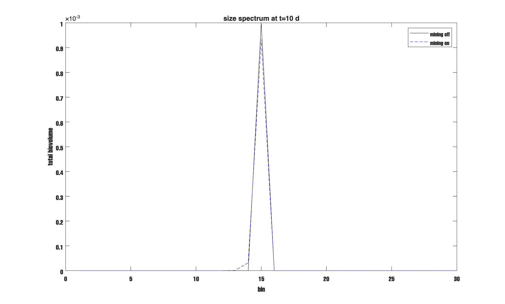

# Report -- June 8, 2026
## Micro-Zooplankton Partial Consumption (Mining Term)

---

I added the micro-zooplankton partial consumption term (mining) . It is coded, tested, and the full column run passes with no negatives.

---

## Contents

1. The equation
2. Implementation
3. Results

---

## 1. The Equation

The mining term is derived in Stemmann and colleagues (2004, Part I), Section 4.7.3, Equations 20 to 25. The encounter rate for mining zooplankton is:

$$e_m(i) = w_i \cdot s \cdot Z_m \tag{1}$$

where $w_i$ is the settling speed of size bin $i$ in m day⁻¹, $s$ is the capture cross-section area of one miner in m² individual⁻¹, and $Z_m$ is the concentration of mining zooplankton in ind m⁻³. This has the same flux-feeding structure as the existing flux feeder term. Miners find particles by detecting the hydrodynamic wake as the particle settles past them.

Each contact removes a fixed mass $\delta_m$, which is approximately the gut volume in cm³. A fraction $p$ of that mass goes to fecal pellets and the rest is assimilated by the animal. The particle that was mined shrinks from size bin $i$ toward bin $i-1$.

The full sectional equation (Equation 25 in Stemmann Part I) for the rate of change of mass in section $i$ is:

$$\frac{\partial Q_i}{\partial t}\bigg|_{\text{mine}} = \alpha^{-1} s \, \delta_m \, Z_m \left( m_{i+1}^{b-1} Q_{i+1} - 2^b m_i^{b-1} Q_i \right) + D_i \tag{2}$$

where $w = \alpha \, m^b$ is the power-law sinking speed and $D_i$ is the fecal production routed to size bins above the fecal bin $i_c$ (Equation 27 in the same paper).

In the discrete sectional code, this becomes two terms per bin. The bite rate fraction is:

$$\text{bite_fac}(i) = e_m(i) \cdot \frac{\delta_m^{\text{eff}}}{v_{\text{av}}(i)} \tag{3}$$

where $v_{\text{av}}(i) = 1.5 \cdot v_{\text{lower}}(i)$ is the average biovolume per particle in bin $i$ in cm³, and $\delta_m^{\text{eff}} = \min(\delta_m, v_{\text{av}}(i))$ caps the bite so it cannot exceed the volume of the particle itself. The update for bin $i$ is:

$$\frac{\partial Q_i}{\partial t}\bigg|_{\text{mine}} = -2 \cdot \text{bite_fac}(i) \cdot Q_i + \text{bite_fac}(i+1) \cdot Q_{i+1} + D_i \tag{4}$$

The factor of 2 comes from Equations 22 and 23 in Stemmann Part I. There are two separate mass flows leaving bin $i$ per contact: the bite mass removed by the animal, and the shrunken particle crossing the lower boundary of bin $i$ into bin $i-1$. Both contribute one `bite_fac(i) * Q_i` to the loss from bin $i$, so the total loss is twice that. These are physically separate things, so the factor of 2 is correct.

Mass budget check. Summing Equation 4 over all bins:

$$\frac{d Q_{\text{total}}}{dt}\bigg|_{\text{mine}} = -\sum_i \text{bite_fac}(i) \cdot Q_i$$

The fecal return is $p \sum_i \text{bite_fac}(i) \cdot Q_i$. The net loss from the combined aggregate and fecal pellet system is $(1-p) \sum_i \text{bite_fac}(i) \cdot Q_i$, which is the assimilated fraction that the animal respires. That is physically correct.

---

## 2. Implementation

### 2.1 New configuration parameters in `SimulationConfig.m`

```matlab
% Micro-zooplankton mining (Stemmann 2004 Part I, Eq. 25)
enable_mining    = false;   % turn mining on or off
mining_Zm        = 250;     % miner concentration [ind m⁻³]
mining_dm        = 1e-5;    % mass taken per contact [cm³], gut volume
mining_s         = 1.3e-5;  % cross-section area [m² individual⁻¹]
mining_min_bin   = 12;      % only mine particles at bins 12 and above (~254 µm)
```

`enable_mining = false` is the default. All existing tests run without change.

`mining_min_bin = 12` is a physical constraint. With a gut volume of $10^{-5}$ cm³, the average biovolume per particle at bins 1 through 11 is smaller than the gut volume. Without the cap, the miner would consume the entire particle, which is total ingestion, not partial consumption. Mining should only apply where the particle is large enough that a bite is genuinely smaller than the particle. Bin 12 (diameter ~254 µm) is where that condition is first satisfied:

| Bin | Diameter (µm) | Average biovolume (cm³) | Gut volume / biovolume | Mining active? |
|-----|------------------------|--------------------------------------|------------------------|----------------|
| 10  | 160                    | 3.2e-6                               | 3.11                   | No             |
| 11  | 202                    | 6.4e-6                               | 1.55                   | No             |
| 12  | 254                    | 1.3e-5                               | 0.78                   | Yes            |
| 15  | 508                    | 1.0e-4                               | 0.10                   | Yes            |
| 20  | 1610                   | 3.3e-3                               | 0.003                  | Yes            |

Both `mining_min_bin` and `mining_dm` are placeholders for now. Their values will be constrained by fitting to EXPORTS data and by information from net tow samples on which copepod types dominate at each depth.

### 2.2 New `mine()` method in `ZooplanktonGrazing.m`

The existing `graze()` method is unchanged. The new `mine()` method is added alongside it:

```matlab
function [dvdt, fp_flux] = mine(obj, v, w_cms, av_vol, Zm, dm_gut, s_area, min_bin)
    % MINE  Partial consumption following Stemmann 2004 Part I Equation 25.
    % Small copepods take a fixed bite dm_gut from each aggregate contact.
    % The aggregate shrinks from bin i toward bin i-1.
    % Fecal fraction p of consumed mass goes to fp_flux.
    v      = v(:);   w_cms = w_cms(:);   av_vol = av_vol(:);
    n      = numel(v);
    w_mday = (w_cms / 100) * 8.64e4;       % convert cm/s to m day⁻¹

    em       = w_mday * s_area * Zm;        % encounter rate [day⁻¹]
    dm_eff   = min(dm_gut, av_vol);         % bite capped at particle volume
    bite_fac = em .* dm_eff ./ av_vol;

    if nargin < 8 || isempty(min_bin), min_bin = 12; end
    bite_fac(1:min_bin-1) = 0;              % no mining below the minimum bin

    dvdt = zeros(n, 1);
    for i = 1:n
        dvdt(i) = dvdt(i) - 2 * bite_fac(i) * v(i);
        if i < n
            dvdt(i) = dvdt(i) + bite_fac(i+1) * v(i+1);
        end
    end
    fp_flux = obj.p * sum(bite_fac .* v);   % fecal produced this time step
end
```

The encounter rate `em(i) = w_i * s * Zm` uses the same flux-feeding structure as the existing `graze()` method in the same file.

### 2.3 Depth-varying miner concentration in `DepthProfile.m`

`Zm` is added as a new property alongside `Zc` and `Zf`:

```matlab
Zm   % mining zooplankton concentration [ind m⁻³], one value per depth layer
```

If `profile.Zm` is set, the mining loop uses `profile.Zm(k)` at each depth layer. If not set, it falls back to `cfg.mining_Zm` (constant with depth). The pattern is the same as for `Zc` and `Zf`. Right now `Zm` uses a flat 250 ind m⁻³ as a placeholder. Real depth profiles will come from EXPORTS net tow data.

### 2.4 Wiring into `ColumnRHS.stepY()` at step 3c

Mining runs after grazing and cross-coagulation, before surface production:

```matlab
% 3c. micro-zoo mining at each depth layer (if enabled)
% Particles shrink bin-by-bin; fecal pellets go to Yfp at the target bin.
if isprop(obj.cfg_orig,'enable_mining') && obj.cfg_orig.enable_mining && ~isempty(obj.zoo)
    av_vol     = obj.size_grid.av_vol(:);
    target_bin = max(1, min(n_sec, round(obj.zoo.ic) + 1));

    for k = 1:n_z
        v_k   = Y_new(k, :)';
        w_cms = obj.w_z(k, :)' .* (100 / day_to_sec);
        if ~isempty(obj.profile.Zm)
            Zm = obj.profile.Zm(k);
        else
            Zm = obj.cfg_orig.mining_Zm;
        end
        min_bin = obj.cfg_orig.mining_min_bin;
        [dvdt_m, fp_m] = obj.zoo.mine(v_k, w_cms, av_vol, Zm, ...
                             obj.cfg_orig.mining_dm, obj.cfg_orig.mining_s, min_bin);
        Y_new(k, :)            = max(v_k + dt .* dvdt_m, 0)';
        Yfp_new(k, target_bin) = max(0, Yfp_new(k, target_bin) + dt * fp_m);
    end
end
```

The fecal target bin is bin 8 (diameter ~115 µm, copepod-sized fecal pellets), shared with macro-zooplankton grazing. This follows Stemmann (2004 Part II), where both mesozooplankton and macrozooplankton egestion goes to a single fecal size class.

---

## 3. Results

Test script: `scripts/physics/run_mining_test.m`. A single aggregate at bin 15 (~508 µm) in the top layer only. Coagulation, disaggregation, and surface production all off. Run for 10 days.

```text
Total mass (mining off): 1.0000e-03
Total mass (mining on):  9.7579e-04
Mining reduces total by: 2.4%
Peak bin (mining off): 15
Peak bin (mining on):  15
Fecal produced:        1.0373e-05
All checks passed.
```

Mining removes 2.4% of total biovolume over 10 days. That is physically reasonable. The fecal produced (1.04e-5 cm³) equals $p \times$ consumed = $0.3 \times 3.46 \times 10^{-5}$, which checks out. The peak stays at bin 15 because 10 days is not long enough to shift it.

The figure shows total biovolume versus bin number at 10 days, summed across all depth layers. Both lines look nearly identical because the 2.4% difference is small. Bin 15 is very slightly lower in the mining-on run (dashed blue), and bin 14 has a barely visible increase because particles shrink one bin at a time, so bin 15 sheds mass directly into bin 14 only. Bins 1 to 11 are zero in both runs because the initial condition only populated bin 15 and mining is explicitly zeroed below bin 12.



*Figure 1. Total biovolume versus bin number at 10 days. Mining off (solid black) versus mining on (dashed blue). Run `scripts/physics/run_mining_test.m` to regenerate.*

Full verification (`run_verify_all.m`): **12 tests passed, 0 failed**. Full column run: Courant number = 0.77, final total biovolume = 1.23e-5 cm³ cm⁻³, no negative concentrations.

