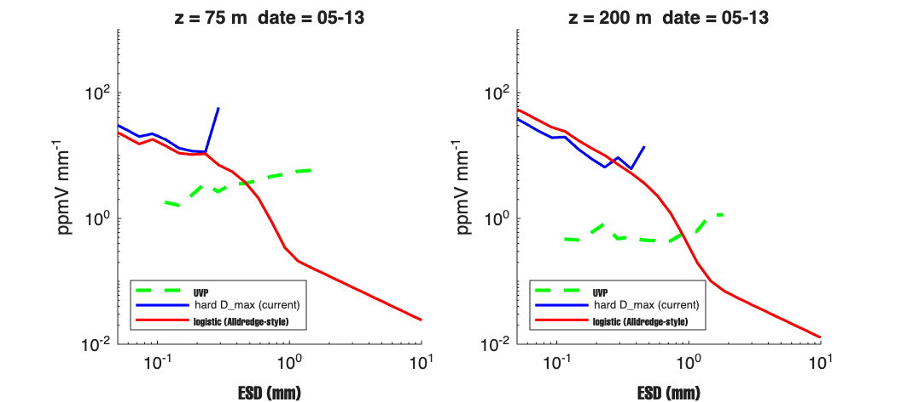
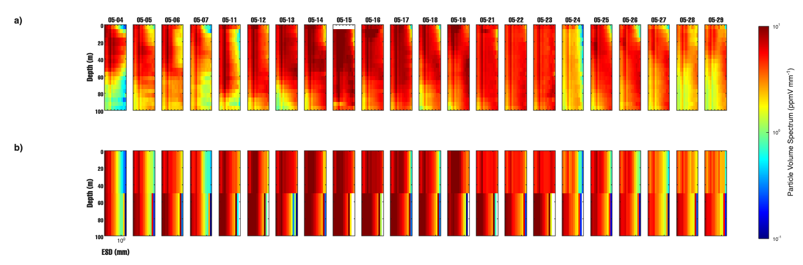
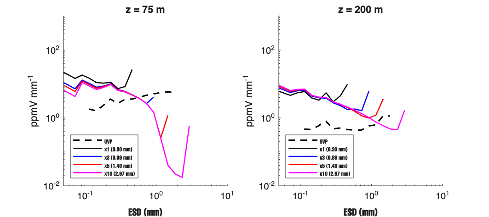

# Report -- June 11, 2026
## 1-D Column Run and Size Spectrum Comparison (EXPORTS-NA)

## 1. Setup

I ran the 1-D column model  by  EXPORTS-NA data (May 4--29, 2021, 22 cast days). Each day, the top model layer is set to the UVP particle size distribution from the surface (top 5 m). The model then predicts what happens below. The turbulence profile ε(z) comes from the data in `keps_for_dave.mat`, updated daily which you shared earlier.

Model config: n\_sections = 30, dt = 0.25 day, sinking law kriest\_8, all physics on (coagulation, disaggregation, zooplankton, fecal pellets, microbial remineralization, mining), α = 0.50, r₀ = 0.03 day⁻¹.

**UVP filter.** Raw UVP includes objects above 2000 µm. At depth, 85--93% of these are zooplankton, not aggregates. Comparing raw UVP to the model gave a false 36× mismatch. I now filter to 100--2000 µm for all comparisons. Below 100 µm is below UVP detection.

**Spectrum unit.** The differential volume spectrum is
$$S \;[\text{ppmV\,mm}^{-1}] = \frac{\phi \;[\text{cm}^3\,\text{cm}^{-3}]}{\Delta w \;[\text{mm}]} \times 10^6 \tag{1}$$

Note that 10⁹ is correct when Δw is in µm — the factor depends entirely on the units of Δw. The script was using a factor of 10⁹ with Δw in mm, giving values 1000× too large. Fixed across all scripts.

**Bin mapping.** The model has 30 sections, but only about 5--8 bins fall in the 100--2000 µm UVP range. The old code snapped each model bin to the nearest UVP bin center, which produced visible vertical stripes in the comparison. I replaced this with a weighted overlap fraction — for each model bin $k$ and UVP bin $j$:

$$\text{overlap}_{kj} = \frac{\max(0,\; \min(d_k^{\text{hi}}, d_j^{\text{hi}}) - \max(d_k^{\text{lo}}, d_j^{\text{lo}}))}{d_k^{\text{hi}} - d_k^{\text{lo}}} \tag{2}$$

This removes the stripes.

**Disaggregation modes.** I tested two modes. The first is `operator_split` (Parker et al. 1972), which sets a hard maximum stable size:

$$D_{\max} = D_a \cdot \varepsilon^{-1/4} \tag{3}$$

where $D_a$ (the calibration constant, $9.39 \times 10^{-6}$ m from Parker et al.) controls how strongly turbulence limits aggregate size. Particles above $D_{\max}$ are fragmented and their mass sent to smaller bins. This is the active mode in all comparison runs.

The second is `logistic` (Alldredge-style), which suppresses particles smoothly above $r_{\max} = C_0 \cdot \varepsilon^{-B}$ ($C_0 = 2\times10^{-3}$ cm, $B = 0.45$) by a factor

$$f = \frac{1}{1 + \exp\!\left(\kappa \left(\frac{r}{r_{\max}} - 1\right)\right)}, \quad \kappa = 3.5 \tag{4}$$

The logistic mode had a redistribution bug: fragmented mass was sent to smaller bins with weight $w_i = r_i^{-p}$ using $p = 2.5$. With radii spanning three orders of magnitude, the smallest bin receives roughly $10^{10}$ times more mass than the largest — all fragmented mass piled at bin 1. Setting $p = 0$ (uniform redistribution) fixed this. Both modes give similar cutoff locations. Logistic gives a smoother spectrum but does not close the UVP gap on its own.

*Figure 1. Size spectrum at z = 75 m: operator\_split (blue) vs logistic with p = 0 (red) vs UVP (green dashed).*

---

## 3. The Main Problem: D\_max Is Too Small

With the fixes in place, Figure 2 shows the 22-cast comparison. The model spectrum collapses above about 0.3 mm on every cast day. The UVP shows strong signal from 0.3 to 1+ mm. I think this is the disaggregation formula cutting particles down too aggressively — it is not a numeric artifact.

*Figure 2. Particle volume spectrum S [ppmV mm⁻¹] for all 22 matched cast days, 0--500 m depth. Panel (a): UVP filtered to 100--2000 µm. Panel (b): model with $D_a \times 5$. Color range 10⁻¹ to 10¹ ppmV mm⁻¹, matching Siegel et al. (2025).*

At surface turbulence levels ($\varepsilon \sim 10^{-6}$ m² s⁻³), equation (3) gives $D_{\max} \approx 0.30$ mm. The UVP shows particles surviving to 1--2 mm, so the formula is fragmenting too aggressively.

I added $D_a$ as a proper config parameter (`cfg.disagg_dmax_A`) and swept it over factors of 1, 3, 5, and 10 (Figure 3). At surface ε this gives $D_{\max}$ of 0.30, 0.89, 1.48, and 2.97 mm respectively.

*Figure 3. Size spectrum vs UVP (black dashed) at z = 75 m (left) and z = 200 m (right) for four values of $D_a$. The x5 case ($D_{\max} \approx 1.48$ mm) brings the model into the UVP size range. Script:.*

The x5 case brings the model spectrum into the 0.3--1.5 mm range where UVP has most of its volume signal. Figure 2 already uses x5.

---

## 4. ?????????

The model spectrum with x5 is too smooth. The UVP panels show patchy, cast-to-cast structure; the model is too uniform. I think this is expected — the 1-D model uses daily-averaged ε(z) with no lateral advection and climatological zooplankton profiles. The smoothness is a 1-D model limit???.

The deep signal (200--400 m) with x5 also looks slightly too strong. The correct value of $D_a$ is probably somewhere between x3 and x5.

-  whether to simply increase $D_a$, or to reconsider the $\varepsilon^{-1/4}$ scaling in equation (3). The exponent $-1/4$ comes from Parker et al. (1972) for inorganic flocs in shear flow. I'm not sure that it applies to marine snow aggregates in stratified ocean turbulence.

Once the $D_a$ direction is settled, the α × r₀ grid search needs to be rerun. The previous grid search assumed the default $D_a$ and is no longer valid.

---

## 5. Mass Budget Check

Before the 100 m start test, I ran a mass budget diagnostic with the full surface-forced run (best cast day: 20210522). The model was compared at each depth against UVP using three quantities: all 30 model bins, model restricted to the UVP size range (100--2000 µm), and UVP measured phi.

The comparison showed that the ratio model-UVP-range / UVP is 0.48--0.84 in the top 75 m (model too low), 1.5--3.1× in the 125--275 m layer (the subsurface peak artifact), and near zero below 375 m. The mean fraction of model mass sitting in bins below 100 µm was only 3.9%, so small-bin pileup is not the cause of the mismatch.

Note that the subsurface peak (known from earlier runs) is a Dirichlet BC artifact: large particles sink quickly past the surface layer, accumulating just below. I think this artifact is the source of the 1.5--3.1× overestimate in the 125--275 m band, not real overproduction by the physics.

The 100 m start run and loss term analysis continue in `report_june12_loss_toggle.md`.
