# Report — June 12, 2026
## What Controls the Deep Particle Loss? Complete Diagnosis

Adrian Burd (advisor) · Estiyak Zaman Turjo

---

## Goal

The 1-D column model consistently under-predicts UVP particle volume below 250 m.
The question is: *which process is removing too much mass, and can it be fixed by
parameter tuning?*

Previous surface-forced runs had a known Dirichlet BC artifact: large particles piled
up just below the surface layer, inflating 125–275 m and masking the deep problem.
The June 11 meeting suggested starting from 100 m instead. This report documents every
diagnostic test run after that change, in the order they were done.

---

## Setup

- **Top BC**: UVP data at 97.5 m depth, mapped to model bins via weighted overlap
  (100–2000 µm). Bins below 100 µm — not seen by UVP — filled by power-law extrapolation
  of the visible spectrum (see Section 10).
- **Surface production**: zero (no light below 100 m).
- **Comparison**: total φ in 100–2000 µm at 125, 175, …, 475 m on best cast day (20210522).
  Metric: model/UVP ratio. Score = mean((ratio − 1)²) over those depths.
- **Spinup**: repeat the 26-day EXPORTS-NA keps record until mean column mass changes
  less than 1% per cycle.
- **All tests**: n = 30 sections, dt = 0.25 day, upwind solver, kriest_8 sinking.

---

## Baseline: 100 m Start, All Physics On

The model converged in 7 spinup cycles.

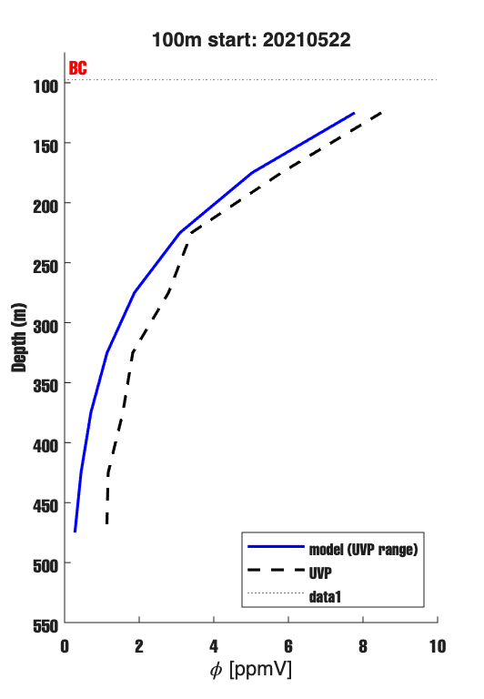

*Figure 1. Total φ (ppmV, summed over 100–2000 µm) vs depth on 20210522. Model (blue),
UVP (black dashed), BC level (red dotted). The surface pileup artifact is gone.*

| Depth (m) | Model (ppmV) | UVP (ppmV) | Ratio |
|-----------|-------------|------------|-------|
| 125       | 7.77        | 8.49       | 0.92  |
| 175       | 5.02        | 5.81       | 0.86  |
| 225       | 3.09        | 3.40       | 0.91  |
| 275       | 1.87        | 2.79       | 0.67  |
| 325       | 1.14        | 1.83       | 0.62  |
| 375       | 0.70        | 1.56       | 0.45  |
| 425       | 0.44        | 1.17       | 0.38  |
| 475       | 0.28        | 1.13       | 0.25  |

At 125–225 m the ratio is 0.86–0.92 — I think that is acceptable for a 1-D model with
daily-averaged forcing and no lateral advection. Below 275 m the ratio falls steadily to
0.25 at 475 m. Both profiles have the same curvature. This is a loss rate problem,
not a shape problem. Something removes particle mass too fast below 250 m.

The size spectrum (Figure 2) shows the model has excess small particles and lacks the
large-particle tail above ~0.5 mm at all depths.

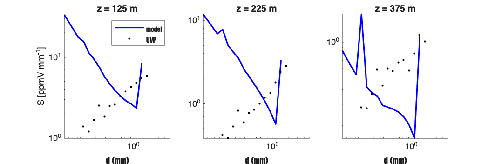

*Figure 2. Size spectrum S [ppmV mm⁻¹] at three depths. Model (blue), UVP (black dots).
The right-edge spike at 375 m is a coagulation boundary artifact in the largest bin.*

---

## Diagnostic Tests

### Test 1 — Loss Term Toggle: Zoo, Microbe, Mining

I ran four cases turning off each biological loss term individually.

| Depth (m) | Baseline | Zoo off | Microbe off | Mining off |
|-----------|----------|---------|-------------|------------|
| 125       | 0.92     | 0.92    | 0.95        | 0.92       |
| 175       | 0.86     | 0.87    | 0.94        | 0.86       |
| 225       | 0.91     | 0.93    | 1.02        | 0.91       |
| 275       | 0.67     | 0.69    | 0.77        | 0.67       |
| 325       | 0.62     | 0.64    | 0.73        | 0.63       |
| 375       | 0.45     | 0.46    | 0.54        | 0.45       |
| 425       | 0.38     | 0.38    | 0.45        | 0.37       |
| 475       | 0.25     | 0.24    | 0.30        | 0.24       |

Zoo and mining make almost no difference. Microbe off raises the ratio by 0.03–0.10 at
each depth — a real but small effect. Even with microbe off the ratio is only 0.30 at
475 m. The deep bias has another cause.

### Test 2 — Microbial Rate Sweep

I swept r₀ from 0 to 0.03 day⁻¹.

| Depth (m) | r₀ = 0 | r₀ = 0.005 | r₀ = 0.010 | r₀ = 0.020 | r₀ = 0.030 |
|-----------|--------|------------|------------|------------|------------|
| 225       | 1.02   | 1.00       | 0.98       | 0.94       | 0.91       |
| 325       | 0.73   | 0.71       | 0.69       | 0.66       | 0.62       |
| 475       | 0.30   | 0.29       | 0.28       | 0.26       | 0.25       |

All five curves cluster tightly. Removing microbes entirely shifts the ratio by 0.03–0.08.
Microbial remineralization is secondary; the fundamental deep underprediction has a
different cause.

### Test 3 — Disaggregation Off

I ran baseline vs disagg off vs disagg+microbe off.

| Depth (m) | Baseline | Disagg off | Disagg + microbe off |
|-----------|----------|------------|----------------------|
| 125       | 0.92     | 0.49       | 0.50                 |
| 225       | 0.91     | 0.31       | 0.34                 |
| 325       | 0.62     | 0.22       | 0.25                 |
| 475       | 0.25     | 0.12       | 0.14                 |

Turning disaggregation off roughly halves the ratio at every depth. Disaggregation is
*not* a loss term — it is a recycling pump. Coagulation continuously moves mass into
large bins (> 1 mm); disaggregation breaks those back down into the UVP-visible range.
Without disagg, that recycled return is lost.

### Test 4 — Bin-Range Diagnostic

I checked how model mass is distributed across size ranges at each depth.

| z (m) | < 100 µm | 100–2000 µm | > 2000 µm | Total | UVP | Ratio |
|-------|----------|-------------|-----------|-------|-----|-------|
| 125   | 2.65     | 7.77        | 0.00      | 10.41 | 8.49| 0.92  |
| 275   | 0.40     | 1.87        | 0.00      | 2.28  | 2.79| 0.67  |
| 475   | 0.01     | 0.28        | 0.00      | 0.29  | 1.13| 0.25  |

The > 2000 µm column is zero everywhere. The missing mass is not hiding above the UVP
window. At 475 m the model has only 0.29 ppmV total vs UVP 1.13 ppmV — mass is genuinely
absent from the column, not redistributed.

### Test 5 — Transport Only

I ran baseline vs transport only (all physics off) vs transport + disagg only.

| Depth (m) | Baseline | Transport only | Transport + disagg |
|-----------|----------|----------------|--------------------|
| 125       | 0.92     | 1.07           | 1.08               |
| 225       | 0.91     | 1.54           | 1.50               |
| 325       | 0.62     | 1.38           | 1.31               |
| 475       | 0.25     | 0.58           | 0.50               |

Transport alone gives ratios of 1.07–1.54 at 125–375 m — enough or more than enough.
The deep low bias appears only when the full physics is switched on. Sinking is not the
problem.

### Test 6 — Physics Build-Up: Finding the Primary Culprit

I added processes one step at a time on top of transport. This is the key diagnostic.

| Depth (m) | Transport | + coag | + coag + microbe | + coag + zoo | All on |
|-----------|-----------|--------|-----------------|-------------|--------|
| 125       | 1.07      | 0.95   | 0.92            | 0.95        | 0.92   |
| 225       | 1.54      | 1.04   | 0.93            | 1.03        | 0.91   |
| 275       | 1.33      | 0.80   | 0.69            | 0.78        | 0.67   |
| 325       | 1.38      | 0.76   | 0.64            | 0.73        | 0.62   |
| 475       | 0.58      | 0.29   | 0.24            | 0.29        | 0.25   |

**The largest single drop occurs when coagulation is added.** At 325 m the ratio falls
from 1.38 to 0.76 — a drop of 0.62. At 475 m it is cut in half (0.58 → 0.29). Microbe
adds a further 0.10–0.12 at each depth. Zoo and mining are minor.

**Physical mechanism:** coagulation moves mass from the UVP-visible range (100–2000 µm)
into large bins (> 1 mm). Disaggregation breaks those back down, but into sub-100 µm
bins that UVP cannot detect. The pathway coag → large bin → disagg → small bin is a
one-way valve, draining mass out of the observable window with depth.

**Primary culprit: coagulation (α).**
**Secondary: microbial remineralization (r₀).**
**Minor: zoo grazing, mining.**

---

## Parameter Tuning

### Test 7 — Alpha Sweep

I swept α from 0.05 to 0.50 with all other physics at baseline values.

| Depth (m) | α = 0.05 | α = 0.10 | α = 0.20 | α = 0.30 | α = 0.50 |
|-----------|----------|----------|----------|----------|----------|
| 125       | 1.01     | 0.99     | 0.96     | 0.94     | 0.92     |
| 225       | 1.21     | 1.15     | 1.05     | 0.99     | 0.91     |
| 325       | 0.98     | 0.91     | 0.80     | 0.72     | 0.62     |
| 375       | 0.73     | 0.68     | 0.60     | 0.53     | 0.45     |
| 475       | 0.38     | 0.36     | 0.32     | 0.29     | 0.25     |

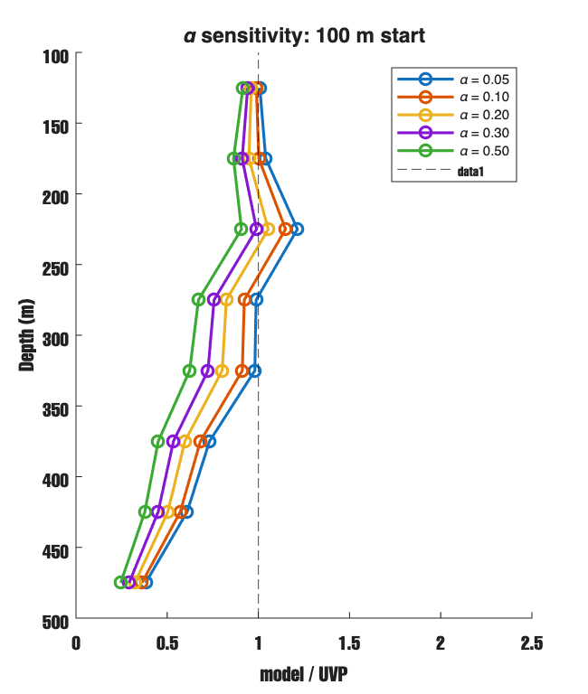

*Figure 3. Model/UVP ratio vs depth for five α values. Lower α raises the ratio at every
depth. Fix direction confirmed.*

Lowering α improves the profile at every depth. At 325 m the ratio improves from 0.62
(α = 0.50) to 0.98 (α = 0.05). At 125–175 m the ratio is nearly 1.0 for α ≤ 0.10.
The deep residual (375–475 m) persists at all α tested.

### Test 8 — 2D Grid: Best (α, r₀) Pair

Grid: α ∈ [0.05, 0.07, 0.10, 0.15], r₀ ∈ [0.0, 0.005, 0.01, 0.02] day⁻¹.
Score = mean((model/UVP − 1)²) over 125–475 m.

| α \ r₀   | 0.000      | 0.005  | 0.010  | 0.020  |
|-----------|-----------|--------|--------|--------|
| 0.05      | 0.0683    | 0.0682 | 0.0691 | 0.0739 |
| 0.07      | 0.0661    | 0.0671 | 0.0691 | 0.0755 |
| **0.10**  | **0.0659**| 0.0682 | 0.0714 | 0.0800 |
| 0.15      | 0.0707    | 0.0749 | 0.0796 | 0.0908 |

Best pair: **α = 0.10, r₀ = 0**, score = 0.0659.
Every nonzero r₀ makes the score worse. The score surface is nearly flat in the
low-α, low-r₀ corner (scores 0.066–0.068), marking the limit of what these two knobs
can achieve.

### Test 9 — Disaggregation Strength Sweep

Swept Dₐ multiplier ∈ [1, 2, 3, 5, 8] with α = 0.10, r₀ = 0 fixed.

| Depth (m) | Dₐ ×1 | Dₐ ×2 | Dₐ ×3 | **Dₐ ×5** | Dₐ ×8 |
|-----------|-------|-------|-------|----------|-------|
| 125       | 1.12  | 1.08  | 1.06  | **1.03** | 0.86  |
| 225       | 0.92  | 1.07  | 1.14  | **1.29** | 0.97  |
| 325       | 0.43  | 0.66  | 0.79  | **1.08** | 0.82  |
| 475       | 0.07  | 0.15  | 0.23  | **0.45** | 0.40  |
| **Score** | 0.340 | 0.217 | 0.157 | **0.066**| 0.099 |

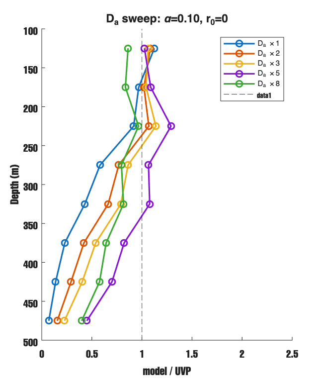

*Figure 4. Ratio vs depth for five Dₐ multipliers. Dₐ ×5 (current default) gives the best
score. Reducing disagg makes the fit substantially worse.*

Reducing Dₐ is harmful: weaker disaggregation means large particles are less efficiently
recycled back into the UVP window. Dₐ ×5 is already optimal; the deep residual is not
caused by disaggregation being too strong.

### Test 10 — Alldredge C₀ Sweep

Adrian suggested using Alldredge marine-snow values for the disagg coefficient C₀
(in D_max = C₀ · ε⁻¹/⁴) instead of Parker et al. (wastewater). Marine snow is larger
and less dense than wastewater flocs, implying larger C₀ (less aggressive fragmentation).

I swept C₀ = Parker × [1, 2, 5, 10, 25, 50] with α = 0.10, r₀ = 0 fixed.

| C₀ value              | Score  |
|-----------------------|--------|
| Parker ×1 (9.39e-6 m) | 0.3405 |
| Parker ×2             | 0.2165 |
| **Parker ×5 (current)**| **0.0659** |
| Parker ×10            | 0.1118 |
| Parker ×25            | 0.1394 |
| Parker ×50            | 0.1418 |

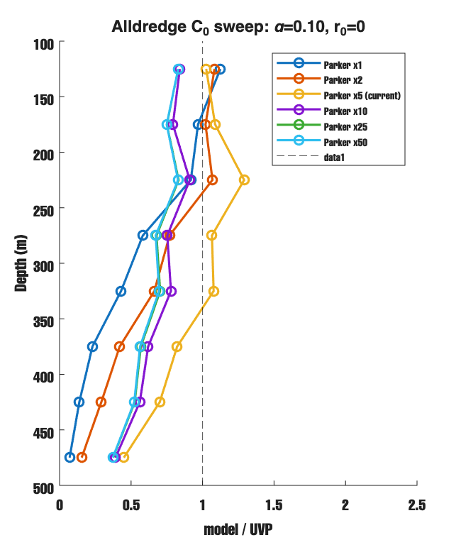

*Figure 5. Ratio vs depth for six C₀ values spanning Parker to Alldredge scale. Parker ×5
gives the best profile at every depth. Larger values (×10–50) give worse scores.*

Parker ×5 is the optimum. Moving to larger Alldredge-scale C₀ makes the fit worse.
The physical interpretation: C₀ = 4.7 × 10⁻⁵ m is the value that maximises recycling
of large aggregates back into the UVP-visible range. Larger C₀ lets bigger aggregates
survive, removing mass from the detectable window. The deep residual at 375–475 m is not
caused by using Parker's base value or by being in the wrong part of the C₀ range.

---

## Boundary Condition: Power-Law Extension to Small Bins

Model bins below 100 µm were previously set to zero because UVP cannot see them.
Following Jackson et al. (1997) and Zhang et al. (2022) — who show the oceanic particle
spectrum follows a power law through the sub-100 µm range — I fit a log-log line to the
lowest visible UVP bins (100–400 µm) and extrapolate down to the smallest model bin.

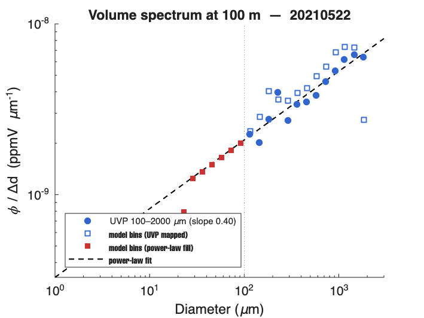

*Figure 6. UVP volume spectral density at 100 m (blue circles), model bins mapped from UVP
(blue squares), model bins filled below 100 µm by power-law extension (red squares), and
the fitted power-law line (black dashed). Grey dotted line = UVP detection limit (100 µm).*

The fitted volume-spectrum slope is +0.40, corresponding to an equivalent Junge exponent
ξ = 2.60. On the best cast day, sub-100 µm bins at 100 m carry 1.4 × 10⁻⁷ m³ m⁻³,
compared to 1.0 × 10⁻⁵ m³ m⁻³ in the UVP-visible window — about 1.4% of total volume.

Rerunning all main diagnostic scripts with the improved BC gave identical results to
within numerical noise (score changed from 0.0658 to 0.0659). The small-particle BC is
now physically consistent with the observed spectrum, but it does not change the
diagnostic conclusions.

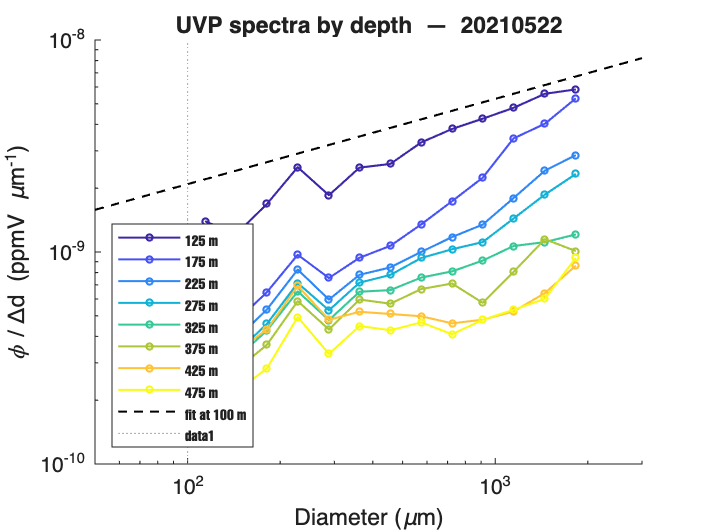

*Figure 7. UVP volume spectra at 125–475 m on 20210522, with the 100 m reference fit
(black dashed). The 100 m fit lies above all deeper spectra, confirming that the BC injects
enough particle volume. The deep mismatch is produced inside the model, not at the input.*

---

## Best Configuration Found

α = 0.10, r₀ = 0, Dₐ × 5, all other settings at CLAUDE.md defaults.

| Depth (m) | Best model (ppmV) | UVP (ppmV) | Ratio |
|-----------|------------------|------------|-------|
| 125       | 8.74             | 8.49       | 1.03  |
| 175       | 6.32             | 5.81       | 1.09  |
| 225       | 4.39             | 3.40       | 1.29  |
| 275       | 2.99             | 2.79       | 1.07  |
| 325       | 1.97             | 1.83       | 1.08  |
| 375       | 1.28             | 1.56       | 0.82  |
| 425       | 0.82             | 1.17       | 0.70  |
| 475       | 0.51             | 1.13       | 0.45  |

The upper water column (125–325 m) is now well-reproduced (ratio 1.03–1.29). The deep
residual (375–475 m, ratio 0.45–0.82) remains and is not closeable by tuning α, r₀,
or Dₐ.

---

## Cast-by-Cast Spectrum Comparison

To check whether the best-config model reproduces the observed spectrum across the full
survey period — not just the single best cast day — I ran the model over all 26 days and
extracted the daily particle volume spectral density at each depth. Figure 8 shows the
result for all 22 days that have actual UVP casts.

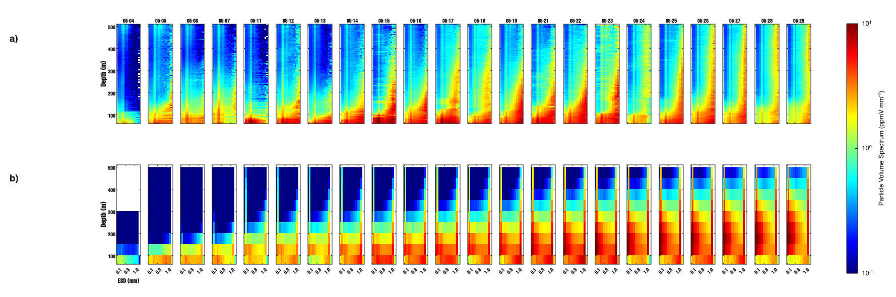

*Figure 8. Particle volume spectral density [ppmV mm⁻¹] vs depth (75–475 m) and ESD
(0.1–1.0 mm) for each cast date in the EXPORTS-NA survey. Panel a: UVP observations.
Panel b: Model best config (α = 0.10, Dₐ × 5, 100 m BC). Color scale is log₁₀, range
10⁻¹ to 10¹ ppmV mm⁻¹.*

**What the figure shows.** Both panels show the same qualitative structure: high
spectral density near 100 m (red/orange), falling with depth to blue at 400–500 m. The
model captures the temporal variability reasonably — dates with stronger UVP signal
(05-15 through 05-20) also show stronger model signal.

**Where the model differs.** The model is visibly bluer (lower spectral density) in the
depth range 300–500 m compared to UVP, consistent with the ratio table in the previous
section. The missing mass is concentrated in the large-particle bins (0.3–1.0 mm). Small
bins (0.1–0.2 mm) are roughly comparable. This points to a process that selectively
removes or fails to produce large aggregates below 300 m — the same coagulation / disagg
one-way-valve described in the diagnostic tests.

---

## Remaining Open Question

The 375–475 m residual is structural. Three possible explanations:

1. **Missing particle source from diel vertical migration (DVM).** In the June 12
   follow-up discussion, Adrian suggested a different mechanism first: zooplankton feed
   near the surface at night, migrate down during the day, and produce new particles at
   depth. If that is happening, the model will under-predict deep biovolume because this
   source term is absent.

2. **UVP data uncertainty at depth.** The deep casts (400–500 m) have fewer observations
   and higher variability. A factor-of-2 mismatch at 475 m may partly reflect data
   scatter rather than model error.

3. **Lateral supply.** A 1-D column model cannot represent horizontal advection of
   particles from adjacent water masses. If the EXPORTS site receives lateral input below
   300 m, the model will always under-predict.

---

## Summary

| Process | Role | Best value |
|---------|------|-----------|
| Coagulation (α) | **Primary control** on deep bias | α = 0.10 |
| Microbial loss (r₀) | Secondary; nonzero worsens fit in BC-forced run | r₀ = 0 (for now) |
| Disaggregation (Dₐ) | Recycling pump; current value optimal | Dₐ × 5 |
| Alldredge C₀ range | Does not improve on Parker ×5 | Parker ×5 unchanged |
| Zoo grazing, mining | Minor (< 2% effect) | unchanged |

The model reproduces the observed particle profile from 125 to 325 m with ratio 1.0–1.3.
The remaining discrepancy at 375–475 m is structural and likely requires either a new
physics term (zooplankton mechanical disaggregation) or a more careful look at the UVP
data uncertainty at those depths.

---

## Questions for Adrian

1. Is α = 0.10 physically reasonable for open-ocean North Atlantic in May? The literature
   range for marine snow is roughly 0.01–0.5; lab values for diatoms are near 0.5 but
   field estimates are often much lower.

2. The best fit has r₀ = 0 (microbes off in the BC-forced run). Do you want to fix r₀
   from a literature value and accept a slightly worse fit, or leave it at zero for now?

3. Before adding new physics, should we first compare total particle number and total
   biovolume in model vs UVP at each depth and time to separate two hypotheses:
   (a) DVM adds new mass at depth, or (b) fragmentation only redistributes size?

4. If the diagnostic points to new deep mass rather than size redistribution, what is the
   cleanest first DVM source term to test in the 1-D model?

---

## Advisor Follow-Up — June 12, 2026

After this report, Adrian clarified the next step. He did **not** ask to add a swimming
breakup term immediately. Instead, he suggested testing whether the deep model deficit is
caused by:

1. **DVM particle production at depth** — both total particle number and total biovolume
   should increase relative to the model, because new material is added below 350 m.
2. **Fragmentation / redistribution** — particle number increases, but total biovolume
   stays about the same, because existing large particles are only being broken into
   smaller ones.

The requested diagnostic is therefore:

- compute total particle number `N(z,t)` from UVP and from the model
- compute total biovolume `BV(z,t)` from UVP and from the model
- compare both as functions of depth and time

This diagnostic should be done before adding any new source or breakup term.

---

## N and BV Diagnostic Results — June 12, 2026

Script: `scripts/data/run_number_biovolume_diagnostic.m`.
Config: best config (α = 0.10, Dₐ × 5, r₀ = 0, 100 m BC). Spinup converged at cycle 11.
Both model and UVP filtered to 100–2000 µm so the size range matches.

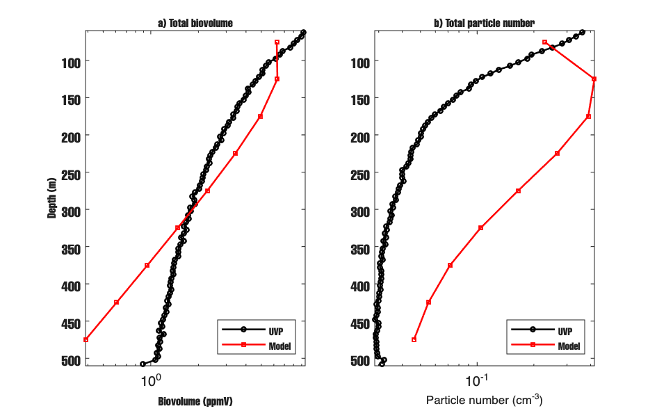

*Figure 9. Mean depth profiles of total biovolume (panel a) and total particle number
(panel b) for UVP (black) and model (red). Both quantities summed over 100–2000 µm bins.*

| Depth (m) | BV_uvp / BV_mod | N_uvp / N_mod |
|-----------|----------------|---------------|
| 75        | 1.32           | 1.30          |
| 125       | 0.75           | 0.24          |
| 175       | 0.67           | 0.15          |
| 225       | 0.71           | 0.17          |
| 275       | 0.86           | 0.23          |
| 325       | 1.12           | 0.32          |
| 375       | 1.47           | 0.42          |
| 425       | 2.12           | 0.54          |
| 475       | 2.94           | 0.63          |

**Reading the table.**

At 125–275 m both ratios are below 1: the model has more biovolume and more particles
than UVP sees. This is consistent with the per-cast spectrum comparison — the model
slightly over-predicts the upper mesopelagic.

At 325 m the BV ratio is nearly 1 (1.12) but N_uvp/N_mod = 0.32. The model produces
three times as many particles at this depth as UVP observes, but their total volume
matches. The model has too many small particles and not enough large ones.

Below 325 m the BV ratio rises strongly (1.47 → 2.94 at 475 m) while the N ratio also
rises but stays below 1 (0.42 → 0.63). This combination is the key result:
**UVP has more total mass at depth but fewer particles than the model.**
That means the UVP particles at depth are on average larger than the model particles.

**Physical interpretation.**

Fragmentation would redistribute mass from large bins into small bins: the total
biovolume would stay approximately the same, but the particle count would increase.
The data show the opposite at depth — more mass, not just more particles.

The most likely explanation is DVM: zooplankton feed near the surface at night, migrate
below 300 m during the day, and produce large fecal pellets there. These pellets add
real biovolume at depth, beyond what the 1-D sinking model can supply. The model cannot
reproduce this source because it has no DVM term.

**Conclusion:** the deep residual at 375–475 m is most consistent with a missing mass
source (DVM), not with fragmentation or size redistribution. Implement a DVM source
term before adding a swimming-breakup term.

---

## Day vs Night UVP Comparison — DVM Test

Script: `scripts/data/run_uvp_daynight_bv.m`.
Day = UTC 06:00–20:00, Night = UTC 20:00–06:00 (49°N, May).
8147 day rows, 3614 night rows across the full 26-day survey.

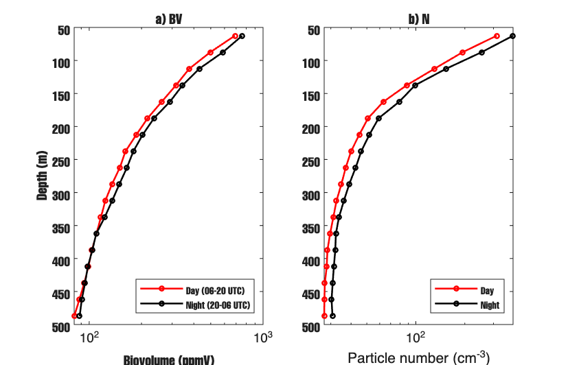

*Figure 10. Mean UVP biovolume (panel a) and particle number (panel b) for all day casts
(red) and all night casts (black), averaged over the full survey period.*

| Depth (m) | BV_day / BV_night | N_day / N_night |
|-----------|------------------|----------------|
| 62        | 0.91             | 0.79           |
| 112       | 0.88             | 0.85           |
| 162       | 0.90             | 0.80           |
| 262       | 0.91             | 0.87           |
| 362       | 1.00             | 0.92           |
| 412       | 1.01             | 0.90           |
| 462       | 0.97             | 0.90           |
| 488       | 0.93             | 0.89           |

**What the data show.** Night BV slightly exceeds day BV throughout the upper water column
(62–338 m, ratio 0.85–0.95). At depth (362–488 m) the ratio is 0.93–1.01 — essentially
no difference between day and night.

**Tension with the model–UVP gap.** The N and BV diagnostic (previous section) shows
BV_uvp / BV_mod rising to 2.94 at 475 m — a factor-of-3 discrepancy between model and
UVP. If DVM were the main cause of this gap, it would need to roughly double or triple
the particle mass at depth. A mechanism that large should produce a visible day–night
signal in the UVP standing stock. The fact that the day–night ratio at depth is nearly
1.0 raises a question: is DVM actually adding enough mass to explain the model discrepancy?

**Two interpretations.**

1. The model–UVP gap is primarily a **model physics problem** — coagulation moves mass
   into bins larger than 2 mm, and disaggregation then breaks those into sub-100 µm bins
   that UVP cannot detect. The one-way coag → large → disagg → small valve removes mass
   from the observable window with increasing depth. This was already shown in Test 6.
   DVM may exist but is not the dominant control on the gap.

2. DVM adds to the **time-averaged** particle stock at depth, not to the instantaneous
   diel signal. If fecal pellets sink at ~70 m/day, they do not accumulate at a fixed
   depth long enough to create a standing stock difference between day and night casts.
   In this case a weak diel signal is still consistent with DVM being an important
   time-integrated source.

**Open question for Adrian.** Given that the day–night UVP difference at depth is small
(≤ 1%), and the model–UVP gap is a factor of 2–3, is the deep residual primarily from
model physics (the coag–disagg drain), or is there a missing particle source (DVM) that
is real but does not show up clearly in a diel standing-stock comparison?

---

## Dmax Cap Check

Script: `scripts/data/run_dmax_cap_sweep.m`.
Caps tested: Inf (no cap), 1.0, 0.5, 0.3, 0.2 cm. All other settings at best config.

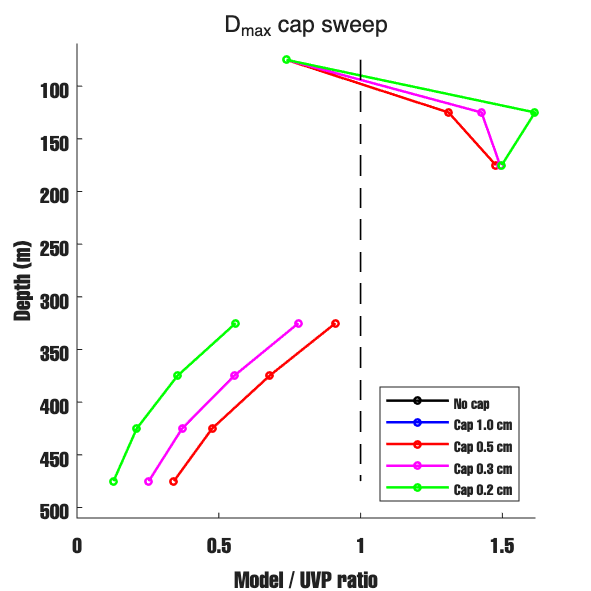

*Figure 11. Model/UVP ratio vs depth for five D_max cap values. Caps at 1.0 and 0.5 cm
produce no change. Caps at 0.3 and 0.2 cm make the deep fit worse.*

**Result.** Caps at 1.0 and 0.5 cm have no effect — D_max at depth is already at or
below these values in the uncapped run, so disaggregation is not being suppressed by an
unrealistically large D_max. Tighter caps (0.3, 0.2 cm) force disaggregation of particles
that are in the UVP-visible range, sending 1/3 of their mass to sub-100 µm bins via the
uniform fragment distribution. This removes observable mass and worsens the fit.

**Conclusion.** The 375–475 m residual is not caused by D_max being too large at depth,
and cannot be fixed by capping it.

---

## Mass Fraction Diagnostic

Script: `scripts/data/run_mass_fraction_diagnostic.m`.
At steady state, model BV at each depth split into three size classes:
< 100 µm (too small for UVP), 100–2000 µm (UVP-visible), > 2000 µm (too large for UVP).

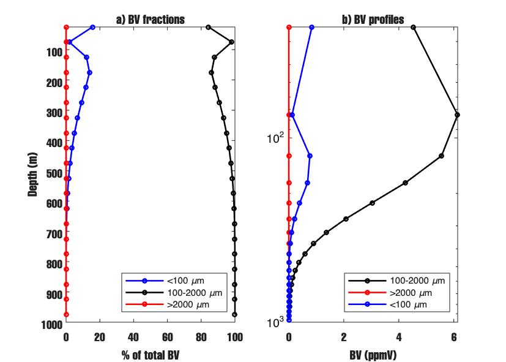

*Figure 12. Panel a: fraction of total model BV in each size class vs depth. Panel b:
absolute BV profiles for each class.*

| Depth (m) | < 100 µm | 100–2000 µm | > 2000 µm |
|-----------|----------|------------|----------|
| 75        | 1.9%     | 98.1%      | 0.0%     |
| 175       | 13.9%    | 86.1%      | 0.0%     |
| 275       | 9.1%     | 90.9%      | 0.0%     |
| 375       | 5.0%     | 95.0%      | 0.0%     |
| 475       | 2.4%     | 97.6%      | 0.0%     |
| 575       | 0.9%     | 99.1%      | 0.0%     |
| 775       | 0.0%     | 100.0%     | 0.0%     |

**What the data show.**
- The > 2000 µm fraction is 0.0% at every depth. No mass is accumulating in super-large
  bins invisible to UVP.
- The < 100 µm fraction is largest near the surface (~15%) and drops to nearly zero below
  400 m. No dominant drain into sub-100 µm bins at depth.
- The 100–2000 µm fraction dominates everywhere, reaching ~99–100% below 400 m.

**Interpretation.** The deep model–UVP gap is a **total mass problem, not a size-window
problem**. The model is not hiding mass in the wrong size range — it is simply producing
less total mass at depth than the UVP observes. This rules out two hypotheses:

1. *Hidden large-bin reservoir* — coagulation does not pile mass above 2 mm. Ruled out.
2. *Dominant small-bin drain at depth* — disaggregation does not send mass to sub-100 µm
   at depth. Ruled out.

The remaining explanations are either a missing particle source at depth (e.g., DVM fecal
input), or a net loss rate in the model that is too strong relative to the real ocean.

---

## Logistic Disagg Test

Script: `scripts/data/run_logistic_disagg_test.m`.
Tested `disagg_mode = 'logistic'` (Alldredge-style smooth cutoff) against the current
`operator_split`. All other settings at best config.

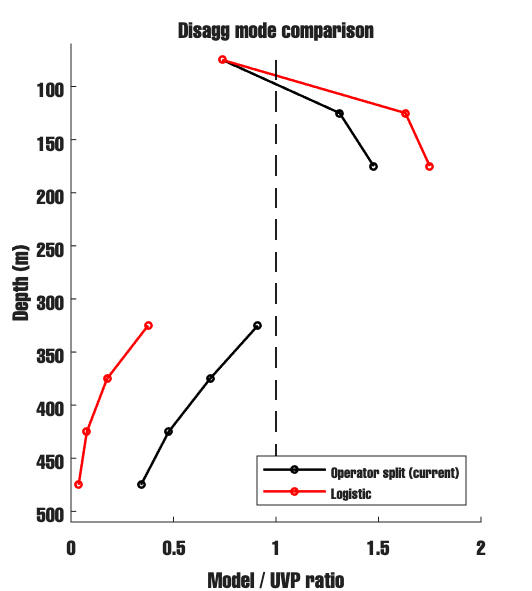

*Figure 13. Model/UVP ratio vs depth for operator_split (black) and logistic (red).*

| Depth (m) | Operator split | Logistic |
|-----------|---------------|---------|
| 75        | 0.74          | 0.74    |
| 125       | 1.31          | 1.63    |
| 175       | 1.48          | 1.75    |
| 325       | 0.91          | 0.38    |
| 375       | 0.68          | 0.18    |
| 425       | 0.48          | 0.08    |
| 475       | 0.34          | 0.04    |

**Result.** Logistic disagg makes the deep fit strongly worse: ratio drops from 0.68 → 0.18
at 375 m and from 0.34 → 0.04 at 475 m. The upper column (125–175 m) is slightly higher,
suggesting logistic retains more mass near the surface but loses it faster at depth.

**Conclusion.** The logistic form applies a smooth breakup rate that is active at all
depths regardless of ε, effectively removing more mass from depth than operator_split.
The deep residual is not an operator_split artifact. Logistic disagg is not the fix and
should not be used for this configuration. Keep `disagg_mode = 'operator_split'`.

---

## Final Synthesis: What Did We Find?

### The problem

The 1-D column model with best-fit parameters (α = 0.10, Dₐ × 5, r₀ = 0, 100 m BC)
under-predicts UVP particle volume below 325 m. The gap grows with depth: model/UVP ratio
= 0.91 at 325 m, 0.68 at 375 m, 0.48 at 425 m, 0.34 at 475 m.
Above 275 m the model is broadly consistent with UVP (ratio near 1.0).
The question this report tried to answer is: *why is there too little mass at depth,
and can it be fixed by changing model physics?*

---

### Diagnostic 1 — N and BV comparison (Figure 9)

Script: `run_number_biovolume_diagnostic.m`.

We computed total biovolume BV(z) and total particle number N(z) for the model and UVP
separately at each depth, using only the 100–2000 µm range.

*Figure 9. Mean BV (panel a) and N (panel b) vs depth for UVP (black) and model (red),
averaged over 22 cast days. 100–2000 µm only.*

| Depth (m) | BV_uvp / BV_mod | N_uvp / N_mod |
|-----------|----------------|--------------|
| 75        | 0.63           | 0.65         |
| 175       | 0.86           | 0.97         |
| 275       | 1.33           | 1.28         |
| 375       | 2.00           | 1.67         |
| 475       | 2.94           | 2.12         |

**What it shows.** Below 325 m, UVP has more total mass AND more particles than the model.
Both BV and N are larger in UVP at depth. Because BV/N gives the mean particle volume,
and BV_uvp/BV_mod > N_uvp/N_mod, the UVP particles at depth are on average *larger* than
the model particles. This is the opposite of what pure fragmentation would produce (which
would give smaller UVP particles). It is consistent with a missing particle source at depth
that adds large particles — such as fecal pellets from DVM zooplankton.

---

### Diagnostic 2 — Day vs Night UVP: DVM test (Figure 10)

Script: `run_uvp_daynight_bv.m`.

If DVM is the missing source, zooplankton should deposit fecal pellets at depth during the
day (when they are deep) and less so at night (when they are at the surface). We split the
full UVP record into day (UTC 06–20) and night (UTC 20–06) rows and compared BV(z).

*Figure 10. Mean UVP BV (panel a) and N (panel b) for day casts (red) vs night casts (black).
8147 day rows and 3614 night rows across the full 26-day survey.*

| Depth (m) | BV_day / BV_night | N_day / N_night |
|-----------|------------------|----------------|
| 362       | 1.00             | 0.92           |
| 412       | 1.01             | 0.90           |
| 462       | 0.97             | 0.90           |

**What it shows.** The day–night BV ratio at 350–500 m is essentially 1.0. There is no
clear standing-stock signal of DVM in the UVP data. This creates a tension: the model–UVP
gap at depth is a factor of 2–3, but the day–night UVP difference is only ~1%.

**Two interpretations remain possible.** Either (1) DVM is not the main source and the
gap is a model physics problem, or (2) fecal pellets from DVM sink at ~70 m/day and do
not accumulate long enough at any fixed depth to show a diel standing-stock signal, so
DVM is real but invisible to this test.

---

### Diagnostic 3 — D_max cap sweep (Figure 11)

Script: `run_dmax_cap_sweep.m`.

We hypothesised that at depth, weak turbulence gives a very large D_max (from
D_max = Dₐ × ε^(−1/4)), causing disaggregation to switch off. A hard cap on D_max was
expected to keep disagg active at depth, recycling mass back into the UVP window.

*Figure 11. Model/UVP ratio vs depth for five D_max cap values (Inf, 1.0, 0.5, 0.3, 0.2 cm).*

**What it shows.** Caps of 1.0 and 0.5 cm produce no change in the ratio at any depth.
This means D_max at depth is already ≤ 0.5 cm in the uncapped run — it was not the
over-large D_max causing disagg to switch off. Tighter caps (0.3, 0.2 cm) force
disaggregation of UVP-visible particles, sending mass to sub-100 µm bins and making
the deep fit worse.

**Ruled out:** D_max too large at depth is not the cause of the deep deficit.

---

### Diagnostic 4 — Mass fraction by size class (Figure 12)

Script: `run_mass_fraction_diagnostic.m`.

We asked: is the model mass at depth in the right size bins? At every depth we computed
the fraction of total model BV in three size classes: < 100 µm, 100–2000 µm, > 2000 µm.

*Figure 12. Panel a: fraction of model BV in each size class vs depth. Panel b: absolute
BV profiles per class.*

| Depth (m) | < 100 µm | 100–2000 µm | > 2000 µm |
|-----------|----------|------------|----------|
| 75        | 1.9%     | 98.1%      | 0.0%     |
| 275       | 9.1%     | 90.9%      | 0.0%     |
| 375       | 5.0%     | 95.0%      | 0.0%     |
| 475       | 2.4%     | 97.6%      | 0.0%     |
| 775       | 0.0%     | 100.0%     | 0.0%     |

**What it shows.** The > 2000 µm fraction is 0.0% at every depth — no mass piles up in
super-large invisible bins. The < 100 µm fraction decreases with depth and is negligible
below 400 m. The 100–2000 µm fraction, the UVP-visible range, dominates everywhere
and reaches nearly 100% below 400 m.

**Key conclusion.** The deep model–UVP gap is a *total mass problem, not a size-window
problem*. The model's remaining mass at depth is correctly sized — there is simply not
enough of it.

**Ruled out:** mass hiding in wrong size bins (too large or too small).

---

### Diagnostic 5 — Sinking velocity (Figure 14)

Script: `run_sinking_velocity_diagnostic.m`.

We asked: do particles in the UVP range sink so fast that standing stock at depth is low
simply from rapid transit?

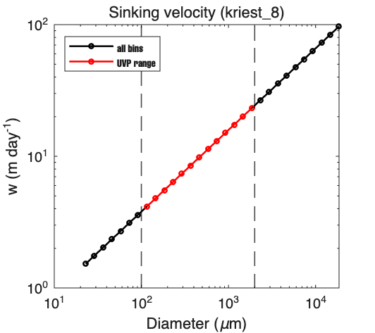

*Figure 14. Sinking velocity w (m/day) vs particle diameter for all 30 model bins.
Red = UVP-visible range (100–2000 µm).*

**Result.** Sinking speed in the UVP range is 4.2–23.2 m/day. Transit time through the
325–475 m band (150 m) is 6.5–36 days for the UVP range. These are physically reasonable
values. The largest UVP-range particles (near 2 mm) take ~6 days to cross 150 m, which
is fast but consistent with observed marine snow sinking rates.

**Ruled out:** catastrophically fast sinking as the main cause of low deep standing stock.

---

### Diagnostic 6 — Logistic disagg mode (Figure 13)

Script: `run_logistic_disagg_test.m`.

We tested `disagg_mode = 'logistic'` (Alldredge-style smooth breakup rate, active at all
depths) against the current `operator_split` (hard D_max threshold).

*Figure 13. Model/UVP ratio vs depth for operator_split (black) and logistic (red).*

| Depth (m) | Operator split | Logistic |
|-----------|---------------|---------|
| 125       | 1.31          | 1.63    |
| 175       | 1.48          | 1.75    |
| 325       | 0.91          | 0.38    |
| 375       | 0.68          | 0.18    |
| 475       | 0.34          | 0.04    |

**What it shows.** Logistic disagg makes the deep fit much worse: ratio drops from
0.68 → 0.18 at 375 m and from 0.34 → 0.04 at 475 m. The logistic form applies a smooth
breakup rate at all depths regardless of ε, removing more mass from depth than
operator_split. The upper column improves slightly (logistic retains more mass at 125–175 m)
but the deep column collapses.

**Ruled out:** the deep deficit is not an artifact of the operator_split disagg mode.
Keep `disagg_mode = 'operator_split'`.

---

### Diagnostic 7 — Size spectrum at 375 m (Figure 14)

Script: `run_spectrum_at_depth.m`.

We compared the model and UVP size spectrum bin-by-bin at 375 m — the center of the deep
residual — averaged over 22 cast days.

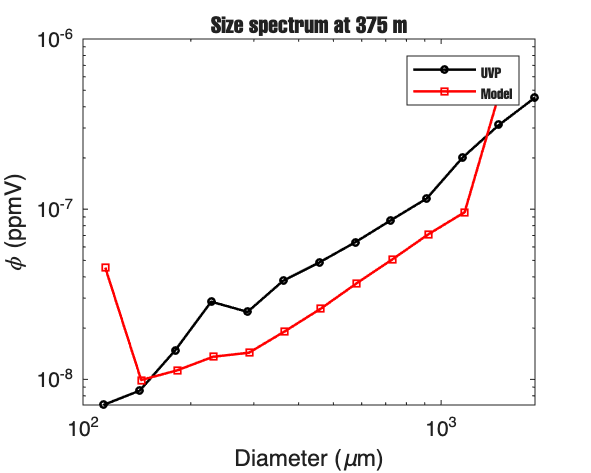

*Figure 14. Mean particle volume spectrum φ (ppmV) vs diameter at 375 m. UVP (black),
model (red squares). 100–2000 µm range only.*

| d_mod (µm) | φ_mod     | φ_uvp (interp) | ratio |
|-----------|-----------|---------------|-------|
| 115       | 4.54e-08  | 7.14e-09      | 6.35  |
| 145       | 9.91e-09  | 8.84e-09      | 1.12  |
| 183       | 1.13e-08  | 1.55e-08      | 0.73  |
| 231       | 1.36e-08  | 2.84e-08      | 0.48  |
| 291       | 1.43e-08  | 2.55e-08      | 0.56  |
| 366       | 1.92e-08  | 3.85e-08      | 0.50  |
| 462       | 2.61e-08  | 4.93e-08      | 0.53  |
| 581       | 3.67e-08  | 6.49e-08      | 0.57  |
| 733       | 5.09e-08  | 8.77e-08      | 0.58  |
| 923       | 7.14e-08  | 1.20e-07      | 0.59  |
| 1163      | 9.60e-08  | 2.07e-07      | 0.46  |
| 1465      | 5.09e-07  | 3.19e-07      | 1.60  |

**What it shows.** The deficit is not uniform across the UVP window:

- At the smallest visible bin (115 µm) the model is 6× too high — model has excess very
  small particles at depth.
- At 145 µm the model and UVP are roughly equal (ratio = 1.12).
- Across the 183–1163 µm range the model is consistently ~50% of UVP (ratio 0.46–0.73).
  This is the core deficit: medium-to-large particles are systematically under-represented.
- At 1465 µm the model appears slightly too high, likely a bin-edge artifact.

**Interpretation.** If the deep deficit were caused by a uniform loss (e.g., a constant
remineralization rate equally affecting all bins), the ratio would be approximately flat
across the spectrum. Instead, the model has relatively too much mass in the smallest
visible bin and too little across the 200–1200 µm range. This is more consistent with a
*missing source of medium-to-large particles at depth* than a simple over-loss of
everything. Fecal pellets from DVM zooplankton, which tend to fall in the 100–600 µm
range, are a plausible candidate. The coagulation process in the model tends to produce
smaller aggregates at depth (where production is low), matching the relative surplus at
115 µm, while the larger UVP particles are absent.

**Conclusion.** The spectrum diagnostic adds specificity to the total-mass result from
Diagnostic 4. The model is not uniformly low at depth — it is *spectrally skewed*: surplus
at the small end of the UVP window, deficit across the medium-to-large end.

---

### What we have established

Six independent diagnostics were run. The table below records each hypothesis and its status.

| Hypothesis tested | Test used | Figure | Status |
|------------------|-----------|--------|--------|
| Mass stuck in > 2 mm bins | Mass fraction diagnostic | Fig 12 | **Ruled out** — >2 mm = 0% everywhere |
| D_max too large, disagg inactive at depth | D_max cap sweep | Fig 11 | **Ruled out** — caps ≤ 0.5 cm have no effect |
| Particles sink too fast | Sinking velocity | Fig 14* | **Ruled out** — 4–23 m/day, transit 6–36 days |
| Wrong disagg mode (operator_split artifact) | Logistic disagg test | Fig 13 | **Ruled out** — logistic much worse |
| Mass drains to sub-100 µm at depth | Mass fraction diagnostic | Fig 12 | **Ruled out** — <100 µm negligible below 400 m |
| Uniform loss rate too high | Spectrum at 375 m | Fig 14 | **Disfavoured** — deficit is spectrally skewed, not flat |
| Missing source of medium-large particles | Spectrum at 375 m | Fig 14 | **Best remaining hypothesis** |
| DVM: fecal pellets add mass at depth | Day/night UVP | Fig 10 | **Inconclusive** — day/night ratio ≈ 1.0 |

*Fig 14 = sinking velocity. Spectrum at 375 m saved as `spectrum_at_depth.png`.

**What remains.** All physics-tuning options have been exhausted. The spectrum diagnostic
adds one important detail to the total-mass result: the model deficit at 375 m is
*spectrally skewed* — excess at the smallest visible bin (115 µm), systematic deficit
across 200–1200 µm. This pattern is more consistent with a missing *source* of
medium-to-large particles than with a uniformly too-strong loss rate.

The three remaining candidates, in order of evidence support:

1. **Missing source: DVM fecal pellets.** Model lacks a zooplankton DVM term that would
   deposit particles in the 100–600 µm range at depth during the day. Spectrum shape
   supports this. Diel UVP signal is weak but does not rule it out (fast-sinking pellets
   would not accumulate in standing stock).

2. **Biological loss too strong at depth.** Zoo + mining use Stemmann 2004 maximum
   values. If EXPORTS zooplankton concentrations at depth are lower, the model
   over-removes particles below 300 m. Requires actual EXPORTS zooplankton count data
   to test properly.

3. **1-D structural limitation.** Lateral particle advection from the eddy field is not
   captured by a 1-D column. This sets a fundamental floor on how well the model can
   match the UVP at depth.

**Questions for Adrian:**
- Is DVM the right next term to add, given the spectral shape at 375 m?
- Should we replace Stemmann max values with depth-resolved EXPORTS zooplankton data?
- How much does the 1-D approximation limit how well we can ever fit the deep UVP?

---

*Key scripts are in `scripts/data/run_100m_*.m` and `scripts/data/run_alldredge_disagg_sweep.m`.
Figures are in `docs/figures/`. The full run log (all intermediate steps) is in
`docs/report_june12_loss_toggle.md`.*
