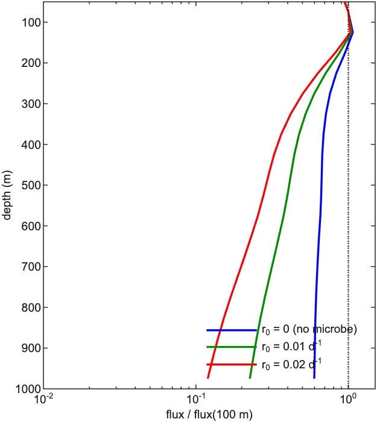
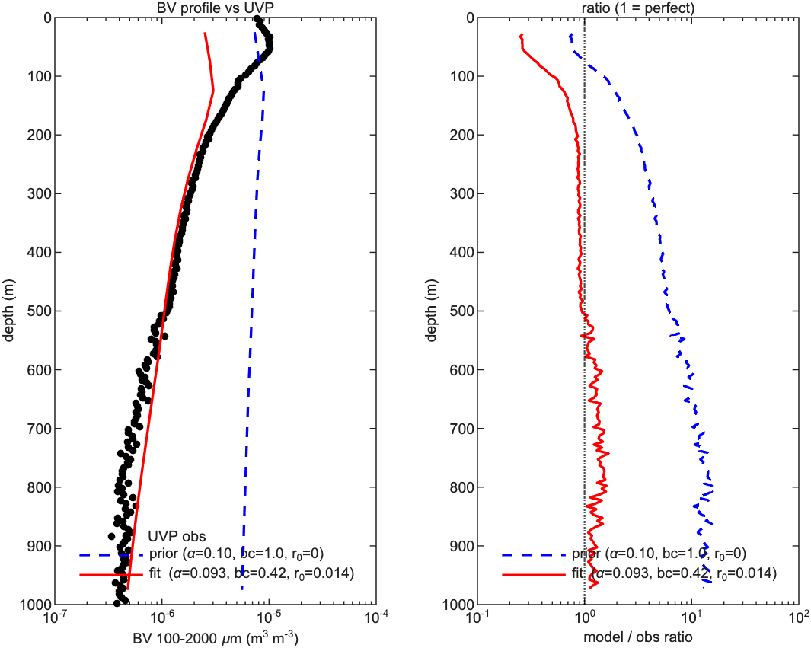
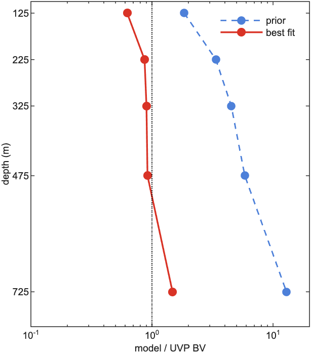

# Inverse Fitting: Best-Fit Parameters vs EXPORTS-NA UVP
**June 25, 2026**

---

## 1. Background

The goal is to find model parameters that make the model output match real ocean
observations. I fit the 1-D column model to particle biovolume (BV) observations
from the EXPORTS-NA cruise. Biovolume is the
total volume of particles per unit volume of water. The data come from the
Underwater Vision Profiler (UVP), an instrument that photographs particles in the
water and counts them by size. I use the size range 100--2000 $\mu$m and filter
out $>$ 2000 $\mu$m because those counts are mostly zooplankton swimmers. Note
that 1 mm$^3$/L = 10$^{-6}$ m$^3$/m$^3$ = 1 ppmV; the model uses m$^3$/m$^3$
internally.

The fitting approach is the Tarantola-Valette (1982) inverse method. The idea is
to define a cost function $J$ that measures how bad the fit is: low $J$ means the
model matches the data well, high $J$ means it does not. $J$ has two parts: a data
term (how far model is from observations) and a prior term (how far parameters are
from physically reasonable starting values). We minimize $J$ using MATLAB's
`fminsearch`. Local minima are a risk, so the initial guess matters.

---

## 2. Three-Parameter Inverse Fit

### 2.1 Parameters and forward model

I fit three parameters:

- $\alpha$: stickiness. Controls how easily particles stick when they collide.
- $s_{\text{bc}}$: BC amplitude scale. Fraction of the UVP signal used as particle input (§3.1).
- $r_0$: microbial remineralization rate. Controls how fast bacteria break down sinking particles.

The forward model is the full 1-D column: n = 30 sections, dt = 0.25 day,
Kriest-8 sinking, operator-split disaggregation with $D_a \times 5$, Stemmann
zooplankton, mining on.

The boundary condition (BC) is the particle source at the top of the model column.
It injects the daily UVP spectrum into layer 2 (center $z = 75$ m, not 100 m).
The concentration increment per time step is:

$$\Delta \phi_k = \frac{\Delta t \cdot w_k \cdot \phi_{\text{bc}}(t, k) \cdot s_{\text{bc}}}{\Delta z} \tag{1}$$

where $\phi_{\text{bc}}$ [m$^3$/m$^3$] is the UVP spectrum remapped to model bins
and $w_k = 66 \cdot d_k^{0.62}$ [m/day] is the Kriest-8 sinking speed. Note that
Eq. (1) is a source term (particles added per time step), not the sinking flux
$F_k = w_k \phi_{\text{bc}} s_{\text{bc}}$ [m$^3$/m$^2$/day]. In code:

```matlab
flux_src = dt * (w_bin .* phi_bc_daily(i_day,:)) * bc_scale / dz;
Y(k_bc,:) = Y(k_bc,:) + flux_src;
```

Microbial loss is first-order decay, operator-split after each disaggregation step:

$$Y \leftarrow Y \cdot \exp(-r_0 \, \Delta t) \tag{2}$$

The model is spun up by repeating the 26-day $\varepsilon$ record until mean column
mass changes by less than 1% between cycles (the model reaches a repeating steady
state):

```matlab
for icyc = 1:max_cycles
    phi_before = mean(sum(Y + Yfp, 2));
    for i_day = 1:n_days
        sim.rhs.profile.eps = keps_day.eps(:, i_day);
        flux_src = dt * (w_bin .* phi_bc_daily(i_day,:)) * bc_scale / dz;
        for i_step = 1:steps_per_day
            Y(k_bc,:) = Y(k_bc,:) + flux_src;
            [Y, Yfp]  = sim.rhs.stepY(Y, dt, Yfp);
        end
    end
    phi_after = mean(sum(Y + Yfp, 2));
    if abs(phi_after - phi_before) / max(phi_before, 1e-20) < spinup_tol
        break
    end
end
```

Each cycle loops over the 26 days, injects the BC at each time step, then calls
`stepY` (coagulation, sinking, disaggregation, zoo grazing, microbial loss). Note
that `Y` is marine snow and `Yfp` is fecal pellets; both are summed against UVP.
After spinup, BV is extracted at the observation depths:

```matlab
for id = 1:n_dep
    [~, k] = min(abs(z_c - obs_depths(id)));
    phi_out(id,:) = Y(k,:) + Yfp(k,:);
end
```


### 2.2 Cost function

The total cost is:

$$J = J_{\text{data}} + J_{\text{prior}} \tag{3}$$

I work in log space because BV spans three orders of magnitude over the column.
The data term compares model and observed BV at each depth:

$$J_{\text{data}} = \sum_{i} \left[ \frac{\ln \text{BV}_{\text{mod},i} - \ln \text{BV}_{\text{obs},i}}{\sigma_{\ln}} \right]^2 \tag{4}$$

$J_{\text{data}} = 0$ means perfect match; larger values mean a worse fit. I set
$\sigma_{\ln} = 0.5$ (natural log units), about a factor of 1.6 in BV. The prior
term penalizes parameters that stray too far from physically expected values:

$$J_{\text{prior}} = \left[\frac{\ln \alpha - \ln \alpha_0}{\sigma_\alpha}\right]^2 + \left[\frac{\ln s_{\text{bc}} - \ln s_0}{\sigma_s}\right]^2 + \left[\frac{\ln(r_0 + \varepsilon) - \ln r_{0,0}}{\sigma_r}\right]^2 \tag{5}$$

The small $\varepsilon = 10^{-8}$ allows $r_0 = 0$ as a starting point. Table 1
gives the prior centers (best guess before fitting) and widths (how strictly we
enforce them).

**Table 1.** Prior centers and widths.

| Parameter       | Center | $\sigma$ (log) |
|-----------------|--------|----------------|
| $\alpha$        | 0.10   | 1.5            |
| $s_{\text{bc}}$ | 0.50   | 1.0            |
| $r_0$           | 0.01   | 1.0            |

```matlab
opts = optimset('TolX',1e-3,'TolFun',0.1,'MaxFunEvals',400,'Display','iter');
[p_opt, J_opt] = fminsearch(@(p) cost_fn_col(p, cfg_base, col_grid, ...), p0, opts);
```

`TolFun = 0.1` is tight enough to separate a good fit ($J < 1$) from the baseline
($J > 2$). Hard bounds: $\alpha \in (0, 2]$, $s_{\text{bc}} \in (0, 2]$,
$r_0 \in [0, 1]$; values outside return $J = 10^6$.


### 2.3 Result

The best-fit parameters are:

$$\alpha = 0.093, \quad s_{\text{bc}} = 0.42, \quad r_0 = 0.014 \text{ day}^{-1}, \quad J = 0.241 \tag{6}$$

Note that the fit used only three depths: $z_{\text{obs}} = [125, 325, 475]$ m.
The 225 m and 725 m depths in Table 2 are diagnostics computed after the fit, not
part of $J$.

The baseline ($\alpha = 0.10$, $s_{\text{bc}} = 1.0$, $r_0 = 0$) gave $J > 2$.
Note that this baseline is not the same as the prior center in Table 1
($s_0 = 0.50$, $r_{0,0} = 0.01$): the prior center is the regularization anchor,
while the baseline is the old default model run. The fitted cost is about 10 times
lower than the baseline, which is a meaningful improvement.

---

## 3. Physical Interpretation

### 3.1 $s_{\text{bc}}$

UVP counts all particles at a depth — sinking ones, swimming copepods, and
particles held up by turbulence. The model only needs the ones actually sinking
downward. $s_{\text{bc}}$ is the fraction of the UVP signal we keep. Using the
full signal ($s_{\text{bc}} = 1.0$) puts too many particles into the model.

At 100 m, the Th-234 tracer gives a POC flux of 4.65 mmol C m$^{-2}$ day$^{-1}$,
while the pump gives 20.9 mmol C m$^{-2}$ day$^{-1}$, a factor of 4.5 higher.
The pump overcounts because small copepods (51--335 $\mu$m) are not removed from
the samples (Roca-Marti et al. 2021). This supports using a reduced $s_{\text{bc}}$.
The fitted value is 0.42, not 0.22 (= 4.65/20.9), but $s_{\text{bc}}$ is in
biovolume and the Th-234 ratio is in carbon mass, so they are not directly
comparable. The direction is the same: the raw UVP signal is too large.

At the surface, $s_{\text{bc}} = 0.057$: only 6% of the surface particles are
sinking. The rest are mixed upward by turbulence.

I also tested fitting $s_{\text{zoo}}$ (scale on grazing rate) instead of
$s_{\text{bc}}$. That gave $J = 2.638$ vs $J = 0.241$ here. Grazing rate is
not the right knob.

### 3.2 $r_0 = 0.014$ day$^{-1}$

Transfer efficiency (TE) is the fraction of particle flux remaining at depth
relative to the flux at 100 m. Without microbial remineralization ($r_0 = 0$) the
TE at 975 m is 63.5%, meaning most particles reach the deep ocean intact. This is
unrealistically flat. Figure 1 shows flux profiles normalized to 1 at 100 m for
three $r_0$ values. At $r_0 = 0.01$ the TE at 975 m is 22%; at $r_0 = 0.02$ it
is 10.6%. The fitted value $r_0 = 0.014$ sits between these and is in line with
published mesopelagic remineralization rates.

Note that Q10 temperature scaling would reduce $r$ in cold deep water, making the
725 m mismatch worse. That is not the right approach here.



### 3.3 $\alpha = 0.093$

Stickiness controls how easily particles aggregate: $\alpha = 0.1$ means about
1 in 10 collisions results in sticking, which is on the lower end of published
values for marine aggregates. The fit moves $\alpha$ from 0.10 to 0.093, well
within the prior width. Both the 100 m BC fit and the surface BC fit (§5) return
$\alpha$ in the range 0.09--0.10. Stickiness is not sensitive to BC depth.

---

## 4. Full-Depth Comparison

Figure 2 shows total BV (100--2000 $\mu$m) vs depth for the baseline, the best
fit, and the UVP observations. Figure 3 shows the model/UVP ratio at each key
depth: a ratio of 1 (dotted line) means a perfect match; $>$ 1 means the model
over-predicts; $<$ 1 means it under-predicts.





**Table 2.** Model/UVP BV ratio at key depths. Parentheses = diagnostic only,
not part of the fit.

| Depth (m) | Baseline ($s_{bc}$=1.0, $r_0$=0) | Best fit ($s_{bc}$=0.42, $r_0$=0.014) |
|-----------|-----------------------------------|---------------------------------------|
| 125       | 1.85                              | 0.62                                  |
| (225)     | 3.37                              | 0.87                                  |
| 325       | 4.52                              | 0.90                                  |
| 475       | 5.85                              | 0.92                                  |
| (725)     | 12.91                             | 1.48                                  |

The baseline over-predicts BV at every depth, worsening from 1.85$\times$ at 125 m
to 12.91$\times$ at 725 m. Too many particles enter the column; without microbial
loss the excess builds up all the way to 725 m.

The best fit brings 225--475 m to within 15% of the UVP. Reducing $s_{\text{bc}}$
cuts the particle input; $r_0 = 0.014$ gives the correct attenuation rate.

Note that the 125 m underprediction (ratio = 0.62) is a geometry artifact: the BC
is injected at layer 2 center ($z = 75$ m), but the UVP BC is taken at 100 m.
At 125 m the model is only 50 m below the injection point and has not built up
the full concentration. This is a grid discretization effect (dz = 50 m), not a
physics problem.

At 725 m the ratio is 1.48: the model over-predicts total BV in the deep
mesopelagic. No combination of $\alpha$, $s_{\text{bc}}$, and $r_0$ closes this
gap (confirmed by grid search). The likely causes are: (a) the model piles too much
volume into large fast-sinking bins that carry signal too deep before remineralizing;
or (b) $r_0$ is depth-uniform, whereas the true microbial rate probably decreases
with depth. A missing particle source at depth would make the over-prediction worse,
not better. This is a structural problem, not a parameter problem.

Transfer efficiency at 500 m: 36.3% (relative to 100 m flux).


---


## 5. Surface BC

I also ran the inverse fit forcing from the surface ($z = 25$ m, layer 1) instead of
100 m. The result: $\alpha = 0.099$, $s_{\text{bc}} = 0.057$, $r_0 = 0.020$
day$^{-1}$, $J = 1.579$. The cost is 6.5$\times$ higher than the 100 m BC fit
($J = 0.241$). The optimizer returned $s_{\text{bc}} = 0.057$ because at the
surface most particles are mixed by turbulence and do not sink. Only 6\% of the
surface UVP signal enters the model as sinking flux, and the column goes dark below
150 m. This confirms that 100 m is the better injection depth. At 100 m the
mixed-layer noise is gone and the UVP signal is closer to the true sinking flux.


---

## 6. Current Model Condition

The 100 m BC fit gives model/UVP ratio 0.87--0.92 in the 225--475 m zone. The
125 m underprediction is a geometry artifact (§4). The 725 m overprediction
remains open.

Figure 4 shows the particle volume spectrum as a function of depth and particle
size, for each of the 9 DY131 casts. Each column is one cast (one day). The
x-axis is particle size; the y-axis is depth; the color is log BV (brighter =
more particles). Row (a) is the UVP data; row (b) is the best-fit model output
remapped to UVP bins.

![Figure 4: Cast-by-cast BV spectrum. Row (a): UVP data, 0--500 m. Row (b): best-fit model, 100--500 m. Color is $\log_{10}$ BV [ppmV]. Each column is one cast.](figures/report_fig4_cast2d.png)

The model matches the upper 100--200 m on most dates but goes dark (near-zero BV)
well above 500 m, while the UVP has signal in the small-size classes
(100--300 $\mu$m) to 500 m on every cast. Note that the total BV ratio at 725 m
is 1.48 (over-prediction), so the model is not simply losing too many particles.
It pushes too much volume into large fast-sinking bins and does not sustain small
particles at mid-depth. Parameter tuning will not fix this.

---

## 7. ?

The $r_0 = 0.014$ day$^{-1}$ is spatially uniform. A depth-varying form would be
more physical. The simplest option is a two-layer step: one value for the upper
mesopelagic and a smaller value below 600 m. I am not sure yet what the right form
is.

