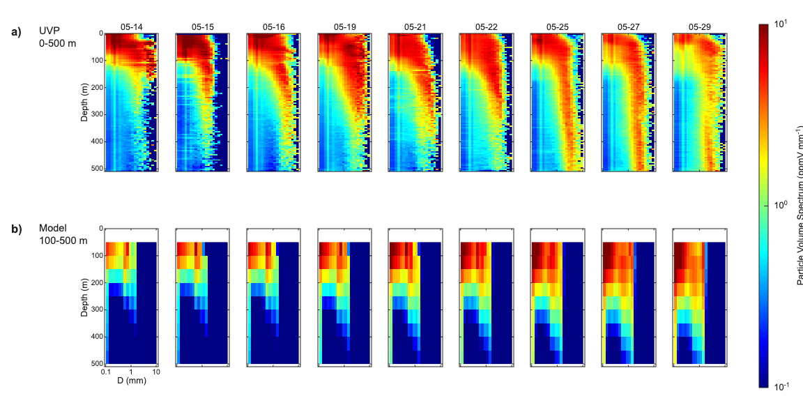
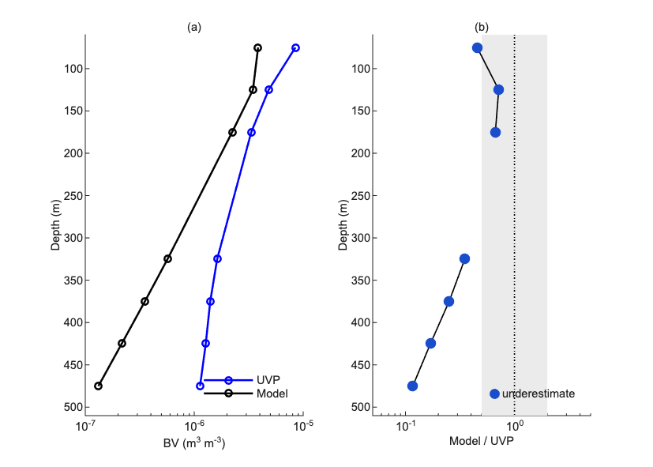
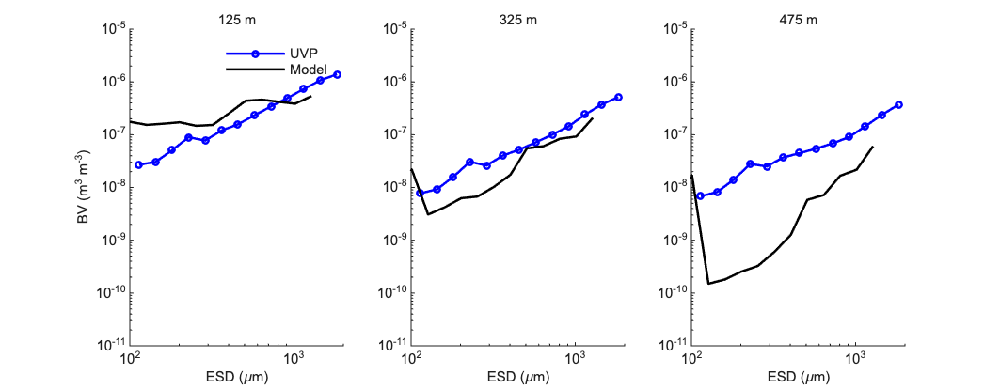
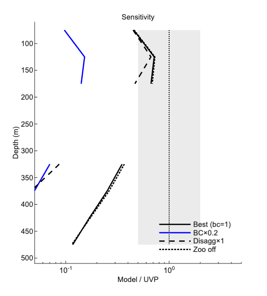

# EXPORTS-NA Comparison: 18 June 2026

---

## 1 Setup

I am running the 1-D coagulation column against UVP5 data from the North Atlantic
EXPORTS cruise (May 2021). The cruise lasted about 25 days at roughly the same
station. The column is 1000 m deep with 20 layers of 50 m each.

The configuration I settled on after testing:

- n_sections = 30, dt = 0.25 day (CFL stable, transfer efficiency 1.1%)
- Sinking: Kriest-8, w = 66 × d_cm^0.62 m/day
- Coagulation: alpha = 0.10 (curvilinear, differential sedimentation + shear + Brownian)
- Disaggregation: operator-split, D_a × 5 (Parker 2002 scaling, depth-varying via epsilon(z))
- Zoo: Stemmann 2004 grazing + micro-zoo mining, depth profile from Stemmann Fig 1
- Microbe: off (r0 = 0)
- Fecal: cross-coagulation with marine snow (alpha_cross = 0.5)
- Boundary condition: UVP flux injected at 100 m (layer 2), w × phi_UVP / dz per day

I filter the UVP to 100–2000 µm for the ratio comparison. Below 100 µm the signal
is dominated by zooplankton, not particles. The cast-by-cast figure in Section 2
uses 0.1–10 mm to match Siegel et al. (2025). Model biovolume is compared to UVP
biovolume at each layer averaged over all cast days. Layers where UVP biovolume
falls below 1% of the column maximum are excluded.

---

## 2 First look: what do I actually see?

Before doing any analysis, I plotted the full particle size spectrum side by side
for the UVP and model, following the layout of Siegel et al. (2025) Fig. 2a.
I picked nine dates from the on-station period (May 14–29). The ship was in transit
during May 05–12 and those early casts were in a different water mass, so I left
them out. Each column in Figure 1 is one cast date. Color is log10 of spectral
density [ppmV mm⁻¹] on the same colorscale as Siegel (10⁻¹ to 10¹). Row a is
UVP (0–500 m); row b is the model (100–500 m). The model starts at 100 m because
nothing is supplied above the boundary condition layer.

**What the UVP shows (row a).** The signal is warm from the surface down to about
200–250 m, then gradually fades to cyan and blue below that. But even at 400–500 m
the UVP still has measurable signal on every date. Two things stand out. First,
size sorting: the large particles (right side, 1–10 mm) disappear with depth faster
than the small ones (left side, 0.1–0.3 mm), which makes sense since larger
particles sink faster. Second, and more interesting, the small-particle left side
stays warm all the way to 400–500 m on every single date. The ocean is keeping
small particles alive deep down throughout the whole cruise.

**What the model shows (row b).** It looks very different. The warm colors are
stuck near 100–200 m. Below 250 m the panels go dark blue fast. By 350 m the
model is essentially dead. Three things are immediately off.

First, there is simply not enough material at depth. By 350 m the model is already
an order of magnitude below the UVP. Second, the right side of every model panel
is blank above ~2 mm: the model bins only go up to about 2 mm by construction,
so it never produces the large aggregates the UVP sees near the surface. Third,
and this one I did not expect at first, the left side of the model panels
(0.1–0.3 mm) goes blank below about 250 m. What is happening there is that
coagulation drains the small particles into larger ones, sinking removes them, and
there is nothing below 100 m to replenish them. The UVP shows the opposite: small
particles persist at depth, which means the real ocean has some process keeping
them there that the model completely lacks.

These three differences raise the obvious question: is this a total-mass problem,
a size-distribution problem, or both?

---

## 3 How bad is the total mismatch?

Figure 2 shows model biovolume versus UVP at each valid depth, and the ratio
Model/UVP on the right.

The model is low at every depth. The ratio never goes above 1. At 125–175 m the
ratio is 0.67–0.72, so I am within a factor of 2, not great but not terrible.
Below that it gets steadily worse. At 325 m the ratio is 0.35. At 475 m it is 0.12,
meaning the model is producing less than one-eighth of what the UVP sees.

The important thing is that the ratio drops smoothly and monotonically with depth.
If the model just had random errors you would expect some depths to be over and
some to be under. The smooth one-directional decrease tells me the model is losing
particles consistently faster than the real ocean does. The attenuation is too steep.

I fitted the flux profile F(z) ~ z^(-b) between 100 m and 500 m. The model gives
b = 1.72. The observational canonical value is about 0.858 (Martin et al. 1987).
The model is attenuating at roughly twice the real rate.

---

## 4 Is it also a size problem?

Figure 3 shows the biovolume per size bin at 125 m, 325 m, and 475 m. Model is
black, UVP is blue, same log-log axes.

At 125 m the two are within a factor of 2 overall. The model starts slightly above
the UVP at small sizes, dips a little in the middle, and meets the UVP again at
large sizes. The shapes are roughly comparable here.

At 325 m something new shows up. The UVP has a smooth upward slope from 100 to
2000 µm, as you would expect. The model has a clear trough in the 200–500 µm range,
dropping to about 10⁻⁹ while the UVP stays at 10⁻⁸ to 10⁻⁷. The large particles
(>1000 µm) are relatively close to the UVP, but the intermediate sizes are strongly
depleted. This is not just a level offset; the shape of the spectrum is changing.

At 475 m it is even more pronounced. The model drops two orders of magnitude below
the UVP in the 200–800 µm range and forms a clear U-shape. Above ~1000 µm the
model comes back up toward the UVP. The UVP at this depth is still a smooth
monotonically increasing spectrum.

I think this U-shape is a coagulation signature. At depth, the model is aggressively
sweeping intermediate-sized particles (200–800 µm) into large ones through aggregation.
With no fragmentation and no in-situ source below 100 m, that intermediate size range
just drains away. The real ocean must have something breaking large particles back
down: fragmentation, disaggregation, or zooplankton feeding, that continuously
refills the intermediate range. The model has none of that at depth.

So yes, there is a shape problem too, not just a level problem. The model is
changing the size distribution with depth in a way the data does not show.

---

## 5 What did I try?

The obvious question after seeing all this is: can I fix it by adjusting the model?
I tried everything I could think of.

**Turning physics on and off.** Six isolation tests: coagulation off, disaggregation
off, zooplankton off, mining off, fecal pellets off, and all off together. None of
them helped. Disaggregation off made things worse because particles piled up at
large sizes with nothing breaking them back down. Zoo off increased total biovolume
everywhere but did nothing to the slope.

**Microbial remineralization.** I tested r0 = 0.001 and r0 = 0.002 day⁻¹. Both
made the mismatch worse. That makes sense: microbe is a sink, and the model
already has too little material at depth. Adding another loss only widens the gap.
So I left it off (r0 = 0).

**DVM (diel vertical migration).** The idea was that zooplankton migrating down at
night and releasing fecal pellets at depth would add material there. I rerouted up
to 30% of daily fecal production to 300–500 m. I also checked the UVP day-versus-
night profiles directly and found no diel signal. In the model, the ratio at 475 m
changed by less than 2%. DVM can only move material that is already in the model.
It cannot add new material, and it cannot close a factor-of-8 gap.

**Boundary condition and parameter search.** Figure 4 shows the ratio profile for
four configurations: the best config, BC × 0.2, disaggregation with Parker scaling
removed, and zoo off.

Scaling BC × 0.2 brings the 125 m ratio up to about 1.0, which is good. But the
deep slope is unchanged. I also ran a 6×6 grid search over alpha (0.05 to 0.50)
and microbial r0 (0 to 0.01). The error landscape was flat and the best result
was the corner I already had.

Every test gave the same answer: none of the existing model parameters control the
attenuation slope. The problem is not in how fast particles sink or how aggressively
they are processed. Something is simply missing.

---

## ???

The model does not have enough particles below 200 m, the size distribution at depth
is wrong (too much in large particles, too little in intermediate sizes), and no
amount of parameter tuning changes either of these. I tried everything available and
the attenuation slope (b = 1.72) did not budge from roughly double the real ocean
value (0.858).

The root cause, as far as I can tell, is that the model has no way to generate
particles below 100 m. Everything at depth arrived from above and sank out. The
real ocean does not work that way. Particles at 400–500 m are being produced or
sustained in-column, probably through fragmentation of sinking aggregates, or
disaggregation by turbulence, or some other process I am not representing. Until
those sources are added, or until I get a data-constrained estimate of what they
must be, the deep deficit will not go away.

