# Report — May 17, 2026
## 1-D Zooplankton Grazing: Parameter Sensitivity Tests

---

## Contents

1. What is Different from the 0-D Slab
2. Equations
3. Implementation in ColumnRHS
4. Production Mode Comparison — Constant vs Growth Rate
5. Wiring Check — 60-Day Pulse Test
6. Egestion Fraction Sensitivity
7. Filter Feeders vs Flux Feeders
8. Steady State — Production + Coagulation + Grazing
9. Zooplankton Density Sensitivity
10. Clearance Rate Sensitivity
11. Identifiability in 1-D
12. Stemmann Table 3 Validation — 5-Case Test
13. Summary
14. Terms

---

## 1. What is Different from the 0-D Slab

The 0-D model treated the whole water column as one well-mixed box. Sinking was a loss term $w/H$ acting on every bin. Grazing ran once per day on that single state vector. The 1-D model resolves 20 depth layers over 1000 m. Each layer has its own biovolume concentration $Y_k$ (n_sec × 1 column vector). Transport — upwind advection plus flux-form diffusion — moves material between layers at each time step.

The question I wanted to answer was: can I drop the same `ZooplanktonGrazing` object at each depth layer and get physically sensible results?

### Two things are different from the 0-D report

**Sinking speed units.** In the 0-D slab, `ZooplanktonGrazing.graze` receives settling speeds in cm/s from the same config that drives coagulation. In the 1-D column, `ColumnRHS` stores sinking speeds as `w_z` in m/day (transport uses m/day). Before passing to `graze`, I convert:

$$w_{\mathrm{cms}}(k, i) = w_z(k, i) \times \frac{100\;\text{cm/m}}{86400\;\text{s/day}} \tag{1}$$

**Surface production.** The 1-D model uses the same density-dependent growth term as the 0-D slab (§8 of `report_may14_zooplankton.md`), applied only to layer 1, bin 1:

$$\left.\frac{dY_{1,1}}{dt}\right|_{\text{growth}} = \mu\,Y_{1,1}, \qquad \mu = 0.1\text{ day}^{-1} \tag{2}$$

This means grazing reduces $Y_{1,1}$, which reduces production — the same stabilizing negative feedback as in the 0-D slab. Both models should reach a genuine steady state with grazing active. Without grazing, production grows exponentially until coagulation and sinking can balance it, which takes much longer than the 180-day sensitivity runs.

---

## 2. Equations

The grazing formulation is identical to the 0-D report. I repeat the equations here so the 1-D report is self-contained.

Let $\phi_i$ be biovolume concentration in bin $i$ [cm³ cm⁻³], $w_i$ the settling speed [cm s⁻¹], $Z_c$ and $Z_f$ concentrations of filter and flux feeders [ind m⁻³], $c$ the clearance rate [m³ ind⁻¹ day⁻¹], and $s$ the capture cross-section [m² ind⁻¹].

Filter feeder removal rate [day⁻¹] — size-independent:

$$R_\mathrm{FF} = c\,Z_c \tag{4}$$

Flux feeder removal rate for bin $i$ [day⁻¹] — scales with settling speed:

$$R_\mathrm{FL}(i) = w_i\,s\,Z_f \tag{5}$$

where $w_i$ is in m day⁻¹ inside `graze` (converted from cm/s by `ZooplanktonGrazing` internally).

Total consumption from bin $i$ [cm³ cm⁻³ day⁻¹]:

$$C_i = \left(R_\mathrm{FF} + R_\mathrm{FL}(i)\right)\phi_i \tag{6}$$

Fecal return goes to bin $i_c + 1$:

$$D_i = \begin{cases} p\displaystyle\sum_j C_j & i = i_c + 1 \\ 0 & \text{otherwise} \end{cases} \tag{7}$$

Full grazing tendency:

$$\left.\frac{d\phi_i}{dt}\right|_\mathrm{graze} = -C_i + D_i \tag{8}$$

Net loss from the system per day is $(1-p)\sum_j C_j$.

### Integration (operator-split)

At each depth layer $k$, grazing is applied as an explicit Euler step:

$$Y_k^{n+1} = \max\!\left(Y_k^n + \Delta t\cdot\left.\frac{dY_k}{dt}\right|_\mathrm{graze},\; 0\right) \tag{9}$$

with $\Delta t = 1$ day. The `max(..., 0)` guard is applied after every split step.

---

## 3. Implementation in ColumnRHS

### 3.1 The Grazing Step

The full time step in `ColumnRHS.stepY` is:

1. Transport (upwind advection + diffusion)
2. Coagulation (depth-scaled beta matrices, explicit Euler with substeps)
3. Grazing (operator-split, one step per layer)
4. Surface production (layer 1, bin 1 only)
5. Disaggregation (operator-split, if enabled)

The grazing step loops over depth layers:

```matlab
% 3. operator-split grazing at each depth layer
if ~isempty(obj.zoo)
    day_to_sec = obj.cfg_orig.day_to_sec;
    for k = 1:n_z
        v_k   = Y_new(k, :)';
        % w_z is m/day; ZooplanktonGrazing.graze expects cm/s
        w_cms = obj.w_z(k, :)' .* (100 / day_to_sec);
        dvdt  = obj.zoo.graze(v_k, w_cms);
        Y_new(k, :) = max(v_k + dt .* dvdt, 0)';
    end
end
```

Each layer calls the same `ZooplanktonGrazing` object as the 0-D slab. The only difference is that `w_z(k,:)` already carries the depth-viscosity correction, so flux feeders see a slightly different settling speed at each depth.

### 3.2 Surface Production

```matlab
% 4. surface production — layer 1 only
% Two modes: constant source or growth rate (mu*phi, same as 0-D slab).
if isprop(obj.cfg_orig,'enable_surface_pp') && obj.cfg_orig.enable_surface_pp
    ib = max(1, min(obj.cfg_orig.n_sections, obj.cfg_orig.surface_pp_bin));
    use_mu = isprop(obj.cfg_orig,'surface_pp_mu') && obj.cfg_orig.surface_pp_mu > 0;
    if use_mu
        % density-dependent: dY/dt = mu*Y  (same as 0-D growth term)
        Y_new(1, ib) = Y_new(1, ib) * (1 + dt * obj.cfg_orig.surface_pp_mu);
    else
        % constant external source
        Y_new(1, ib) = Y_new(1, ib) + dt * obj.cfg_orig.surface_pp_rate;
    end
end
```

I did not use the old `pp_source` flag from `CoagulationRHS` because that applies production at every depth layer, which is wrong for a 1-D column.

### 3.3 Shared Configuration

New fields added to `SimulationConfig`:

```matlab
enable_zoo  = false;   % turn grazing on/off
zoo_Zc      = 100;     % filter feeder concentration [ind m^-3]
zoo_c       = 1e-4;    % clearance rate [m^3 ind^-1 day^-1]
zoo_Zf      = 50;      % flux feeder concentration [ind m^-3]
zoo_s       = 1e-4;    % capture cross-section [m^2 ind^-1]
zoo_p       = 0.3;     % egestion fraction
zoo_ic      = 1;       % fecal pellet target bin threshold

enable_surface_pp = false;    % surface source on/off
surface_pp_bin    = 1;        % which size bin gets the source
surface_pp_rate   = 1e-8;     % constant source strength [bv day^-1]
surface_pp_mu     = 0;        % growth rate [day^-1]; > 0 enables mu*phi mode
```

---

## 4. Production Mode Comparison — Constant vs Growth Rate

Script: `scripts/run_1d_pp_compare.m`

**All 1-D sensitivity tests (§6–11) use the density-dependent $\mu\phi_1$ mode, same as the 0-D slab.** This was the right choice: it means the negative feedback is present — grazing reduces $Y_{1,1}$, which reduces production, which stabilizes the system. A constant source $S$ has no feedback and the no-grazing case never reaches steady state, which is not real biology.

The `run_1d_pp_compare.m` script shows what changes when you switch modes. It runs four 500-day cases:

| Case | Production mode | Grazing | Total bv $t=500$ |
|---|---|---|---|
| Constant, no grazing | $S = 3 \times 10^{-8}$ | off | 1.328 × 10⁻⁵ |
| Constant, with grazing | $S = 3 \times 10^{-8}$ | on | 2.354 × 10⁻⁶ |
| $\mu\phi_1$, no grazing | $\mu = 0.1$ day⁻¹ | off | 2.879 × 10⁻⁵ |
| $\mu\phi_1$, with grazing | $\mu = 0.1$ day⁻¹ | on | 4.999 × 10⁻⁶ |

*Table PP. 500-day production-mode comparison from `scripts/run_1d_pp_compare.m`.*

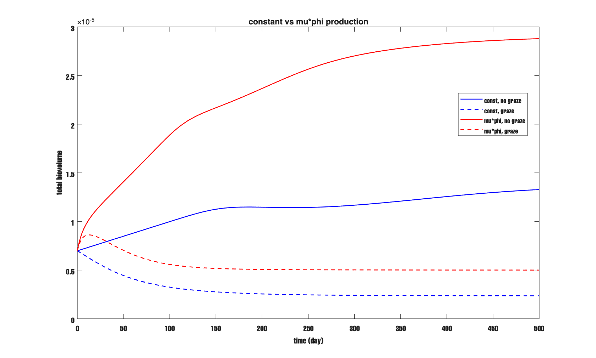

*Figure PP. Total column biovolume vs time. Solid blue: constant source, no grazing. Dashed blue: constant source, with grazing. Solid red: $\mu\phi_1$, no grazing. Dashed red: $\mu\phi_1$, with grazing.*

With constant source and no grazing (solid blue), the total biovolume grows linearly forever — there is nothing to stop it. With $\mu\phi_1$ and no grazing (solid red), the growth slows as coagulation and sinking remove large aggregates, eventually reaching a balance. With grazing active (dashed lines), both modes reach a lower quasi-steady state, but the $\mu\phi_1$ case (dashed red) gets there faster and sits lower, because grazing has reduced the surface production as well as removing particles directly. This comparison confirms that $\mu\phi_1$ is the physically consistent choice.

---

## 5. Wiring Check — 60-Day Pulse Test

Script: `scripts/run_1d_zoo_compare.m`

Before running any sweeps I wanted to confirm the grazing wiring is correct. I set up the column with no production (power-law initial pulse in layer 1 only) and ran 60 days — one case with grazing off, one with $Z_c = 100$.

| Case | $Z_c$ | bv at $t=0$ | bv at $t=60$ | Change |
|---|---|---|---|---|
| No grazing | 0 | 6.98 × 10⁻⁶ | 6.98 × 10⁻⁶ | 0.00% |
| With grazing | 100 | 6.98 × 10⁻⁶ | 2.88 × 10⁻⁶ | −58.7% |

CFL = 0.46. No negatives in either run.

The 0.00% change without grazing makes sense. Small particles in the initial spectrum have settling speeds of order 0.1–1 m day⁻¹. In 60 days they travel 6–60 m — less than one layer thickness (50 m) — so almost nothing has reached the open bottom yet. The column is acting as a closed box for this run length. If the numbers were not exactly 0.00%, I would have a transport bug.

The −58.7% with grazing is purely from net zooplankton removal. This is close to the 0-D slab result at the same parameters (−53.6% in §7.2 of `report_may14_zooplankton.md`). The small difference comes from depth-varying kernel scaling changing the size distribution that grazing acts on. The wiring is correct.

---

## 6. Egestion Fraction Sensitivity

Script: `scripts/run_1d_p_sweep.m`

I varied $p$ from 0 to 0.9 keeping all other parameters at default. Net removal per bin per day is $(1-p)\cdot c Z_c \cdot \phi_i$ — larger $p$ returns more fecal volume to bin 2, so less is permanently lost.

| $p$ | Total bv at $t=180$ | Change from no-grazing |
|---|---|---|
| no grazing | 2.284 × 10⁻⁵ | — |
| 0.0 | 3.896 × 10⁻⁶ | −82.94% |
| 0.1 | 4.209 × 10⁻⁶ | −81.57% |
| 0.3 | 5.093 × 10⁻⁶ | −77.70% |
| 0.6 | 7.642 × 10⁻⁶ | −66.54% |
| 0.9 | 1.383 × 10⁻⁵ | −39.45% |

*Table 1. Sensitivity to egestion fraction. No-grazing baseline at $t = 180$: $2.284 \times 10^{-5}$ (with $\mu\phi_1$ production, $\mu = 0.1$ day⁻¹).*

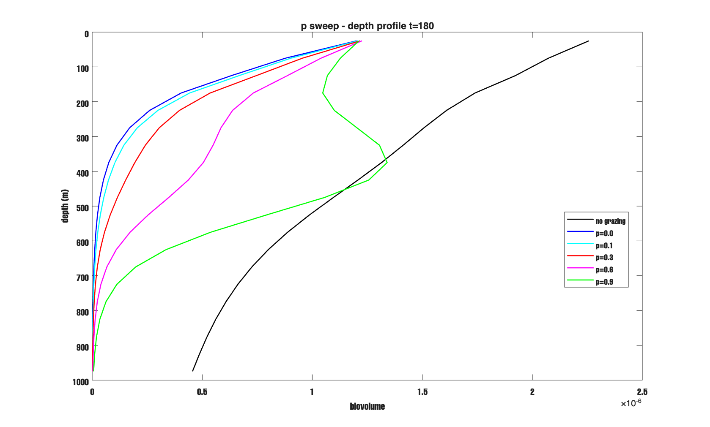

*Figure 1. Depth profile at $t = 180$ for six values of $p$. No grazing (black), $p = 0$ (blue), $p = 0.1$ (cyan), $p = 0.3$ (red), $p = 0.6$ (magenta), $p = 0.9$ (green).*

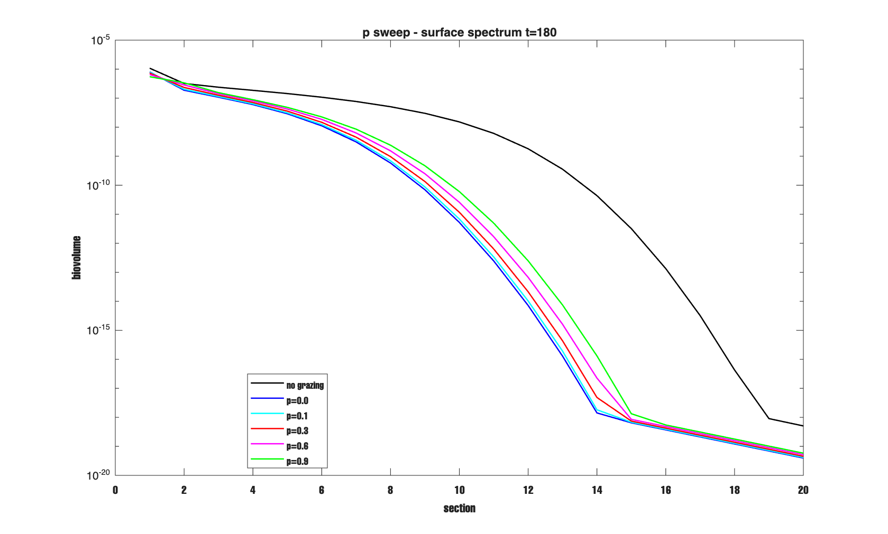

*Figure 2. Surface layer size spectrum at $t = 180$. Same color scheme.*

The response is strong and monotonic: every increase in $p$ reduces net removal, as expected from the formula. Even at $p = 0.9$, where 90% of consumed volume is returned as fecal pellets, there is still an 18% net loss — fecal pellets in bin 2 sink to depth and are then caught by flux feeders at each layer on the way down, so the material does not all come back.

The depth profiles (Figure 1) show two distinct regimes. For $p \leq 0.3$ (blue, cyan, red), biovolume drops steeply within the top 200–300 m — the column is strongly depleted. For $p = 0.6$ and $p = 0.9$, the profiles develop a **non-monotonic shape**: biovolume decreases from the surface, develops a slight bulge around 200–500 m, and then keeps falling. This feature does not appear in the 0-D slab. It is there because at high $p$, large amounts of fecal material are continuously injected into bin 2 at the surface. Bin 2 particles sink faster than bin 1, creating an elevated concentration at intermediate depths. The bump is a sinking-fecal signal — a 1-D feature invisible in the 0-D box.

The surface spectrum (Figure 2) shows all grazing cases below no-grazing from bin 2 onwards. The lines are ordered by $p$ at every bin. There is no crossover at large bins. In the 0-D slab at $p = 0.9$, fecal return was fast enough to push large-bin biovolume above the no-grazing case. Here, fecal pellets sink out of the surface layer before they coagulate into the largest bins — the recycling loop is broken by vertical transport.

---

## 7. Filter Feeders vs Flux Feeders

Script: `scripts/run_1d_ff_vs_flux.m`

I set $Z_f = 0$ for the filter-only run and $Z_c = 0$ for the flux-only run to isolate each feeding type. All four cases ran 180 days with surface production on.

| Run | Total bv at $t=180$ | Change |
|---|---|---|
| No grazing | 2.284 × 10⁻⁵ | — |
| Filter only | 1.047 × 10⁻⁵ | −54.18% |
| Flux only | 1.019 × 10⁻⁵ | −55.39% |
| Both | 5.093 × 10⁻⁶ | −77.70% |

*Table 2. Total column biovolume, $t = 180$. $\mu\phi_1$ production, $\mu = 0.1$ day⁻¹.*

| Run | Surface bin 1 | Surface bin 10 | Surface bin 20 |
|---|---|---|---|
| No grazing  | 1.078 × 10⁻⁶ | 1.520 × 10⁻⁸ | 5.059 × 10⁻¹⁹ |
| Filter only | 8.768 × 10⁻⁷ | 1.063 × 10⁻⁹ | 1.485 × 10⁻¹⁹ |
| Flux only   | 9.268 × 10⁻⁷ | 7.988 × 10⁻¹⁰ | 1.198 × 10⁻¹⁹ |
| Both        | 7.306 × 10⁻⁷ | 1.168 × 10⁻¹¹ | 4.538 × 10⁻²⁰ |

*Table 3. Surface layer biovolume at selected bins, $t = 180$.*

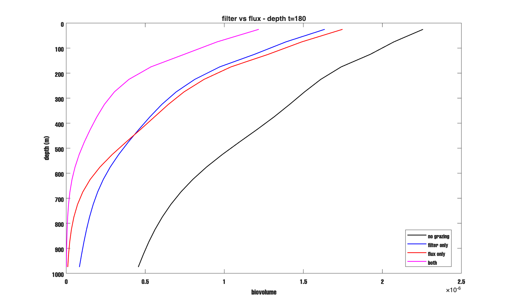

*Figure 3. Depth profile at $t = 180$. No grazing (black), filter only (blue), flux only (red), both (magenta).*

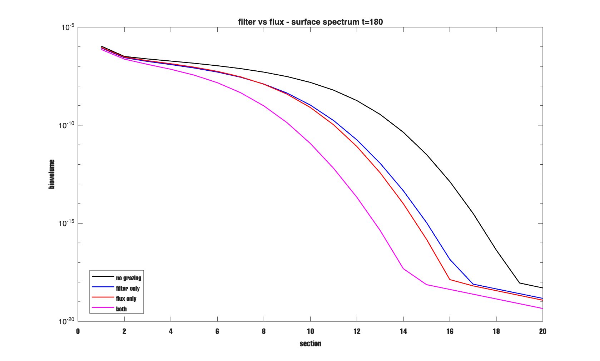

*Figure 4. Surface layer size spectrum at $t = 180$. Same colors.*

Filter only (−54.2%) and flux only (−55.4%) give nearly the same total column removal — close in the depth profiles too.

The difference shows up in the size spectrum (Figure 4). At bin 10, filter only leaves $1.063 \times 10^{-9}$ while flux only leaves $7.988 \times 10^{-10}$ — a ratio of 1.33×. Flux feeders remove somewhat more from large intermediate bins ($R_\mathrm{FL}(i) = w_i s Z_f$ scales with settling speed, so they preferentially target fast-sinking particles). Filter feeders act uniformly — they take the same fraction from every bin. The differential is less dramatic than in the constant-source tests (where the ratio was ~4×), because with $\mu\phi_1$ production the steady-state size distribution is different.

The combined run (magenta) removes more than either alone (−77.7% vs −54.2% and −55.4%), but less than the arithmetic sum (−109.6%) — because both feeding types compete for the same particle pool. Once one feeder removes material, less is available for the other.

### 7.1 No large-bin crossover in 1-D

The 0-D slab report (§7.2, Figure 3) showed a large-bin crossover: from about section 14 onwards, all grazing cases sat *above* the no-grazing case. That crossover was driven by fecal return — pellets deposited into bin 2 continuously coagulated upward into the largest bins. In the 1-D model, that crossover disappears. In the surface spectrum (Figure 4), all grazing cases stay *below* no-grazing at every bin. Fecal pellets injected at the surface sink out of the surface layer before they can coagulate into the largest bins. The recycling loop that powered the 0-D crossover is broken by vertical transport. This is an important difference — the large-bin enhancement seen in the 0-D slab is a closed-box artifact.

---

## 8. Steady State — Production + Coagulation + Grazing

Scripts: `scripts/run_1d_steadystate.m`

I ran both cases (no grazing, and $Z_c = 100 / Z_f = 50$) to 500 days to see whether they approach steady state.

| Case | $t=0$ | $t=100$ | $t=200$ | $t=500$ |
|---|---|---|---|---|
| No grazing | 6.981 × 10⁻⁶ | 1.889 × 10⁻⁵ | 2.367 × 10⁻⁵ | 2.879 × 10⁻⁵ |
| With grazing | 6.981 × 10⁻⁶ | 5.579 × 10⁻⁶ | 5.067 × 10⁻⁶ | 4.999 × 10⁻⁶ |

*Table 4. Total column biovolume over time. $\mu\phi_1$ production, $\mu = 0.1$ day⁻¹.*

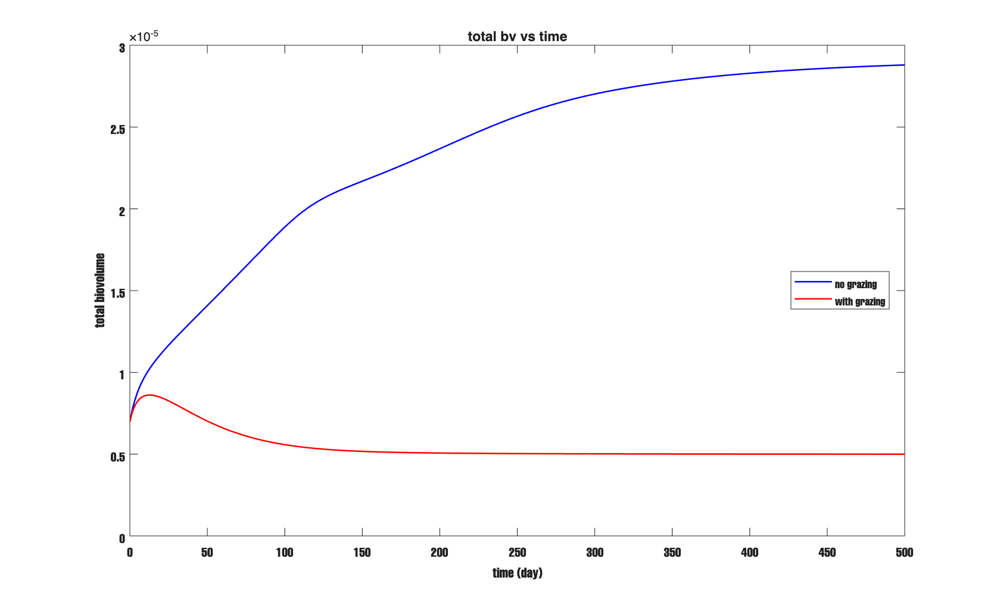

*Figure 5. Total column biovolume vs time. Blue: no grazing. Red: with grazing ($Z_c = 100$, $Z_f = 50$).*

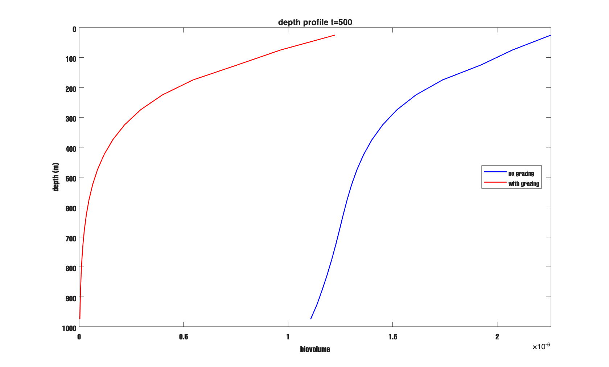

*Figure 6. Depth profile at $t = 500$. Blue: no grazing. Red: with grazing.*

The with-grazing case (red) drops quickly from $6.98 \times 10^{-6}$ to $5.58 \times 10^{-6}$ by day 100, then slows and approaches $4.999 \times 10^{-6}$ by day 500. The rate of decline over t = 200–500 is only $-2.26 \times 10^{-10}$ day⁻¹ — effectively flat. The system is very close to steady state. At $t = 500$ the change from the no-grazing baseline is $-82.64\%$, which is larger than the 180-day sensitivity runs because the no-grazing case keeps growing with $\mu\phi_1$ production.

The no-grazing case (blue) rises steadily through the run and does not approach steady state by 500 days. With $\mu\phi_1$ production and no grazing, the surface bin 1 grows exponentially (rate $\mu = 0.1$ day⁻¹). Coagulation and sinking slow it down but cannot fully balance a 10% per day growth rate on bin 1 over this run length. This is consistent with the 0-D slab behavior — without a top-down sink, the system accumulates material.

At $t = 500$ (Figure 6), the grazing profile (red) drops to near zero by about 700 m. The no-grazing profile (blue) fills the full column. The separation between the two curves is the direct signature of grazing suppressing deep export.

### 8.1 Process Budget at $t = 500$

I found two bugs in the first version of the budget script and fixed them before producing this table.

**Bug 1 — flux feeder velocity units.** Inside `ZooplanktonGrazing.graze`, the passed-in speed (cm/s) is converted back to m/day before computing $R_{FL}(i) = w_i \cdot s \cdot Z_f$. So the budget must also use m/day directly. The original script used cm/s, which underestimated the flux feeder contribution by a factor of $86400/100 = 864$.

**Bug 2 — bottom flux units.** `ColumnTransport.bottomFluxDay` returns the flux at the lower boundary in units of [m/day × bv]. To get the contribution to $dB/dt = d(\sum_k Y_k)/dt$, the result must be divided by layer thickness $\Delta z = 50$ m. The original script used the raw flux value, which overstated the bottom flux by 50×.

After fixing both bugs the corrected budget is:

| Process | Rate [bv day⁻¹] |
|---|---|
| Production ($\mu Y_{1,1}$ at $t = 500$) | 7.312 × 10⁻⁸ |
| Gross grazing | 9.471 × 10⁻⁸ |
| Fecal return | 2.841 × 10⁻⁸ |
| Net grazing | 6.630 × 10⁻⁸ |
| Bottom flux / $\Delta z$ (advective) | 1.030 × 10⁻¹⁰ |
| Bottom flux / $\Delta z$ (diffusive) | 1.285 × 10⁻¹² |
| Bottom flux / $\Delta z$ (total) | 1.043 × 10⁻¹⁰ |
| $dB/dt$ (t = 200–500 window) | −2.262 × 10⁻¹⁰ |
| Budget residual | 6.946 × 10⁻⁹ |

*Table 5. Process budget at $t = 500$ (with grazing, $\mu\phi_1$ production). Production is $\mu \times Y_{1,1}$ at $t = 500$. Bottom flux divided by $\Delta z = 50$ m. Residual = production − net grazing − bottom flux − $|dB/dt|$.*

The dominant result is clear: **grazing is the dominant sink** (net grazing = $6.63 \times 10^{-8}$ day⁻¹ vs production = $7.31 \times 10^{-8}$ day⁻¹, i.e. grazing accounts for 91% of production). Bottom flux is negligible — the total is $1.04 \times 10^{-10}$ day⁻¹, or 0.14% of production. The column is still very slightly declining at $t = 500$ ($dB/dt = -2.26 \times 10^{-10}$ day⁻¹).

The budget residual is $6.95 \times 10^{-9}$ day⁻¹ (~9.5% of production). This is larger than ideal and means the system has not fully reached steady state. The instantaneous production rate at $t = 500$ (computed from the current $Y_{1,1}$) is somewhat higher than the time-averaged loss rate over t = 200–500 — the two rates have been converging throughout the run. At true steady state the residual would be zero. More runtime (say 1000 days) would reduce it.

The key physical balance is:

$$\mu Y_{1,1} \approx (1-p)\sum_{k,i}(R_\mathrm{FF} + R_\mathrm{FL}(i))\,Y_{k,i} \tag{10}$$

Compare to the 0-D slab: there too, grazing was the dominant sink and production ≈ net grazing at steady state. The 1-D column reproduces the same dominant balance — depth structure distributes the removal across layers but does not change which process controls the system.

---

## 9. Zooplankton Density Sensitivity

Script: `scripts/run_1d_Zc_sweep.m`

I ran four cases keeping $Z_c : Z_f = 2:1$ and all other parameters at default.

| Case | $Z_c$ | $Z_f$ | Total bv $t=180$ | Change vs no-grazing |
|---|---|---|---|---|
| No grazing | 0 | 0 | 2.284 × 10⁻⁵ | — |
| Z-low | 50 | 25 | 1.018 × 10⁻⁵ | −55.45% |
| Z-mid | 100 | 50 | 5.093 × 10⁻⁶ | −77.70% |
| Z-high | 200 | 100 | 1.324 × 10⁻⁶ | −94.20% |

*Table 6. Total column biovolume vs zooplankton density. $\mu\phi_1$ production, $\mu = 0.1$ day⁻¹.*

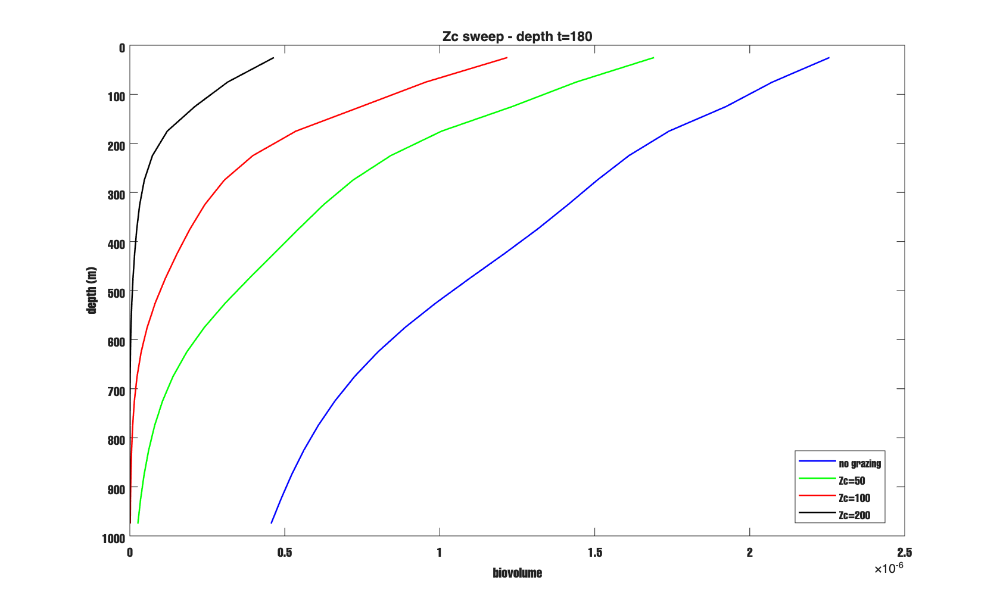

*Figure 7. Depth profile at $t = 180$. Blue: no grazing. Green: $Z_c = 50$. Red: $Z_c = 100$. Black: $Z_c = 200$.*

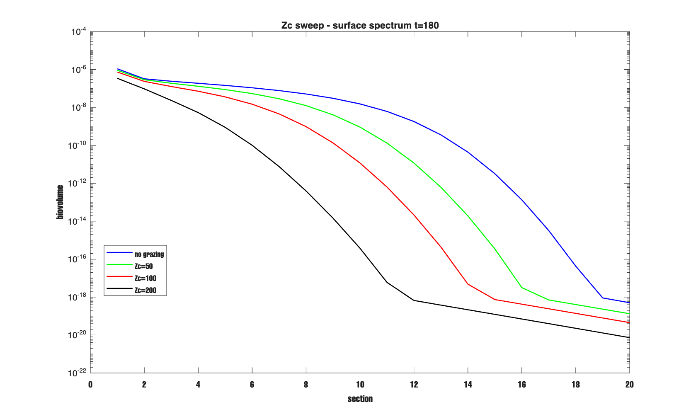

*Figure 8. Surface layer size spectrum at $t = 180$. Same colors.*

The depth profiles (Figure 7) show a clear pattern: higher $Z_c$ gives a steeper, more concave profile and pushes the near-zero depth shallower. No grazing (blue) fills the full column nearly linearly. $Z_c = 50$ (green) reaches near-zero around 950 m. $Z_c = 100$ (red) around 800 m. $Z_c = 200$ (black) around 300 m.

Grazing saturates in the depth profiles. Going from $Z_c = 50$ to $Z_c = 100$ (doubling) increases total removal from 55.5% to 77.7% — a 22 percentage-point gain. Going from $Z_c = 100$ to $Z_c = 200$ (another doubling) adds a further 16.5 points (to 94.2%). With $\mu\phi_1$ production the saturation is more pronounced at high $Z_c$ than with a constant source — at $Z_c = 200$ the system loses 94% of the no-grazing baseline, which is much stronger suppression. This is the negative feedback: higher grazing suppresses $Y_{1,1}$, which suppresses production, which reduces the available food even further. Each doubling of $Z_c$ buys less additional absolute removal because the food supply also shrinks.

---

## 10. Clearance Rate Sensitivity

Script: `scripts/run_1d_c_sweep.m`

I varied $c$ at fixed $Z_c = 100$, $Z_f = 50$, 180 days with production.

| Case | $c \cdot Z_c$ [day⁻¹] | Total bv $t=180$ | Change vs no-grazing |
|---|---|---|---|
| No grazing | — | 2.284 × 10⁻⁵ | — |
| $c/2$ | 0.005 | 7.205 × 10⁻⁶ | −68.46% |
| $c$ | 0.010 | 5.093 × 10⁻⁶ | −77.70% |
| $2c$ | 0.020 | 2.482 × 10⁻⁶ | −89.13% |
| $4c$ | 0.040 | 3.861 × 10⁻⁷ | −98.31% |

*Table 7. Total column biovolume vs clearance rate. $\mu\phi_1$ production, $\mu = 0.1$ day⁻¹.*

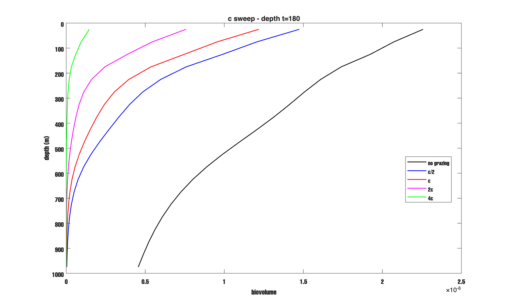

*Figure 9. Depth profile at $t = 180$. No grazing (black), $c/2$ (blue), $c$ (red), $2c$ (magenta), $4c$ (green).*

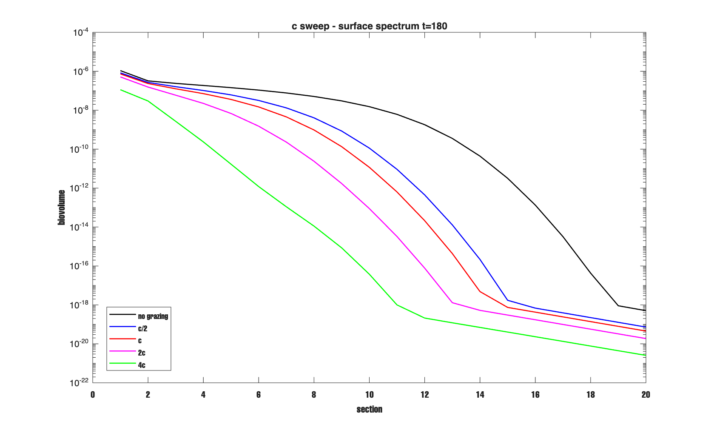

*Figure 10. Surface layer size spectrum at $t = 180$. Same colors.*

The depth profiles (Figure 9) are ordered cleanly. Higher $c$ gives steeper profiles and a shallower extinction depth. At $4c$ (green), biovolume is near-zero by 200 m. At $c/2$ (blue) material reaches 800 m.

The response is strongly nonlinear. Incremental gains: $c/2 \to c$: 9.2 pp, $c \to 2c$: 11.4 pp, $2c \to 4c$: 9.2 pp. The middle step is the largest — not strictly monotone — but by $4c$ the system has lost 98.3% of the no-grazing baseline, which is essentially complete suppression. The $\mu\phi_1$ feedback amplifies the response at high $c$: higher clearance rates reduce $Y_{1,1}$ more, which also reduces production, causing the food supply to collapse. This is why $4c$ gives 98.3% removal compared to 92.1% in the constant-source tests — the negative feedback makes high grazing much more effective.

The surface spectrum (Figure 10) shows progressive removal of large particles. At bin 10, the ordering is: no-grazing $\gg$ $c/2$ $>$ $c$ $>$ $2c$ $>$ $4c$. Higher $c$ pushes the large-bin cutoff to progressively smaller section numbers.

---

## 11. Identifiability in 1-D

In the 0-D slab (§10 of `report_may14_zooplankton.md`), I found that only the product $c Z_c$ is observable — running with $c = 2 \times 10^{-4}$, $Z_c = 100$ gave exactly the same total biovolume as $c = 10^{-4}$, $Z_c = 200$. The result held because $Z_f$ was kept fixed.

In the 1-D model I tested the same idea, but I also changed $Z_f$ proportionally to $Z_c$:

| Run | $c$ | $Z_c$ | $Z_f$ | $c \cdot Z_c$ | Total bv $t=180$ |
|---|---|---|---|---|---|
| A | $1 \times 10^{-4}$ | 100 | 50 | 0.010 | 5.093 × 10⁻⁶ |
| B | $2 \times 10^{-4}$ | 50  | 25 | 0.010 | 7.044 × 10⁻⁶ |

The two runs have the same $c Z_c$ but give different total biovolumes — B is $1.951 \times 10^{-6}$ higher than A (a 38% difference).

The reason: halving $Z_c$ required me to halve $Z_f$ to maintain the 2:1 ratio. But halving $Z_f$ reduces flux feeder removal ($R_\mathrm{FL}(i) = w_i s Z_f$), which is an independent process from filter feeding. So the identifiability break here is not a failure of the 1-D physics — it is because I changed two parameters at once.

The correct identifiability test for filter feeders alone would hold $Z_f$ fixed and only change $Z_c$ and $c$ with $c Z_c$ constant. Based on the 0-D result (which did keep $Z_f$ fixed), I expect that test would recover exact identifiability. In a model with both feeding types, the two products $c Z_c$ and $s Z_f$ both matter separately. Both must be fixed for identifiability of one to hold.

---

## 12. Stemmann Table 3 Validation — 5-Case Test

Script: `scripts/run_1d_stemmann.m`

The 0-D report (§11 of `report_may14_zooplankton.md`) ran the exact parameters from Stemmann et al. (2004), Table 3 as a validation check. I ran the same 5 cases in the 1-D column to confirm that the grazing module gives consistent results regardless of the transport model around it.

Setup: 10-day run, no production, power-law initial condition in layer 1 only, same column and size grid as the other 1-D tests. Stemmann 2004 parameters: $Z_c = 0.307$ ind m⁻³, $c = 0.025$ m³ ind⁻¹ day⁻¹, $Z_f = 250$ ind m⁻³, $s = 1.3 \times 10^{-5}$ m² ind⁻¹, $p = 0.5$, $i_c = 1$.

| Case | $Z_c$ | $Z_f$ | Total bv $t=10$ | Change |
|---|---|---|---|---|
| No grazing | 0 | 0 | 6.981 × 10⁻⁶ | 0.000% |
| Flux only | 0 | 250 | 6.780 × 10⁻⁶ | −2.878% |
| Filter only | 0.307 | 0 | 6.718 × 10⁻⁶ | −3.772% |
| Both | 0.307 | 250 | 6.524 × 10⁻⁶ | −6.549% |
| Double Z | 0.614 | 500 | 6.095 × 10⁻⁶ | −12.694% |

*Table 8. Stemmann 2004 five-case validation from `scripts/run_1d_stemmann.m`.*

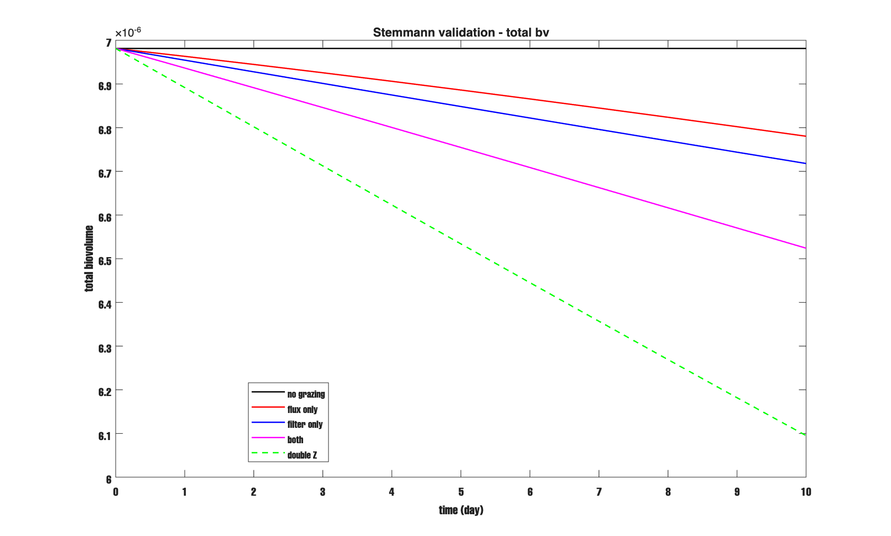

*Figure 11. Total column biovolume vs time, Stemmann parameters. No grazing (black) is flat. Flux only (red), filter only (blue), both (magenta), double Z (green dashed) show small and ordered removal. At these slow grazing rates ($c Z_c = 7.7 \times 10^{-3}$ day⁻¹), the curves barely separate over 10 days.*

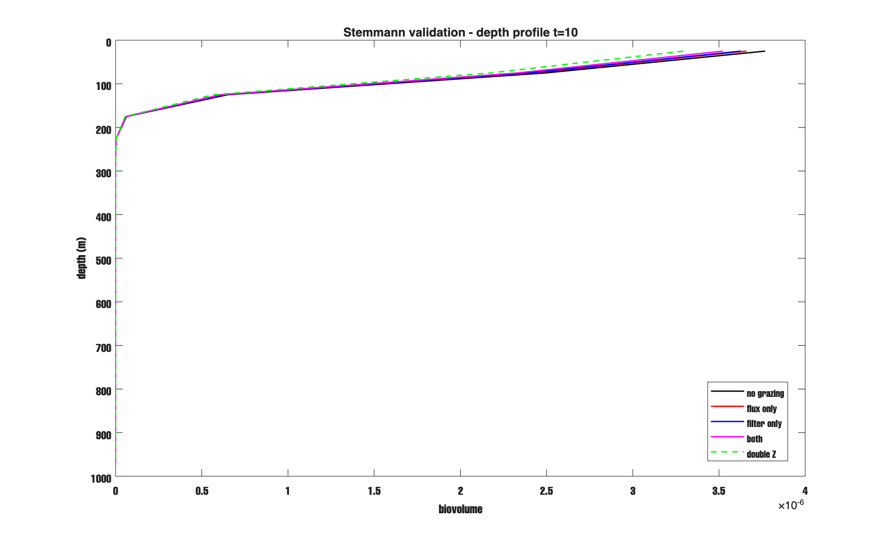

*Figure 12. Depth profile at $t = 10$. All five cases are nearly identical — at these rates and this run length, grazing has not changed the depth structure yet. The difference is visible only in the total biovolume plot.*

The total biovolume decrease in 10 days is in the expected range. For filter-only it is −3.772%, very close to the simple estimate from net removal rate $(1-p)cZ_c \approx 3.8 \times 10^{-3}$ day⁻¹ over 10 days. This also matches the 0-D slab trend (about −3.6% for filter-only at day 10). At these slow rates the 10-day run is mostly a grazing test, with very little transport effect.

The depth profile (Figure 12) shows all cases nearly identical — particles have not had time to sink or diffuse meaningfully in 10 days. This is expected and confirms that the depth model is not doing anything unexpected on short time scales.

---

## 13. Summary

The 1-D zooplankton tests confirm the 0-D results and add new depth structure.

**Wiring.** Dropping the same `ZooplanktonGrazing` object at each depth layer gives physically sensible results. The 60-day pulse test without production conserves biovolume exactly when grazing is off (0.00%), and removes the expected fraction when it is on (−58.7%, close to the 0-D slab at −53.6%).

**Egestion fraction.** Higher $p$ reduces net removal, as in the slab. The new 1-D feature: at $p = 0.9$, fecal pellets in bin 2 create a mid-depth biovolume bulge around 200–500 m. This sinking-fecal signal has no 0-D analogue.

**Filter vs flux feeders.** Both feeding types remove nearly the same total biovolume (−54.2% vs −55.4%). Flux feeders preferentially remove large particles — at bin 10, flux-only leaves 1.33× less surface biovolume than filter-only. With $\mu\phi_1$ production the differential is smaller than with a constant source because the steady-state size distribution is different. The large-bin crossover seen in the 0-D slab disappears here because fecal recycling is broken by vertical transport.

**Steady state.** The with-grazing case reaches $4.999 \times 10^{-6}$ by day 500, declining at only $-2.26 \times 10^{-10}$ day⁻¹ — essentially flat. The change from the no-grazing case (which keeps growing) is $-82.6\%$. The process budget shows net grazing ($6.63 \times 10^{-8}$ day⁻¹) is the dominant sink, accounting for 91% of production ($7.31 \times 10^{-8}$ day⁻¹). Bottom flux (total $1.04 \times 10^{-10}$ day⁻¹) is 0.14% of production — negligible. Budget residual is ~9.5%, meaning the system is close to but not yet at true steady state at t = 500.

**Zooplankton density.** With $\mu\phi_1$ production, high $Z_c$ gives stronger suppression than the constant-source tests: doubling $Z_c$ from 50 to 100 gives 22 pp gain; 100 to 200 gives 16.5 pp more (to 94.2% total removal). The negative feedback amplifies the response — higher grazing also suppresses production.

**Clearance rate.** Incremental gains: 9.2, 11.4, 9.2 pp. At $4c$ the system loses 98.3% of the no-grazing baseline — near-complete suppression. The $\mu\phi_1$ feedback makes high $c$ much more effective than under a constant source.

**Identifiability.** The 0-D result ($c Z_c$ is the only observable for filter feeders) holds only when $Z_f$ is kept fixed. Changing $Z_f$ alongside $Z_c$ breaks it because flux feeders are a separate process. Runs A and B (same $c Z_c$, halved $Z_f$) differ by 38% in total biovolume.

**Production mode.** All 1-D sensitivity tests (§6–11) use the same $\mu\phi_1$ growth term as the 0-D slab ($\mu = 0.1$ day⁻¹, applied to layer 1 bin 1 only). This ensures the stabilizing negative feedback is present. The constant source mode remains available via `surface_pp_rate` in `SimulationConfig` but is no longer used in the main tests.

**Stemmann validation.** The same 5-case Stemmann 2004 test run in 1-D gives results consistent with the 0-D slab — approximately 3–4% total removal in 10 days at the slow Table 3 grazing rates. The depth structure does not change at these short time scales, confirming the wiring is correct.

---

## 14. Terms

**$c$** — Clearance rate of filter feeders [m³ ind⁻¹ day⁻¹]. §2, eq. (4).

**$C_i$** — Consumption rate from bin $i$ [cm³ cm⁻³ day⁻¹]. §2, eq. (6).

**$D_i$** — Fecal return tendency [cm³ cm⁻³ day⁻¹]. Non-zero only at bin $i_c + 1$. §2, eq. (7).

**$i_c$** — Fecal pellet threshold bin. Fecal return goes to bin $i_c + 1$. §2.

**$p$** — Egestion fraction [—]. Fraction of consumed biovolume returned as fecal pellets. §6.

**$R_\mathrm{FF}$** — Filter feeder removal rate [day⁻¹]. Size-independent. §2, eq. (4).

**$R_\mathrm{FL}(i)$** — Flux feeder removal rate for bin $i$ [day⁻¹]. Scales with $w_i$. §2, eq. (5).

**$s$** — Capture cross-section of flux feeders [m² ind⁻¹]. §2.

**$S$** — Surface production rate [bv day⁻¹]. Fixed constant source added to layer 1, bin 1 each day. §1, eq. (3).

**$w_i$** — Settling speed of particles in bin $i$. Used as m day⁻¹ inside `graze` after conversion from cm/s. §1, §2.

**$Y_k$** — Biovolume concentration vector at depth layer $k$ [cm³ cm⁻³], length n_sec. §1.

**$Z_c$** — Filter feeder concentration [ind m⁻³]. §2.

**$Z_f$** — Flux feeder concentration [ind m⁻³]. §2.

---

*Scripts: `scripts/run_1d_zoo_compare.m`, `run_1d_p_sweep.m`, `run_1d_ff_vs_flux.m`, `run_1d_steadystate.m`, `run_1d_Zc_sweep.m`, `run_1d_c_sweep.m`, `run_1d_pp_compare.m`, `run_1d_stemmann.m`*
*Source files: `src/ColumnRHS.m`, `SimulationConfig.m`, `ZooplanktonGrazing.m`*
