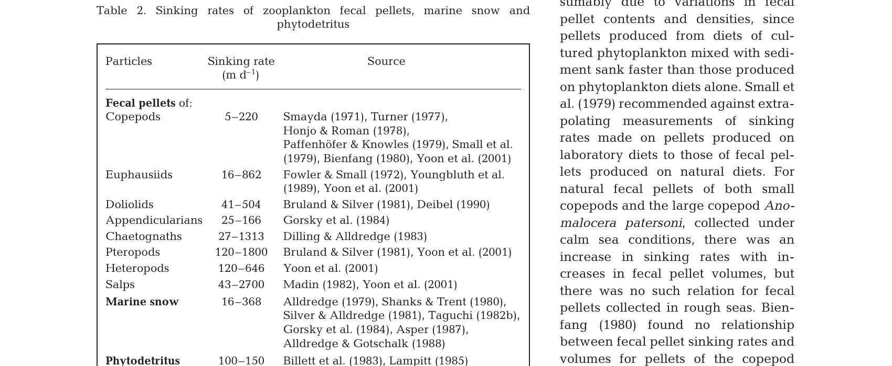
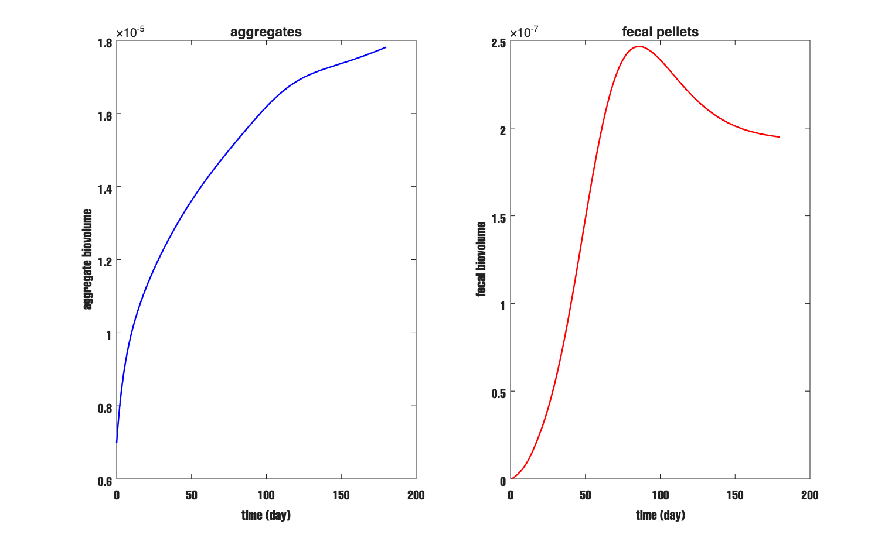
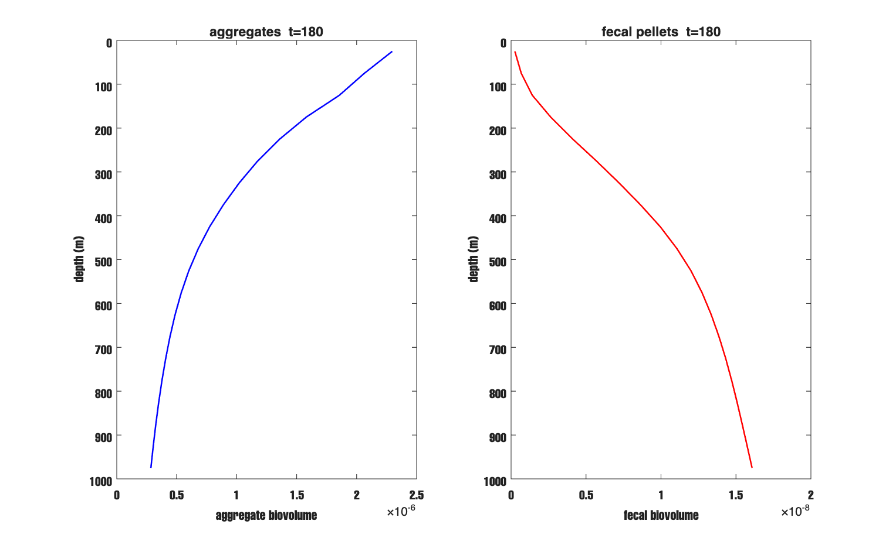
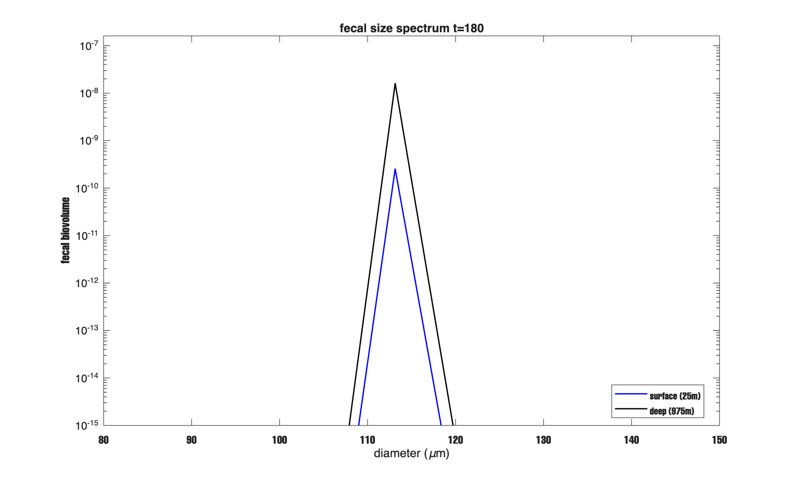
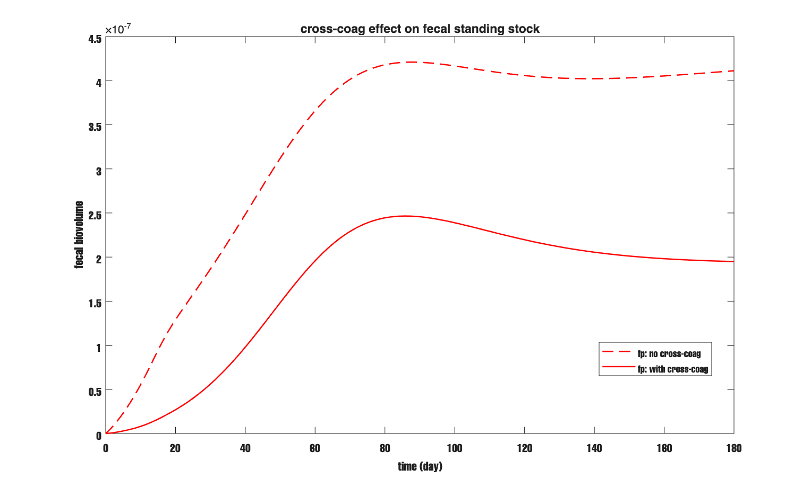
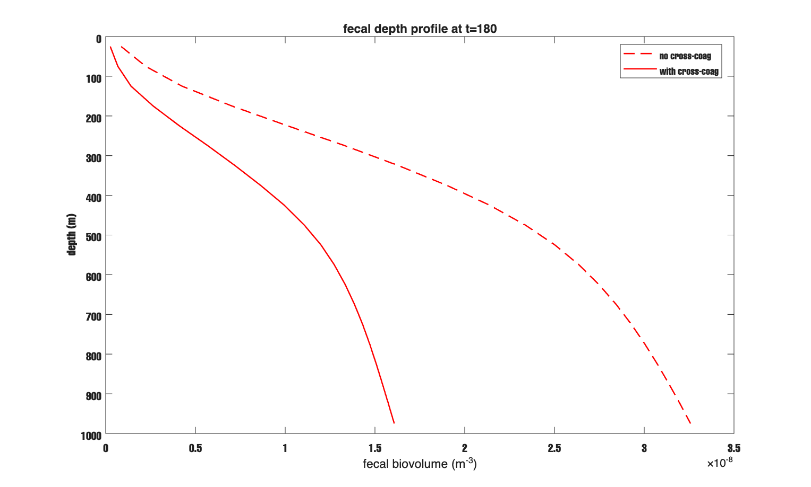
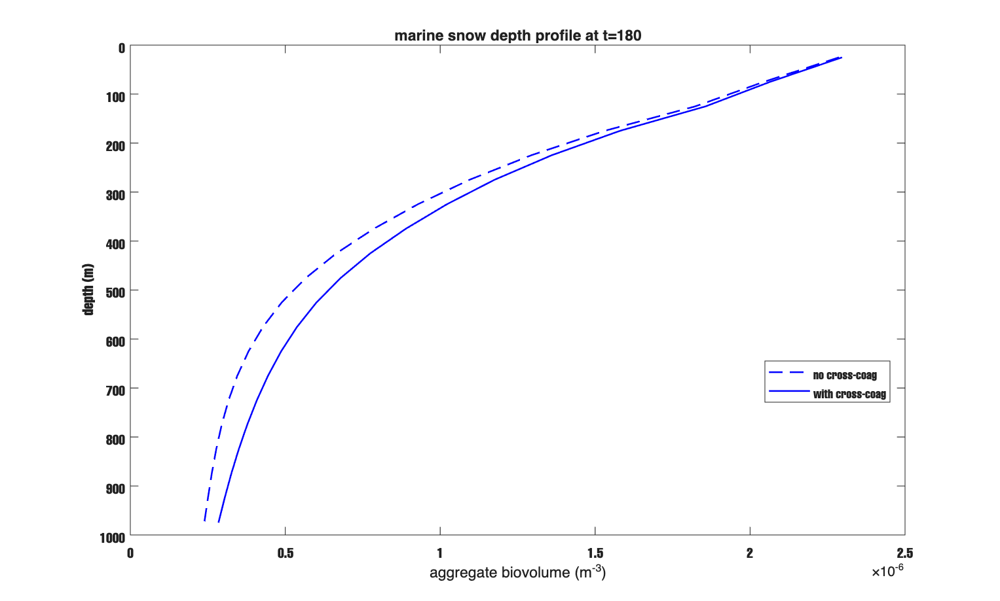
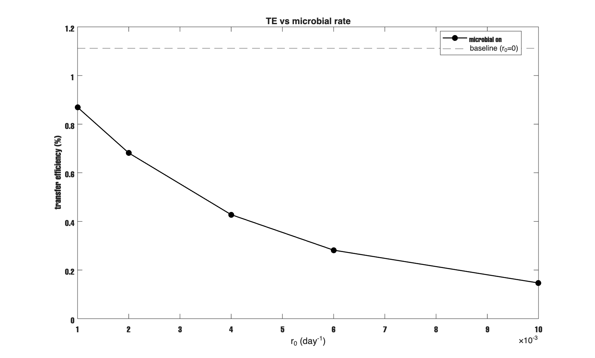
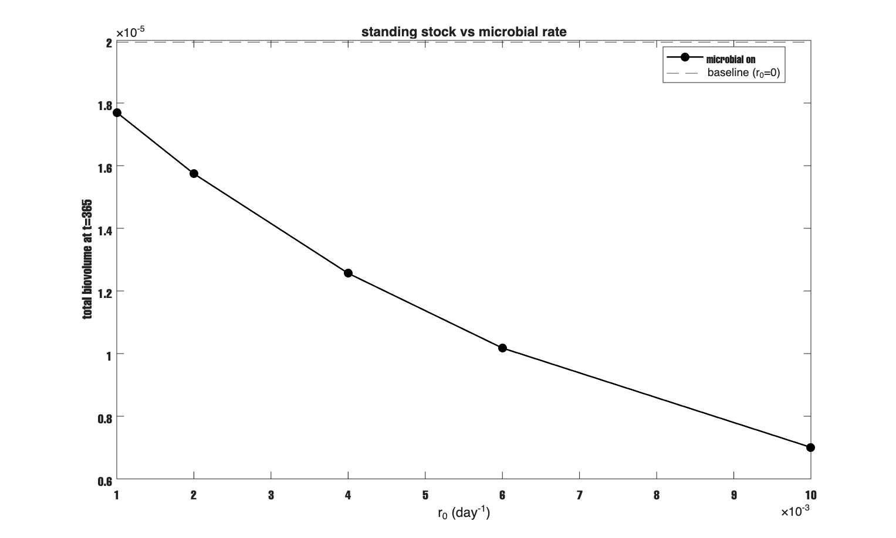

# Report — May 28, 2026
## Fecal Pellets as a Separate Population, Cross-Coagulation, and Microbial Remineralization

---

## Contents

1. Where I started and what had to be fixed first
2. Separate fecal array (Y_fp)
3. Stokes sinking for fecal pellets
4. Cross-coagulation (FecalCrossCoag.m)
5. Results
6. Microbial remineralization
7. questions
8. Current model state


---

## 1. Where I Started and What Had to Be Fixed First

Before getting to fecal pellets, I had to fix three things that were wrong in the model. These matter because they affect everything downstream.

**Zooplankton concentrations were way too high.** The old model used constant Zc = 100 ind/m³ and Zf = 50 ind/m³ at every depth. I looked at Stemmann et al. (2004) Fig 1 and the maximum filter feeder concentration there is 0.307 ind/m³. The old default was 325 times too large. The model was over-grazing the whole column by two to three orders of magnitude. I replaced the constant values with depth-varying profiles from Stemmann Fig 1:

$$Z_c(z) = 0.307 \times R_\mathrm{FF}(z), \qquad Z_f(z) = 0.063 \times R_\mathrm{FL}(z)$$

where R_FF and R_FL are relative profiles interpolated from the Fig 1 control points. Filter feeders peak at ~375 m. Flux feeders increase monotonically with depth. Note that with the old Zc = 100, the column total biovolume at t = 180 days was 5.09 × 10⁻⁶. With the Stemmann profiles it is 2.28 × 10⁻⁵ — 4.5 times more. The old model was removing so much material from the upper layers that almost nothing reached depth. With realistic concentrations, sinking rather than grazing controls the vertical profile shape. That is more physical.

**The fecal pellet bin was wrong.** Output was going to bin 2 (~29 μm). Real copepod fecal pellets are 100 to 150 μm. I confirmed the right bin using allometric equations from Countryman, Steinberg, and Burd (2022). Fecal pellet volume scales with prosome length L_p [mm] as:

$$\log_{10}(V_{fp}) = 2.474 \times \log_{10}(L_{p,\mathrm{mm}}) + 5.226$$

Converting volume to equivalent spherical diameter gives the bin. For medium copepods:

| PL (mm) | ESD (μm) | Bin |
|---|---|---|
| 0.95 | 65.7 | 6 |
| 1.50 | 95.7 | 7 |
| **2.00** | **121.3** | **8** |
| 2.40 | 141.0 | 9 |

A typical medium copepod at PL = 2.0 mm gives ESD = 121 μm, which maps to bin 8. Setting `zoo_ic = 7` (bin 8, d = 113 μm) is correct. The old `zoo_ic = 1` would require PL < 0.3 mm, which is not realistic.

**Transfer efficiency was 49% — a grid artifact.** The first full 1-D run (n = 20, dt = 1 day) gave TE = 49% at 1000 m. The real North Atlantic is roughly 1 to 15%. The problem was the grid ceiling. With n = 20, the largest bin is 1.81 mm. D_max grows from 1.0 mm at the surface to 8.4 mm at 975 m (from the Kolmogorov-based formula D_max = A × ε(z)^(-1/4)). Below about 225 m, D_max exceeds the grid ceiling and the disaggregation step is silently skipped. Large aggregates pile up and sink to 1000 m intact.

I also ran a SLAMS comparison to understand this. In a pure-coagulation slab run (no sinking, no disaggregation), volume in the sectional ODE started disappearing sharply at day 18 — exactly when particles first hit the top bin. Once bin-N particles coagulate, the merged product should go to bin N+1, which does not exist. The loss term subtracts volume from bin N but the gain term has nowhere to land. SLAMS instead snaps merged products back to bin N, conserving volume but creating an artificial spike at the top bin. Both are truncation artifacts. In the real 1-D model this does not happen — sinking and disaggregation remove particles before they pile at the ceiling.

The fix was to use n = 30. The grid ceiling becomes 18.25 mm, well above D_max everywhere. Disaggregation now runs at every depth layer. Note that dt = 0.4 day is needed because the Courant-Friedrichs-Lewy (CFL) number grows with bin size — at n = 30 and dt = 1 day, CFL = 1.92, which is unstable.

| | n=20, dt=1.0 | n=30, dt=0.4 | Ocean range |
|---|---|---|---|
| Transfer efficiency | 49% | **1.1%** | 1 to 15% |
| Disagg active to | ~225 m | ~975 m | |
| Deep max bin | 20/20 (at ceiling) | 21/30 | |

TE dropped by a factor of 45 and is now in the physically realistic range. The deep max bin = 21/30 (~2.3 mm) confirms particles are not piling at the ceiling.

So the model was in good shape — n = 30, TE = 1.1%, Stemmann zoo profiles, zoo_ic = 7. The remaining problem was that fecal pellets were still mixed into the aggregate array Y (aggregates). They coagulated, disaggregated, and sank at the same speed as marine snow of the same size. That is not right. Fecal pellets are compact and dense. They behave very differently from porous marine snow aggregates. That is what Phase 6 addresses.

I tried to follow the approach in Tinna Jokulsdottir (2011) — tracking fecal pellets separately, giving them their own sinking speed, and adding cross-coagulation with marine snow. I'm not fully sure about every parameter choice, especially α_cross, and I flag those at the end.

---

## 2. Separate Fecal Array (Step 1)

The first thing that needed to change was in `ZooplanktonGrazing.graze()`. Before, this returned one output — `dvdt`, the net tendency for the aggregate array Y (aggregates), with fecal return already mixed back in. Now it returns a second output `fp_flux`, the total fecal biovolume produced per day at this depth layer:

```matlab
function [dvdt, fp_flux] = graze(obj, v, w_cms, Zc_in, Zf_in)
    ...
    sum_consumed = sum(consumed);
    fp_flux = obj.p * sum_consumed;   % egestion [bv/day]
    dvdt = -consumed;                 % losses only, no fecal return
end
```

Note that this change is backward-compatible — old calls with one output still work fine. The key idea is that `dvdt` now represents pure grazing loss. No fecal material is returned to Y. Instead, `fp_flux` goes into Y_fp (fecal pellets) at the correct production bin.

Now in `ColumnRHS.stepY()`, the grazing loop routes the fecal flux into Y_fp at bin 8:

```matlab
target_bin = max(1, min(n_sec, round(obj.zoo.ic) + 1));   % bin 8 for zoo_ic=7

for k = 1:n_z
    v_k   = Y_new(k, :)';
    w_cms = obj.w_z(k, :)' .* (100 / day_to_sec);
    [dvdt, fp_flux] = obj.zoo.graze(v_k, w_cms, ...
                          obj.profile.Zc(k), obj.profile.Zf(k));

    Y_new(k, :) = max(v_k + dt .* dvdt, 0)';
    Yfp_new(k, target_bin) = max(0, ...
        Yfp_new(k, target_bin) + dt * fp_flux);
end
```

The first thing to note is that `target_bin` is computed once before the loop — it is the same at every depth because `zoo_ic` is a global model parameter. Then for each depth layer k, grazing removes material from Y (aggregates) and the egested fraction goes directly into Y_fp (fecal pellets) at bin 8. The `max(0,...)` on both arrays prevents numerical negatives from accumulating.

`ColumnSimulation.run()` was updated to carry Y_fp as a separate array through the full time loop and save it in the output struct alongside Y.

---

## 3. Stokes Sinking for Fecal Pellets (Step 2)

Turner (2002) reviews fecal pellet sinking speeds across many species (his Table 2, reproduced below). Copepod fecal pellets range from 5 to 220 m/day. Marine snow ranges from 16 to 368 m/day in the same review. The wide overlap means size alone does not explain the difference — density does. Fecal pellets are compact and dense. Marine snow is porous and nearly neutrally buoyant.



*Table 2 from Turner (2002). Sinking rates of zooplankton fecal pellets, marine snow and phytodetritus.*

For a dense compact sphere settling at low Reynolds number, the drag force is F_drag = 6πμrw (Stokes 1851). At terminal velocity, drag balances the net downward force:

$$6\pi\mu r\,w = \tfrac{4}{3}\pi r^3\,\Delta\rho\,g$$

Solving for w and using μ = ρ_f ν gives:

$$w_\mathrm{fp}(r) = \frac{2}{9}\,\frac{\Delta\rho}{\rho_f}\,\frac{g\,r^2}{\nu} \quad \text{[cm/s]} \tag{1}$$

Here Δρ is the excess density above seawater [g/cm³], ρ_f = 1.0275 g/cm³, g = 980 cm/s², r [cm] is the equivalent sphere radius, and ν = 0.01 cm²/s is kinematic viscosity. This form is valid when the Reynolds number Re = 2rw/ν << 1 — I check this below. Komar et al. (1981) confirmed that a modified Stokes equation gives a reasonable fit to measured sinking speeds of cylindrical copepod and euphausiid fecal pellets, and that most variation in sinking rates comes from diet-related differences in pellet density.

I use Δρ = 0.15 g/cm³. I'm not sure exactly where this specific number came from — Komar et al. (1981) and Turner (2002) do not give a single density value directly. I chose it as a representative mid-range value. The indirect check is that the resulting speed at bin 8 (69 m/day) falls well within the Turner copepod range of 5 to 220 m/day, so it is not unreasonable. This should be verified against actual density measurements before any EXPORTS comparison. ????

The code is in `SettlingVelocityService.velocityFecalPellets`:

```matlab
function v = velocityFecalPellets(grid, cfg)
    del_rho = cfg.fp_excess_density;      % default 0.15 g/cm^3
    r = grid.dcomb / 2;                   % bin lower-bound radius [cm]
    v = (2/9) .* (del_rho ./ cfg.rho_fl) .* cfg.g .* r.^2 ./ cfg.kvisc;
    v(~isfinite(v)) = 0;
    v(v < 0) = 0;
end
```

Note that `dcomb(k)` is the lower-bound diameter of bin k, not the midpoint. At bin 8, dcomb(8) = d₀ × 2^(7/3) = 0.002 × 5.040 = 0.01008 cm, so r = 0.00504 cm (100.8 μm). Let's work through the numbers at the reference condition (ν_ref = 0.01 cm²/s):

$$w_\mathrm{fp,ref} = \frac{2}{9} \times \frac{0.15}{1.0275} \times \frac{980 \times (0.00504)^2}{0.01} \approx 0.0807 \text{ cm/s} = 69.8 \text{ m/day} \tag{2}$$

The Reynolds number check: Re = 2r × w / ν = 2 × 0.00504 × 0.0807 / 0.01 = 0.081. Since Re << 1, Stokes drag is valid here.

At the surface layer (z = 25 m, T ≈ 19.6°C), the depth profile gives ν(z) ≈ 0.01008 cm²/s. The depth-correction factor is ν_ref/ν(z) = 0.01/0.01008 = 0.992, giving w_surf = 69.2 m/day — consistent with the model printout.

Now compare this to the aggregate sinking speed. The Kriest-8 speed at bin 8 is 4.1 m/day. The ratio is 16.8×. A fecal pellet crosses 1000 m in about 14 days. A marine snow aggregate of the same size takes roughly 240 days. That is a large difference and it matters for the column budget.

`ColumnRHS` stores a second velocity field `w_fp_z` (n_z × n_sec [m/day]) with the same viscosity depth correction as for aggregates. Transport then uses `w_fp_z` for Y_fp (fecal pellets):

```matlab
Yfp_new = ColumnTransport.step(Yfp, obj.w_fp_z, obj.profile.Kz, ...
                                obj.col_grid.dz, dt);
```

`fp_excess_density = 0.15` was added to `SimulationConfig` as a tunable parameter.

---

## 4. Cross-Coagulation (Step 3)

### The physical rule

Jokulsdottir (2011, p. 62) is explicit on this: "A fecal pellet remains a fecal pellet until it is fragmented or coagulates with another particle. At that point it ceases to be a fecal pellet and becomes an aggregate, the only difference being the fractal dimension."

Note that "another particle" technically includes other fecal pellets. I do not include fecal-fecal coagulation here. At bin 8, all fecal pellets have nearly the same sinking speed, so the differential settling kernel gives |Δw| ≈ 0 between two pellets of the same size. The shear kernel between two 115 μm pellets is small and I neglect it as a first approximation. So cross-coagulation here means: a fecal pellet hits a marine snow aggregate, is absorbed, Y_fp (fecal pellets) loses the pellet volume and Y (aggregates) gains it.

### The collision kernel

At bin 8 (~115 μm), Brownian motion is negligible — it matters only below ~1 μm. Differential settling (DS) dominates because

$$|\Delta w| = |w_{\mathrm{fp},i} - w_{\mathrm{agg},j}| \quad \text{[m/day]}$$

At bin 8, this gives |69.2 − 4.1| = 65.1 m/day for a fecal-aggregate pair. Two aggregates of similar size would have a much smaller |Δw|. DS dominates the cross-coagulation rate by a large margin.

I use the curvilinear DS kernel:

$$\beta^\mathrm{cross}_{ij} = \alpha_\mathrm{cross} \cdot \frac{\pi}{2} \cdot r_{\min}(i,j)^2 \cdot |\Delta w_{ij}| \cdot 100 \quad \text{[cm}^3\text{/day]} \tag{3}$$

Here r_min(i,j) = min(r_i, r_j) [cm] is the curvilinear correction — the smaller particle sets the effective collision cross-section. The factor of 100 converts Δw from [m/day] to [cm/day]. Note that I'm not sure the π/2 factor is exactly right here. The standard rectilinear DS kernel uses π/4 × (r_i + r_j)². For the curvilinear limit where one particle is much smaller, some references use π × r_min² and others π/4 × r_min². This needs to be traced to a specific derivation before the model is used for data comparison — a factor-of-2 error here propagates into all cross-coagulation rates. ????

### Choosing α_cross = 0.5

There is no direct measurement for this. Fecal pellets are compact and have low porosity. TEP (transparent exopolymer particles) is what makes marine particles sticky, and TEP coats porous aggregates much more than dense fecal pellets. Jokulsdottir (2011) notes their reduced stickiness compared to fresh aggregates. SLAMS-2.0 (James et al. 2026) uses α = 0.50 for phytoplankton, the stickiest common particle type. Since fecal pellets are less sticky than fresh phytoplankton, 0.5 is a conservative upper bound. I start here and expose it as `fp_alpha_cross` in `SimulationConfig`. This is a fudge factor and needs sensitivity testing before any comparison to data. ????

### Volume conservation

When a fecal pellet at bin i merges with an aggregate at bin j, three things happen: Y_fp (fecal pellets) at bin i loses v_i, Y (aggregates) at bin j loses v_j, and Y at the target bin k gains v_i + v_j. In volume rate form:

$$\frac{dY_{\mathrm{fp},i}}{dt} = -\sum_j \frac{\beta^\mathrm{cross}_{ij}}{v_j}\,Y_{\mathrm{fp},i}\,Y_j \tag{4}$$

$$\frac{dY_j}{dt}\bigg|_\mathrm{loss} = -\sum_i \frac{\beta^\mathrm{cross}_{ij}}{v_i}\,Y_{\mathrm{fp},i}\,Y_j \tag{5}$$

$$\frac{dY_k}{dt}\bigg|_\mathrm{gain} = \sum_{\substack{i,j \\ v_i+v_j \in \mathrm{bin}\,k}} \frac{\beta^\mathrm{cross}_{ij}(v_i+v_j)}{v_i\,v_j}\,Y_{\mathrm{fp},i}\,Y_j \tag{6}$$

### How FecalCrossCoag.m works

All kernel matrices are precomputed once at construction:

```matlab
% precomputed at surface [cm^3/day / (bv^2)]
B_loss_fp(i,j)  = alpha_cross * beta_ref(i,j) / v(j)
B_loss_agg(i,j) = alpha_cross * beta_ref(i,j) / v(i)
B_gain(i,j)     = alpha_cross * beta_ref(i,j) * (v(i)+v(j)) / (v(i)*v(j))
target_bin(i,j) = bin k where v(i)+v(j) falls
```

At runtime, `apply(Y, Yfp, dt, ds_scale)` scales by ds_scale(k) = ν_ref/ν(k) and updates both arrays:

```matlab
outer   = Yfp * Y';
dYfp    = -dt .* sum(ds_scale .* B_loss_fp  .* outer, 2);
dY_loss = -dt .* sum(ds_scale .* B_loss_agg .* outer, 1)';
dY_gain = accumarray(target_bin(valid), dt.*ds_scale.*B_gain.*outer, [n,1]);

Yfp_new = max(Yfp + dYfp, 0);
Y_new   = max(Y   + dY_loss + dY_gain, 0);
```

What is going on here is that the entire computation reduces to an outer product — no inner loops are needed at runtime. Note that ds_scale(k) is the same depth factor used for regular differential settling. Since both w_fp and w_agg scale with ν_ref/ν(k), the velocity difference |Δw| also scales by ds_scale(k), so applying it to the reference β_cross is exact, not an approximation.

`ColumnRHS.stepY()` calls this at every depth layer after zooplankton grazing:

```matlab
if ~isempty(obj.cross_coag)
    for k = 1:n_z
        sd = obj.ds_scale(k);
        [Y_new(k,:), Yfp_new(k,:)] = obj.cross_coag.apply( ...
            Y_new(k,:)', Yfp_new(k,:)', dt, sd);
    end
end
```

---

## 5. What the Model Showed

### 5.1 Sinking speed test (t = 180 days, n=30, cross-coag off)

The first run after Steps 1 and 2 confirmed that fecal pellets were being tracked and sinking correctly. At t = 180 days, Y_fp (fecal pellets) had grown from zero to about 1.1% of total biovolume. No negatives appeared in either Y or Y_fp. The fecal standing stock stays low because fast sinking (69 m/day) removes most of what is produced before it can accumulate.

The sinking speed printout confirmed the physics:

```
Marine snow (Kriest-8) at bin 8:  4.1 m/day
Fecal pellet (Stokes):            69.2 m/day
Ratio:                            16.8x
```

Figure 5.1 shows each standing stock separately on its own scale — a shared y-axis would make the fecal signal invisible.



*Figure 5.1. Total biovolume vs time. Left: aggregate biovolume (blue). Right: fecal pellet biovolume (red). Fecal pellets reach ~1.1% of aggregate volume at t = 180 because fast sinking continuously clears them.*

Figure 5.2 shows depth profiles at t = 180. Aggregates spread across the full column because slow sinking allows material to build up at all depths. Fecal pellets drop steeply because fast sinking clears them from the upper column quickly.



*Figure 5.2. Depth profiles at t = 180. Left: aggregate biovolume vs depth (blue). Right: fecal pellet biovolume vs depth (red). The steeper fecal profile is consistent with 16.8× faster sinking.*

Figure 5.3 shows the fecal size spectrum at surface and depth. Both show a single spike at the production bin. There is no spread because fecal pellets do not coagulate with each other and there is only one source bin.



*Figure 5.3. Fecal pellet size spectrum at t = 180: surface 25 m (blue) vs deep 975 m (black). Single spike at bin 8. Y-axis truncated at 10⁻¹⁵.*

### 5.2 Cross-coagulation test (t = 180 days, n=30)

I ran two cases: α_cross = 0.5 (cross-coag ON) vs α_cross = 0 (cross-coag OFF). Results at t = 180:

| | Cross-coag ON | Cross-coag OFF | Change |
|---|---|---|---|
| Marine snow Y (aggregates) | 1.782 × 10⁻⁵ | 1.630 × 10⁻⁵ | +9.3% |
| Fecal Y_fp (fecal pellets) | 1.949 × 10⁻⁷ | 4.112 × 10⁻⁷ | −52.6% |
| Total | 1.801 × 10⁻⁵ | 1.671 × 10⁻⁵ | +7.8% |

Both checks passed. Fecal standing stock is lower with cross-coag on. Marine snow is higher. The direction is right.

The +7.8% total biovolume with cross-coag ON is not a conservation error. Without cross-coag, fecal pellets sink at 69 m/day and leave the column in about 14 days. With cross-coag, a fraction is absorbed into marine snow (4 m/day) and retained for months instead. Higher residence time means higher standing stock. The column is not gaining material from nowhere — it is losing material more slowly.

Figure 5.4, 5.5, and 5.6 show fecal biovolume vs time, fecal depth profiles, and marine snow depth profiles for the two cases.



*Figure 5.4. Fecal biovolume vs time: without cross-coag (red dashed) vs with cross-coag (red solid). Cross-coag steadily removes fecal pellets as they are absorbed into marine snow.*



*Figure 5.5. Fecal depth profile at t = 180: without cross-coag (red dashed) vs with cross-coag (red solid). Depletion is stronger in the upper layers where marine snow concentration is highest.*



*Figure 5.6. Marine snow depth profile at t = 180: without cross-coag (blue dashed) vs with cross-coag (blue solid). Marine snow is higher everywhere with cross-coag on.*

---

## 6. Microbial Remineralization

### Why I added this

The biological pump does not just move particles downward — bacteria attached to sinking particles consume and remineralize organic matter as they sink. This is one of the main reasons flux attenuates strongly with depth in the mesopelagic. SLAMS-2.0 (James et al. 2026) explicitly lists "Microbial respiration and solubilisation of POC" as a separate process (Section 3.3.11 of their model). It made sense to include at least a simple version in our model too.

The key paper here is Iversen and Ploug (2013). They measured carbon-specific respiration rates of bacteria on sinking diatom aggregates across a range of temperatures (2 to 15°C). Their main finding is that respiration rate increases strongly with temperature — roughly a factor of 2 per 10°C (Q10 ≈ 2). They also note that aggregate sinking velocity changes with temperature through viscosity. The implication is that particles sinking through the warm surface layer are degraded much faster than particles in the cold deep. Marsay et al. (2015) showed this pattern in real flux data — the Martin curve exponent b is positively correlated with temperature in the mesopelagic. That is the physical motivation for adding a temperature-dependent microbial loss.

I added a first-order loss as a starting point. Every particle loses a fraction r [day⁻¹] of its biovolume per day:

$$\frac{dY}{dt}\bigg|_\mathrm{microbe} = -r\,Y \tag{7}$$

I'm not sure this is the correct functional form — it is the simplest possible assumption. In reality, bacterial degradation rate depends on particle size, surface area, organic content, temperature, and community composition. I treat r as a tunable parameter for now and plan to constrain it from EXPORTS flux attenuation data.

I apply the same loss to Y_fp (fecal pellets), with a separate multiplier (`microbe_fp_mult`) in case fecal pellets degrade at a different rate. I'm genuinely not sure what that multiplier should be — I left it at 1.0 by default.

### Implementation

The code block in `ColumnRHS.stepY()` is:

```matlab
if isprop(obj.cfg_orig,'enable_microbe') && obj.cfg_orig.enable_microbe
    d_cm = obj.size_grid.dcomb(:);
    for k = 1:n_z
        r = obj.cfg_orig.microbe_r0;
        if obj.cfg_orig.microbe_use_temp
            T_C = obj.profile.T_K(k) - 273.15;
            r = r * obj.cfg_orig.microbe_q10 ^ ...
                ((T_C - obj.cfg_orig.microbe_tref_C) / 10);
        end
        if obj.cfg_orig.microbe_gamma_size ~= 0
            r_vec = r .* (d_cm / obj.cfg_orig.microbe_dref_cm) .^ ...
                        (-obj.cfg_orig.microbe_gamma_size);
        else
            r_vec = r * ones(obj.cfg_orig.n_sections, 1);
        end
        Y_new(k,:)   = Y_new(k,:)'   .* exp(-dt .* r_vec);
        Yfp_new(k,:) = Yfp_new(k,:)' .* exp(-dt .* r_vec ...
                           .* obj.cfg_orig.microbe_fp_mult);
    end
end
```

The first thing to note is that I use the exact exponential form Y_new = Y × exp(−r·Δt), not the Euler approximation Y_new = Y(1 − r·dt). The Euler form can go negative if r or dt is large. The exponential form is stable for any r·Δt. This step runs as Step 6 in `stepY()`, after disaggregation.

There are three optional scalings built in. The temperature scaling (Q10) follows Iversen and Ploug (2013): r(T) = r0 × Q10^((T − T_ref)/10). With Q10 = 2 and T_ref = 20°C, this gives r ≈ r0 at the warm surface and r ≈ 0.33 × r0 in the cold deep (around 4°C). The size scaling (gamma_size) lets larger particles degrade more slowly, reflecting lower surface-area-to-volume ratio. Both are off by default — I'm not confident enough in the right parameter values to turn them on yet.

Eight parameters were added to `SimulationConfig`: `enable_microbe`, `microbe_r0`, `microbe_fp_mult`, `microbe_use_temp`, `microbe_q10`, `microbe_tref_C`, `microbe_gamma_size`, `microbe_dref_cm`. All are off by default — existing runs are unchanged.

### Sensitivity

A coarse sweep (r0 = 0, 0.01, 0.03, 0.1 day⁻¹) showed right away that anything above 0.01 day⁻¹ is too strong for this column. At r0 = 0.1, total biovolume drops to 1.9 × 10⁻¹⁴ — essentially nothing left. These large values match the Iversen and Ploug (2013) lab measurements in warm (10 to 15°C) surface water. They are not appropriate for a 1000 m cold water column with a uniform r0.

A narrow sweep from 0 to 0.01 day⁻¹ gave a clearer picture. Table 1 shows TE and aggregate biovolume at t = 365 days.

| r0 (day⁻¹) | TE (%) | TE change | agg bv |
|---|---|---|---|
| 0 | 1.11 | baseline | 1.994 × 10⁻⁵ |
| 0.001 | 0.87 | −22% | 1.770 × 10⁻⁵ |
| 0.002 | 0.68 | −39% | 1.574 × 10⁻⁵ |
| 0.004 | 0.43 | −61% | 1.256 × 10⁻⁵ |
| 0.006 | 0.28 | −75% | 1.018 × 10⁻⁵ |
| 0.01 | 0.15 | −86% | 7.006 × 10⁻⁶ |

*Table 1. TE and aggregate biovolume (Y only) vs r0. n=30, dt=0.4 day, t=365 days, full physics on.*

Figure 6.1 shows TE vs r0. Figure 6.2 shows aggregate biovolume vs r0 at t = 365.



*Figure 6.1. TE vs r0. Dashed line is the baseline at 1.11%. Doubling r0 from 0.001 to 0.002 day⁻¹ removes an additional 17% of the baseline TE.*



*Figure 6.2. Aggregate biovolume at t=365 vs r0. Note: script sums Y (aggregates) only, not Y+Y_fp. Standing stock decreases monotonically but less steeply than TE.*

The baseline TE (r0 = 0) is already 1.11%, near the low end of the observed ocean range. Deep disaggregation and zooplankton grazing are already strong sinks — microbial loss adds on top of them.

TE drops faster than total biovolume because microbial loss hits slow-sinking deep particles hardest. A small aggregate near 1000 m may have spent 200 days in the water column. At r0 = 0.002 day⁻¹ it retains exp(−0.002 × 200) = 0.67 of its biovolume — meaning 33% was lost to bacteria before reaching the bottom. The bottom flux drops steeply while the surface layer is continuously replenished by production. So TE falls more than the column total.

To keep TE at or above 0.5%, r0 must stay at or below ~0.003 day⁻¹ with temperature scaling off. The realistic column-integrated rate for the North Atlantic mesopelagic is probably in this range. Turning on Q10 scaling would give higher r near the surface and lower r at depth — that is more physical and is the right next step before calibrating against data.

---

## 7. some Questions i have now!

**On α_cross = 0.5.** This is a judgment call with no direct measurement behind it. The 52.6% reduction in fecal standing stock at t = 180 scales directly with α_cross. Sensitivity tests at α_cross = 0.1, 0.25, and 0.5 would bracket the uncertainty. Sediment traps show fecal pellets both embedded in aggregates and as free-standing particles, so both extremes seem unrealistic. ????

**On the π/2 factor in the cross-coagulation kernel.** I'm not sure this is right. The standard rectilinear DS kernel uses π/4 × (r_i + r_j)². For the curvilinear limit when one particle is much smaller, some references use π × r_min² and others π/4 × r_min². This should be traced to a specific equation before the model is used for data comparison. A factor-of-2 error here propagates into all cross-coagulation rates. ????

**On Δρ = 0.15 g/cm³.** I'm not sure where this exact value came from. It gives a sinking speed within the Turner (2002) copepod range, which is indirect validation, but it should be checked against actual density measurements from the literature. ????

**On microbial r0.** The working range (TE ≥ 0.5%) corresponds to r0 ≤ 0.003 day⁻¹. The right value should come from the EXPORTS flux attenuation profile. The model gives a clean sensitivity table — once I have the data I can match the slope.

**On temperature scaling.** Turning on `microbe_use_temp = true` with Q10 = 2 and T_ref = 20°C gives r ≈ r0 near the surface and r ≈ 0.33 × r0 in the cold deep. For r0 = 0.01 day⁻¹ this gives r ≈ 0.01 at the surface and r ≈ 0.003 at depth — closer to what Iversen and Ploug (2013) measured and probably more physical than uniform r0.

---

## 8. Current Model State

The following are all active and tested. Coagulation uses Brownian, shear, and differential settling with depth-scaled kernels per layer. Sinking uses the Kriest-8 law for aggregates and Stokes law for fecal pellets, both viscosity-corrected with depth. Disaggregation is operator-split with depth-varying D_max from ε(z), active through the full 1000 m column with n = 30. Zooplankton grazing follows Stemmann (2004) depth profiles for filter feeders and flux feeders. Fecal pellets are tracked in a separate Y_fp (fecal pellets) array with Stokes sinking and bin 8 production from grazing. Cross-coagulation is handled by FecalCrossCoag.m — DS-dominated, volume-conserving kernels, α_cross = 0.5. Microbial remineralization uses first-order exact decay, operator-split, all scalings off by default.

Baseline TE = 1.11% at 1000 m, t = 365 days.


## Terms

**α_cross:** Fecal-marine snow stickiness. Set to 0.5. No direct measurement exists. ????

**β_cross(i,j):** Cross-coagulation kernel [cm³/day]. Curvilinear DS based on |w_fp(i) − w_agg(j)|. π/2 factor uncertain — see Section 7.

**CFL:** Courant-Friedrichs-Lewy number. Stability criterion for explicit advection. CFL = w·dt/dz ≤ 1 required for upwind scheme.

**Δρ:** Excess density of fecal pellets above seawater [g/cm³]. Set to 0.15 via `fp_excess_density`. Assumed representative value — needs verification against density measurements. ????

**D_max(z):** Maximum stable aggregate diameter at depth z [mm]. Grows from 1.0 mm at surface to 8.4 mm at 975 m.

**r0:** Base microbial remineralization rate [day⁻¹]. Default off. Keep ≤ 0.003 day⁻¹ to maintain TE ≥ 0.5%.

**TE:** Transfer efficiency [%]. Total sinking flux at 1000 m divided by surface PP flux.

**w_fp:** Fecal pellet sinking speed [m/day]. At bin 8 (~115 μm): 69.2 m/day. Marine snow at same bin via Kriest-8: 4.1 m/day. Ratio: 16.8×.

**Y (aggregates):** Aggregate biovolume concentration [bv/m³] (n_z × n_sec).

**Y_fp (fecal pellets):** Fecal pellet biovolume concentration [bv/m³]. Same shape as Y, evolved separately.

**Zc(k), Zf(k):** Filter feeder and flux feeder concentration at layer k [ind/m³]. From Stemmann (2004) Fig 1. Zc peaks at ~375 m; Zf increases monotonically with depth.
