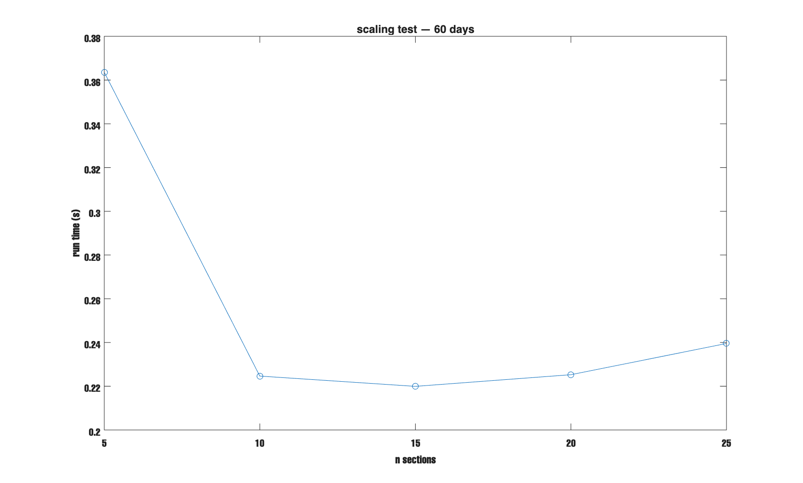
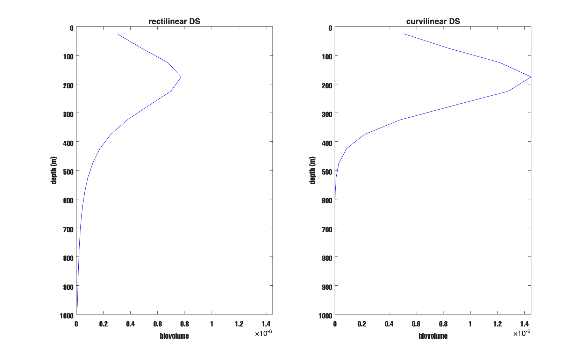
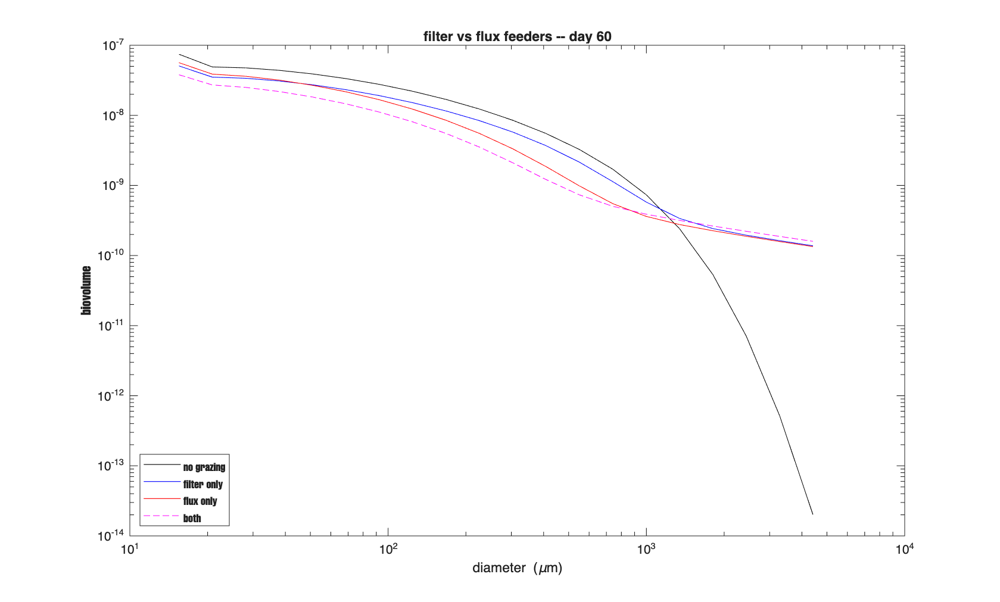
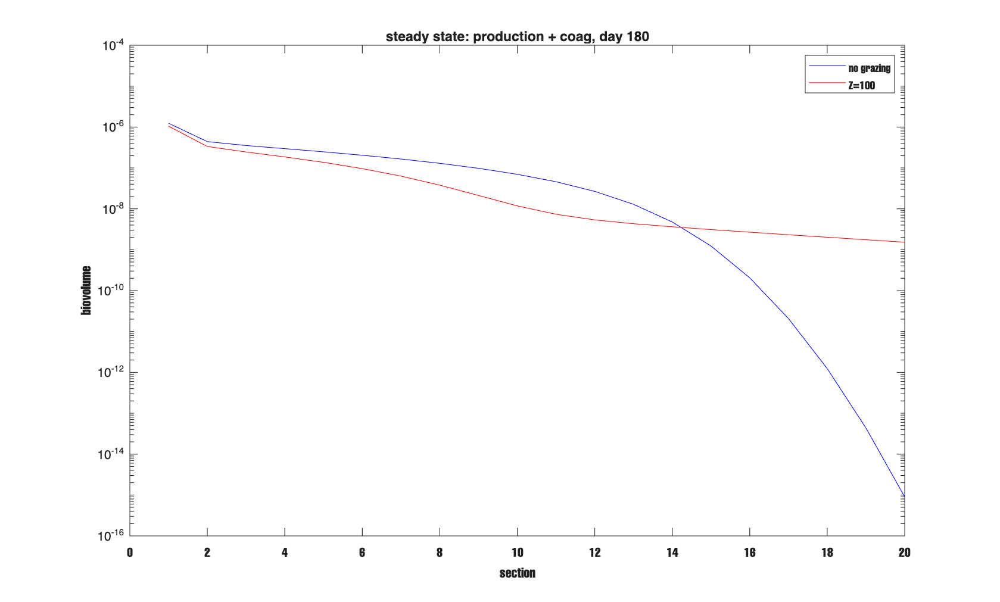
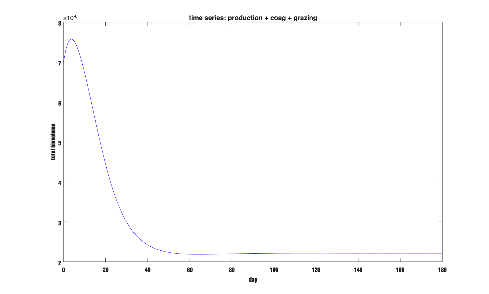
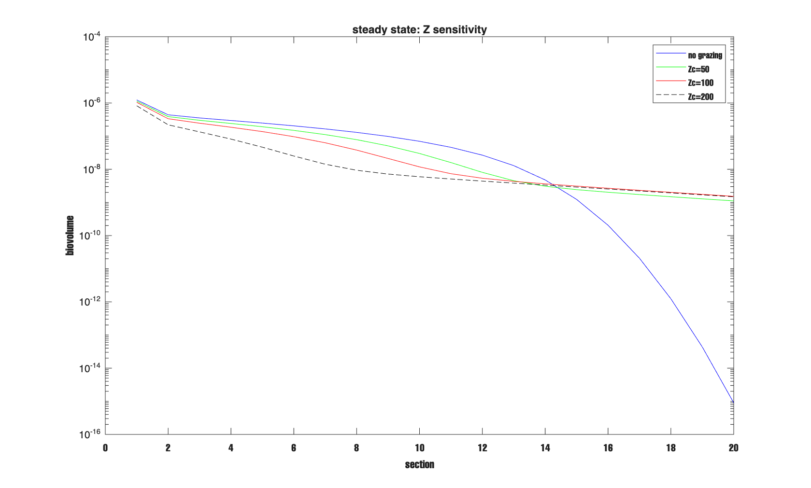

# Report — May 14, 2026
## 1-D Model: Transport, Boundary Fix, Kernel Checks, and Zooplankton Grazing

---

## Contents

1. Finite Difference Equations
2. Bottom Boundary Condition Fix
3. Run Time Scaling
4. Rectilinear vs Curvilinear DS Kernel
5. DS Dominance Check 
6. Zooplankton Grazing — Stemmann 2004 Formulation
7. Steady State — Production + Coagulation + Grazing
8. Zooplankton Density Sensitivity

---

## 1. Finite Difference Equations

The 1-D model uses explicit upwind advection and flux-form diffusion on a uniform depth grid. The state variable $Y_k$ is particle biovolume concentration at depth layer $k$, and sinking is taken as positive downward. This section writes out the discrete equations so it is clear exactly what the code is doing.

### 1.1 Advection

The upwind flux at the downward face of layer $k$ is

$$F_k^{\text{adv}} = w(k)\,\max(Y_k,\,0) \tag{1}$$

where $w(k)$ [m day⁻¹] is the settling speed at layer $k$. The $\max(Y_k, 0)$ guard prevents negative concentrations from driving an upward flux — this matters because the explicit time-step can briefly produce small negative values from numerical noise. The advective tendency is then

$$\left.\frac{\partial Y_k}{\partial t}\right|_{\text{adv}} = \frac{F_{k-1}^{\text{adv}} - F_k^{\text{adv}}}{\Delta z} \tag{2}$$

At the top boundary ($k = 1$), $F_0^{\text{adv}} = 0$ — no particles enter from above. At the bottom ($k = n_z$), the advective flux $F_{n_z}^{\text{adv}}$ simply exits the domain.

### 1.2 Diffusion

$K_z(k)$ is the turbulent diffusivity at layer $k$ [m² day⁻¹]. The diffusive flux at the face between layers $k$ and $k+1$ is

$$F_{k+1/2}^{\text{diff}} = K_{k+1/2}\,\frac{Y_{k+1} - Y_k}{\Delta z}, \qquad K_{k+1/2} = \frac{K_z(k) + K_z(k+1)}{2} \tag{3}$$

The face diffusivity is the arithmetic mean of the two adjacent cell values. The diffusive tendency is

$$\left.\frac{\partial Y_k}{\partial t}\right|_{\text{diff}} = \frac{F_{k+1/2}^{\text{diff}} - F_{k-1/2}^{\text{diff}}}{\Delta z} \tag{4}$$

At the top boundary, $F_{1/2}^{\text{diff}} = 0$ — no diffusive flux through the surface. At the bottom, the open-flux boundary condition (see §2) gives $F_{n_z+1/2}^{\text{diff}} = -K_z(n_z)\,Y_{n_z} / \Delta z$.

### 1.3 Full Update

The state is advanced by one explicit Euler step and then clipped:

$$Y_k^{\text{new}} = \max\!\left(Y_k + \Delta t\left(\left.\frac{\partial Y_k}{\partial t}\right|_{\text{adv}} + \left.\frac{\partial Y_k}{\partial t}\right|_{\text{diff}}\right),\; 0\right) \tag{5}$$

The outer $\max(\cdot, 0)$ removes residual numerical noise. Note that the explicit Euler scheme requires a CFL condition: $w \,\Delta t / \Delta z < 1$ for advection and $K_z \,\Delta t / \Delta z^2 < 0.5$ for diffusion. These should be verified before running; the `maxCFL` method in `ColumnTransport` returns both numbers for a given configuration.

---

## 2. Bottom Boundary Condition Fix

Previously the diffusion bottom boundary was zero-flux — particles that diffused down to the last layer had nowhere to go. For a short 60-day run this makes almost no difference, but for longer spin-up runs material accumulates at the bottom layer. The fix assumes the concentration below the domain is zero, which gives an open diffusive flux out.

The change in `src/ColumnTransport.m` is:

```matlab
% Old — zero-flux bottom
diff_flux_full = [zeros(1, n_sec); diff_flux; zeros(1, n_sec)];

% New — open-flux bottom
Kz_bot         = Kz_day(end);
diff_flux_bot  = -Kz_bot * Y(end, :) / dz;
diff_flux_full = [zeros(1, n_sec); diff_flux; diff_flux_bot];
```

A static diagnostic method `bottomFluxDay(Y, w_z, Kz_z, dz)` was also added to return the total biovolume leaving the bottom each day (advective plus diffusive).

**Verification** — pulse test, $n_{\text{sections}} = 5$, $H = 1000$ m, 60 days.

| Metric | Result |
|---|---|
| Negative count | 0 |
| Biovolume change | −0.0000% |
| Bottom diffusive flux (day 60) | 1.09 × 10⁻¹⁹ |

The bottom diffusive flux is negligible at 60 days, as expected — $K_z \sim 10^{-5}$ m² s⁻¹ is small and the domain is deep. No negatives, no conservation problem. The fix is safe.

---

## 3. Run Time Scaling

To check that scaling up to 20–25 size sections is feasible, the same 60-day column run ($H = 1000$ m, $n_z = 20$, upwind, coagulation on) was timed as a function of $n_{\text{sections}}$.

| $n_{\text{sections}}$ | Run time (s) |
|---|---|
| 5  | 0.36 |
| 10 | 0.22 |
| 15 | 0.22 |
| 20 | 0.23 |
| 25 | 0.24 |



*Figure 1. Run time vs $n_{\text{sections}}$ for a 60-day column run.*

Run time is flat from $n = 10$ to $n = 25$, between 0.22 and 0.24 s. The $n = 5$ point is slightly slower because MATLAB's JIT compiler warms up on the first call. The matrix computation is fast enough that function-call overhead dominates, so doubling the number of size bins adds almost nothing to total run time. This means 20–25 sections is not a practical constraint.

---

## 4. Rectilinear vs Curvilinear DS Kernel

The differential-settling (DS) collision kernel can be written two ways. The rectilinear form treats the collision volume as a full geometric tube swept out by the relative velocity — it assumes particles move through vacuum with no fluid interaction. The curvilinear form corrects for the fact that fluid streamlines deflect small particles around large ones, reducing the effective collision cross-section. For particles in seawater the curvilinear form is physically correct.

The same 60-day column run ($n_{\text{sections}} = 20$, $H = 1000$ m, $n_z = 20$, kriest_8 sinking) was run with each kernel.

| Metric | Rectilinear | Curvilinear |
|---|---|---|
| Midwater biovolume (layers 8–13) | 7.45 × 10⁻⁷ | 3.43 × 10⁻⁷ |
| Total biovolume change (60 days) | −32.46% | 0.0000% |

The rectilinear run was repeated at `proc_substeps = 100` to rule out numerical error. The result was unchanged (−32.33%, midwater 7.45 × 10⁻⁷). The mass loss is physically real, not numerical.

The rectilinear kernel overestimates collision rates because it ignores fluid deflection. Particles aggregate too fast, quickly build up into large sizes, and sink out the bottom. About 32% of the initial biovolume exits the 1000 m column in 60 days as fast-sinking large aggregates. The curvilinear kernel reduces the collision cross-section through the streamline correction — less aggregation, smaller particles, slower sinking, no exit.



*Figure 2. Total biovolume vs depth at day 60. Rectilinear (blue) has almost nothing below 300 m — large aggregates have already sunk out. Curvilinear (red) has material distributed through the full column.*

The rectilinear kernel is not appropriate for marine particles. The curvilinear kernel (`ds_kernel_mode = 'sinking_law'`) is the correct default.

---

## 5. DS Dominance Check — Hand Calculation

To verify that the model computes physically correct collision rates, three size pairs were selected from the 20-section grid and each kernel component was computed by hand.

$$\beta_{\text{Br}} = \frac{2k_BT}{3\mu}\,\frac{(d_i+d_j)^2}{d_i\,d_j} \tag{6}$$

$$\beta_{\text{sh}} = \frac{\pi}{6}\,\gamma\,\left(\frac{d_i+d_j}{2}\right)^3 \tag{7}$$

$$\beta_{\text{DS}} = \frac{\pi}{4}\,(d_i+d_j)^2\,|w_i - w_j| \tag{8}$$

Parameters: $T = 293$ K, $\mu = 1.0275 \times 0.01$ g cm⁻¹ s⁻¹, $\gamma = 0.1$ s⁻¹. Sinking speeds from kriest_8.

All $\beta$ values in cm³ s⁻¹.

| Pair | $d_i$ (cm) | $d_j$ (cm) | $\beta_{\text{Br}}$ | $\beta_{\text{sh}}$ | $\beta_{\text{DS}}$ | DS/Br | DS/sh |
|---|---|---|---|---|---|---|---|
| (1, 5)  | 2.29 × 10⁻³ | 5.77 × 10⁻³ | 1.22 × 10⁻¹¹ | 3.43 × 10⁻⁹ | 6.95 × 10⁻⁸ | 5,722 | 20.3 |
| (1, 10) | 2.29 × 10⁻³ | 1.83 × 10⁻² | 2.50 × 10⁻¹¹ | 5.73 × 10⁻⁸ | 1.55 × 10⁻⁶ | 61,763 | 27.0 |
| (5, 15) | 5.77 × 10⁻³ | 5.81 × 10⁻² | 3.01 × 10⁻¹¹ | 1.71 × 10⁻⁶ | 3.20 × 10⁻⁵ | 1,062,618 | 18.7 |

Brownian is negligible by a factor of at least 5,000 across all pairs. This is expected — Brownian motion only matters for particles below roughly 1 μm, and the smallest bin here is 23 μm.

DS exceeds shear by a factor of 19–27 at $\gamma = 0.1$ s⁻¹. This follows directly from the kriest_8 sinking speeds — it is not a model artifact. At much higher shear ($\gamma \sim 1$ s⁻¹) or for smaller size ranges, shear becomes competitive. The apparent contradiction with groups that report shear domination likely comes from different parameter choices rather than different physics.

---

## 6. Zooplankton Grazing — Stemmann 2004 Formulation

Zooplankton grazing was added to the 0-D slab model following Stemmann et al. (2004). Two zooplankton types are included: filter feeders, whose removal rate depends only on particle concentration; and flux feeders, whose removal rate depends on particle flux — that is, on the settling velocity of the particles they encounter.

### 6.1 Formulation

Let $Q_i$ be the biovolume concentration in size section $i$ [m³ m⁻³], $w_i$ the settling velocity of section $i$ [m day⁻¹], $Z_c$ and $Z_f$ the filter-feeder and flux-feeder concentrations [ind m⁻³], $c$ the clearance rate per filter feeder [m³ ind⁻¹ day⁻¹], and $s$ the capture cross-section per flux feeder [m² ind⁻¹].

The grazing tendency for filter feeders (Stemmann Eq. 15, 18) is

$$\left.\frac{dQ_i}{dt}\right|_{\text{FF}} = -c\,Z_c\,Q_i + D_i \tag{9}$$

and for flux feeders (Stemmann Eq. 16, 19) is

$$\left.\frac{dQ_i}{dt}\right|_{\text{FL}} = -w_i\,s\,Z_f\,Q_i + D_i \tag{10}$$

Note that the filter-feeder rate $c Z_c$ [day⁻¹] is the same for all size bins, while the flux-feeder rate $w_i s Z_f$ [day⁻¹] scales with settling speed — larger, faster-sinking particles are removed at a higher rate by flux feeders.

The two types are combined into a single removal rate per bin

$$\text{rate}_i = c\,Z_c + w_i\,s\,Z_f \tag{11}$$

A fraction $p$ of consumed material is egested as fecal pellets. The fecal production is distributed equally across all size sections $i > i_c$ (Stemmann Eq. 27):

$$D_i = \frac{p}{l - i_c}\sum_{q=1}^{l}\text{rate}_q\,Q_q \qquad \text{for } i > i_c \tag{12}$$

where $l$ is the total number of sections. Note that the sum runs over all bins — fecal pellets from eating small particles are distributed to large bins, and vice versa. This is what allows the largest size bins to receive material that coagulation alone cannot supply (§7).

In the code, equation (12) is implemented as:

```matlab
rate    = obj.c * obj.Zc + w_mday * obj.s * obj.Zf;  % n x 1 [day^-1]
consumption      = rate .* v;
actual_consumed  = min(consumption, v);   % cap: can't remove more than exists
total_consumed   = sum(actual_consumed);
fecal_per_bin    = obj.p * total_consumed / n_fecal_bins;
dvdt             = -actual_consumed;
dvdt(ic+1 : n)   = dvdt(ic+1:n) + fecal_per_bin;
```

The `min(consumption, v)` cap is a numerical guard — it prevents the removal from exceeding the available biovolume in a single time step. At the rates used here ($c Z_c = 0.01$ day⁻¹), this cap never triggers, but it is good practice.

Default parameters: $Z_c = 100$ ind m⁻³, $c = 10^{-4}$ m³ ind⁻¹ day⁻¹, $Z_f = 50$ ind m⁻³, $s = 10^{-4}$ m² ind⁻¹, $p = 0.3$, $i_c = 1$.

The class is wired into `CoagulationRHS` as an operator-split step. At each outer time step (every 1/24 day by default), the coagulation ODE is integrated first, then grazing is applied to the result. The process budget was verified to balance to numerical precision at steady state (§7.2).

### 6.2 Egestion Fraction Sensitivity

The egestion fraction $p$ controls how much grazed material is returned as fecal pellets vs permanently removed. As $p$ increases, more material is returned to the size spectrum, so total net removal decreases. The run was 60 days with the full Stemmann parameters ($Z_c = 100$, $Z_f = 50$). The no-grazing baseline at 60 days is 3.865 × 10⁻⁷.

| $p$ | Total biovolume (day 60) | Change from no-grazing |
|---|---|---|
| 0.0 (all ingested) | 1.562 × 10⁻⁷ | −59.6% |
| 0.1 | 1.631 × 10⁻⁷ | −57.8% |
| 0.3 | 1.793 × 10⁻⁷ | −53.6% |
| 0.6 | 2.114 × 10⁻⁷ | −45.3% |
| 0.9 (mostly egested) | 2.569 × 10⁻⁷ | −33.5% |

*Table 1. Sensitivity to egestion fraction $p$, 60 days. $Z_c = 100$, $c = 10^{-4}$, $Z_f = 50$, $s = 10^{-4}$.*

The response is smooth and physically reasonable. At $p = 0$, all consumed material is permanently removed and the system loses 60% of its biovolume in 60 days. At $p = 0.9$, most material is returned and net loss drops to 34%. Note that even at $p = 0.9$, there is still substantial net removal — the fecal pellets go back into all bins including the large ones, where they are grazed again.

### 6.3 Filter Feeders vs Flux Feeders

To isolate the two feeding modes, three runs were compared against a no-grazing baseline over 60 days: filter feeders only ($Z_f = 0$), flux feeders only ($Z_c = 0$), and both combined.

| Run | Total biovolume (day 60) | Change |
|---|---|---|
| No grazing  | 3.865 × 10⁻⁷ | — |
| Filter only | 2.698 × 10⁻⁷ | −30.2% |
| Flux only   | 2.628 × 10⁻⁷ | −32.0% |
| Both        | 1.793 × 10⁻⁷ | −53.6% |

*Table 2. Filter vs flux feeder comparison, 60 days. Filter only: $Z_c = 100$, $Z_f = 0$. Flux only: $Z_c = 0$, $Z_f = 50$. Both: $Z_c = 100$, $Z_f = 50$.*

| Run | Bin 1 | Bin 10 | Bin 20 |
|---|---|---|---|
| No grazing  | 7.45 × 10⁻⁸ | 1.23 × 10⁻⁸ | 2.01 × 10⁻¹⁴ |
| Filter only | 5.07 × 10⁻⁸ | 8.42 × 10⁻⁹ | 1.38 × 10⁻¹⁰ |
| Flux only   | 5.65 × 10⁻⁸ | 5.54 × 10⁻⁹ | 1.34 × 10⁻¹⁰ |
| Both        | 3.79 × 10⁻⁸ | 3.53 × 10⁻⁹ | 1.59 × 10⁻¹⁰ |

*Table 3. Biovolume at selected bins for each feeding mode.*



*Figure 3. Size spectrum at day 60, log-log axes, x-axis is particle diameter [μm]. Black: no grazing. Blue: filter only. Red: flux only. Magenta dashed: both. Flux feeders (red) fall below filter feeders (blue) at large diameters because their removal rate scales with settling velocity.*

Filter feeders and flux feeders remove nearly the same total amount (30% vs 32%) at these parameter values. The difference is in where the removal falls. At bin 10, filter feeders leave 8.42 × 10⁻⁹ while flux feeders leave only 5.54 × 10⁻⁹ — flux feeders take more from the larger, faster-sinking bins. This is because the flux-feeder rate $w_i s Z_f$ grows with settling speed, so large particles are disproportionately targeted.

The combined run shows −53.6%, which is less than the sum −30.2 − 32.0 = −62.2%. The two feeding modes compete over the same particle pool, so as one depletes particles, there is less left for the other. This sub-additive behavior is expected.

The key physical message is that flux feeders shift the size spectrum toward smaller particles more strongly than filter feeders do. This is the biological pump mechanism Stemmann et al. (2004) describe — flux feeding selectively removes the large fast-sinking particles that would otherwise carry carbon to depth.

---

## 7. Steady State — Production + Coagulation + Grazing

The runs in §6 start with an initial biovolume pulse and let it decay. That setup has no source, so the system simply empties over time. It cannot reach a steady state. To test the model in a physically meaningful way, a simple phytoplankton growth term was added: bin 1 grows at specific rate $\mu = 0.1$ day⁻¹, applied as an operator-split step after coagulation each substep. This mimics phytoplankton dividing and continuously feeding new, small particles into the system.

We now have three processes running together: production feeds bin 1, coagulation moves material to larger bins, and grazing plus sinking remove material. The question is what steady state these balance to.

Two 180-day runs were compared: production + coagulation only (no grazing), and production + coagulation + Stemmann grazing ($Z_c = 100$, $Z_f = 50$, $p = 0.3$).

| Run | Total biovolume (day 180) | Change |
|---|---|---|
| No grazing   | 3.333 × 10⁻⁶ | — |
| With grazing | 2.212 × 10⁻⁶ | −33.6% |

| Bin | No grazing | With grazing |
|---|---|---|
| 1  | 1.238 × 10⁻⁶ | 1.046 × 10⁻⁶ |
| 3  | 3.533 × 10⁻⁷ | 2.453 × 10⁻⁷ |
| 5  | 2.475 × 10⁻⁷ | 1.369 × 10⁻⁷ |
| 8  | 1.296 × 10⁻⁷ | 3.786 × 10⁻⁸ |
| 10 | 6.985 × 10⁻⁸ | 1.180 × 10⁻⁸ |
| 13 | 1.287 × 10⁻⁸ | 4.318 × 10⁻⁹ |
| 16 | 2.049 × 10⁻¹⁰ | 2.678 × 10⁻⁹ |
| 20 | 8.967 × 10⁻¹⁶ | 1.526 × 10⁻⁹ |

*Table 4. Steady-state size distribution at day 180, 20 sections.*



*Figure 4. Size spectrum at day 180, x-axis is size section index (1 = smallest, 20 = largest). Blue: no grazing. Red: with grazing ($Z_c = 100$, $Z_f = 50$). Note that sections 16–20 are higher with grazing on — fecal pellets supply these large bins faster than coagulation alone can.*

For bins 1–13, grazing reduces biovolume, as expected. The reduction increases toward larger bins because flux feeders add to the removal. Bins 16–20 show the opposite: biovolume is higher with grazing than without. Without grazing, coagulation alone barely populates bin 20 (8.97 × 10⁻¹⁶ — essentially zero). With grazing, fecal pellets are distributed equally across bins 2–20 by equation (12), injecting material into the large bins directly. Coagulation is too slow to build up bin 20 on its own in 180 days, but fecal return can do it.

This is the biological pump signal in the model. Zooplankton suppress the intermediate size spectrum while enhancing the large-particle end via fecal production. The total biovolume is 34% lower, but the size distribution has shifted toward large, fast-sinking particles.

### 7.1 Steady-State Verification — Time Series

| Day | Total biovolume |
|---|---|
| 0   | 6.981 × 10⁻⁶ |
| 20  | 4.438 × 10⁻⁶ |
| 40  | 2.421 × 10⁻⁶ |
| 60  | 2.187 × 10⁻⁶ |
| 80  | 2.198 × 10⁻⁶ |
| 100 | 2.211 × 10⁻⁶ |
| 120 | 2.213 × 10⁻⁶ |
| 180 | 2.212 × 10⁻⁶ |

*Table 5. Total biovolume vs time for the grazing run.*

Mean drift over last 30 days: −0.0001% per day. The system is at steady state by day 60.



*Figure 5. Total biovolume vs time, grazing on. The system starts high (large initial pulse) and levels off near 2.21 × 10⁻⁶ by day 60. After that the drift is below measurement noise.*

The initial biovolume (6.98 × 10⁻⁶) is larger than the steady-state value because the initial pulse contains more material than the balance of production and removal can sustain. Grazing and sinking remove the excess, and the system settles to the production-balanced equilibrium by day 60. The day-180 values in Table 4 can be taken as steady-state values.

### 7.2 Process Budget at Steady State

At steady state, production must equal removal. We can compute each term directly from the steady-state spectrum.

| Process | Rate [biovolume day⁻¹] |
|---|---|
| Production (bin 1 source) | 1.046 × 10⁻⁷ |
| Gross grazing loss | 3.723 × 10⁻⁸ |
| Fecal return | 5.296 × 10⁻⁹ |
| Net grazing removal | 3.194 × 10⁻⁸ |
| Coagulation + sinking | 7.267 × 10⁻⁸ |

*Table 6. Process budget at steady state ($Z_c = 100$, $Z_f = 50$, $\mu = 0.1$ day⁻¹). Production and grazing terms are computed directly from the steady-state spectrum. The coagulation + sinking term is the residual: production − net grazing.*

Budget check: 3.194 × 10⁻⁸ + 7.267 × 10⁻⁸ = 1.046 × 10⁻⁷ = production. Balanced to numerical precision.

Of the material produced each day, 30.5% is removed by net grazing and 69.5% exits via coagulation and sinking. At these parameter values, coagulation and sinking is still the dominant removal pathway, but grazing is a significant secondary sink.

We can also look at the grazing tendency per bin:

| Bin | dvdt from grazing [biovolume day⁻¹] |
|---|---|
| 1  | −1.842 × 10⁻⁸ |
| 2  | −5.564 × 10⁻⁹ |
| 5  | −2.497 × 10⁻⁹ |
| 8  | −4.439 × 10⁻¹⁰ |
| 10 | +2.764 × 10⁻¹⁰ |
| 13 | +4.938 × 10⁻¹⁰ |
| 16 | +5.187 × 10⁻¹⁰ |
| 20 | +5.285 × 10⁻¹⁰ |

*Table 7. Per-bin grazing tendency at steady state. Negative = net loss, positive = net gain from fecal return.*

The sign flips between bins 8 and 10. For bins 1–8, direct grazing removal exceeds fecal return — these bins are a net loss. For bins 10–20, fecal return exceeds direct consumption. This is why Figure 4 shows bins 16–20 with more material when grazing is on: the fecal return is larger than the direct grazing at those bin sizes.

---

## 8. Zooplankton Density Sensitivity — Steady-State Budget

To see how the process balance changes with zooplankton abundance, four runs were compared at steady state (180 days, $\mu = 0.1$ day⁻¹) with increasing zooplankton concentration. The filter:flux ratio was kept fixed at $Z_c : Z_f = 2:1$.

| Case | $Z_c$ (ind m⁻³) | $Z_f$ (ind m⁻³) | Total biovolume | Production | Net grazing | Coag+sink | % grazed |
|---|---|---|---|---|---|---|---|
| No grazing | 0   | 0   | 3.333 × 10⁻⁶ | 1.238 × 10⁻⁷ | — | 1.238 × 10⁻⁷ | 0% |
| Z-low      | 50  | 25  | 2.725 × 10⁻⁶ | 1.144 × 10⁻⁷ | 2.021 × 10⁻⁸ | 9.420 × 10⁻⁸ | 17.7% |
| Z-mid      | 100 | 50  | 2.212 × 10⁻⁶ | 1.046 × 10⁻⁷ | 3.194 × 10⁻⁸ | 7.267 × 10⁻⁸ | 30.5% |
| Z-high     | 200 | 100 | 1.396 × 10⁻⁶ | 8.230 × 10⁻⁸ | 3.909 × 10⁻⁸ | 4.322 × 10⁻⁸ | 47.5% |

*Table 8. Steady-state budget as a function of zooplankton concentration.*



*Figure 6. Steady-state size spectrum for all four zooplankton concentrations, x-axis is size section index. Blue: no grazing. Green: $Z_c = 50$. Red: $Z_c = 100$. Black dashed: $Z_c = 200$. The spectrum shifts downward as Z increases for small and intermediate bins. At large bins (sections 16–20), the grazed runs sit above the no-grazing run because fecal return to those bins grows with grazing intensity.*

We find two things worth noting. First, grazing saturates. When $Z_c$ doubles from 50 to 100, net grazing increases by 58% (2.02 → 3.19 × 10⁻⁸ per day). When it doubles again from 100 to 200, grazing increases by only 22% (3.19 → 3.91 × 10⁻⁸). Each doubling of zooplankton density gives diminishing additional removal. The reason is that grazers at higher density deplete their own food supply — there are fewer particles available per grazer.

Second, the production rate itself drops with Z. Growth adds material at rate $\mu v_1$, so it depends on how much is in bin 1. Higher grazing keeps bin 1 smaller, which reduces production. The production rate falls from 1.238 × 10⁻⁷ at no grazing to 8.230 × 10⁻⁸ at $Z_c = 200$ — a 34% drop. The system does not simply lose a fixed fraction of a fixed-production background; instead the whole steady state shifts downward.

The coag+sinking share decreases from 100% (no grazing) to 52.5% at $Z_c = 200$. At roughly $Z_c = 300$–400 ind m⁻³ the two pathways would be equal. Above that, zooplankton become the dominant removal mechanism, and the large-aggregate sinking pathway would be strongly suppressed.

---

## 9. Clearance Rate Sensitivity

Adrian also asked what happens when the clearance rate constant $c$ is varied directly, rather than the zooplankton count $Z_c$. Four runs were made at $c = 0.5 \times 10^{-4}$, $10^{-4}$, $2 \times 10^{-4}$, $4 \times 10^{-4}$, with $Z_c = 100$ fixed. All other parameters are the same as §8 (180-day spin-up, $\mu = 0.1$ day⁻¹, $Z_f = 50$, $p = 0.3$).

| Case | $c \cdot Z_c$ | % grazed |
|---|---|---|
| $c/2$ | 0.005 | 24.9% |
| $c$ (default) | 0.010 | 30.5% |
| $2c$ | 0.020 | 39.9% |
| $4c$ | 0.040 | 52.8% |

*Table 9. Steady-state grazing fraction as a function of clearance rate $c$, $Z_c = 100$ fixed.*


*Figure 7. Steady-state size spectrum for the four clearance rate runs. Same saturating pattern as Figure 6.*

The saturation pattern is the same as in §8. Doubling $c$ from $10^{-4}$ to $2 \times 10^{-4}$ raises the grazed fraction from 30.5% to 39.9%. Doubling again gives only 52.8% — food depletion limits the gain.

Note that the filter-feeder removal rate is $c Z_c Q_i$ (Eq. 11) — only the product $c Z_c$ appears. An equivalence check confirmed this: the run with $c = 2 \times 10^{-4}$, $Z_c = 100$ and the run with $c = 10^{-4}$, $Z_c = 200$ give identical steady-state totals (difference = 0). Doubling $c$ at fixed $Z_c$ is exactly the same as doubling $Z_c$ at fixed $c$. What matters is the product. This means $c$ and $Z_c$ cannot be separately constrained from biovolume data alone.

---
